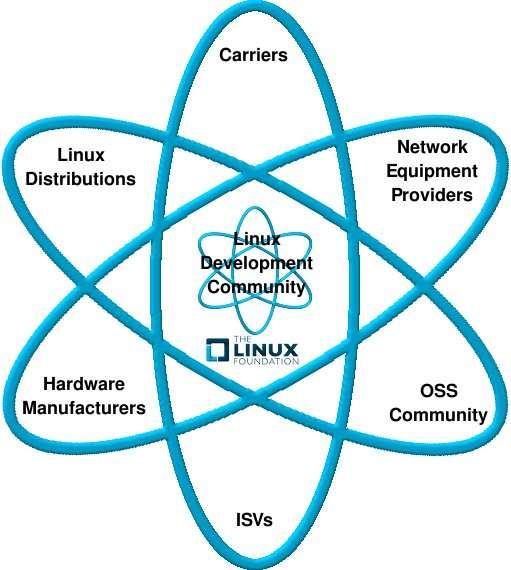
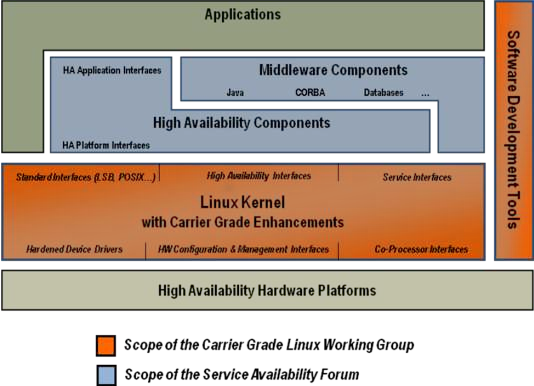

Overview of Carrier Grade Linux
...............................

.. note:: Introduction to v.5.0.1

   This section will have the introduction to the v.5.0.1 version of the
   specification when complete.  The v.5.0 specification introduction should be
   left intact.

Introduction to the Carrier Grade Linux Requirements Defintion v.5.0
====================================================================

In the time since the fourth major version of the Carrier Grade Linux
Specification has been published there has been a great shift in both the
telecommunication industry and the open source community. Most consumers of
mobile communications devices see them as conduits for communication, be that
voice, text, locations services, and general internet browsing. Providers need
to ensure that voice and data traffic shares the network seamlessly with the
same correctness and performance regardless of the packet. This pushes the need
for carrier-grade reliability to nearly every application server and it must be
available to the very edges of the network. This makes “old” ideas about
scalability, handling hundreds of thousands of calls with predictable
performance, seem almost quaint when carriers are now expecting to be able to
handle that as well as stream video, audio and packet traffic all with varying,
but immutable, service requirements. At the same time this level of reliability
is seen as being needed beyond the “carriers” because almost every server is
connected to an ever-on world-wide network with users awake every hour of the
day. This has helped many of the features published in earlier versions of the
CGL specification to become accepted parts of the Linux mainstream.

While the usage models and goals described above evolve, this is accompanied by
a simultaneous shift away from proprietary platform architectures to commercial
off-the-shelf (COTS) platforms and open software environments.  This continues
to pick up pace but now there is also increasing demand for integration with
acceleration technologies and performance tuning options rarely seen in the
past. Open software and COTS hardware were once seen as a means for rapid
deployment of voice and data services; now they are considered essential in many
areas and without continued advancement and adoption in both areas the
competitive nature of the market risks fracturing the community that has formed.

Carrier Grade Linux (CGL) still stands at the centre of all of this. More than
seven years ago a group of industry representatives from platform vendors, Linux
distribution suppliers and network equipment providers set out to define how
“Carrier Grade Linux” could enable environments with higher availability,
serviceability, and scalability requirements and formed the Carrier Grade Linux
Working Group. The working group has produced four major versions of a
specification to define the required capabilities. The result is that Linux
distribution suppliers have been able to demonstrate that they meet the needs of
telecommunications by disclosing how their products address the requirements in
this document.

   Illustration 1: The Linux Ecosystem

Today the CGL working group represents interests from Linux distribution
suppliers as well as telecommunications industry equipment manufacturers,
service providers and end users. The CGL working group continues to strive to
bring these various groups together and to foster open communication and
collaboration, always with the goal of championing these requirements to the
community and bringing carrier-grade improvements to everyone.

High availability middleware components and service availability middleware that
run on CGL systems are addressed by organizations such as the Distributed
Management Task Force (DMTF), the Object Management Group (OMG), and the Service
Availability Forum (SAF). High availability hardware platforms underlying CGL
are addressed by organizations such as the PCI Industrial Computer Manufacturers
Group (PICMG) and the Intelligent Platform Management Interface (IPMI). In
addition, organizations like the SCOPE Alliance address several layers
applicable to carrier grade environments. The SCOPE Alliance defines profiles
for hardware, OS, and middleware; its purpose is to help, enable, and promote
the availability of open carrier grade platforms based on

   Illustration 2: Full Carrier Grade Application Stack

The CGL 5.0 specification is an upwardly compatible superset of the CGL 4.0
specification. As with the 4.0 specification, many requirements have been
deprecated, since at the time of publication they have been deemed to be
ubiquitous and therefore no longer relevant for the purposes of meeting carrier
requirements. These deprecated requirements represent the broad adoption
described earlier of carrier-grade objectives by the community and can be viewed
as validation of the objectives of the group as a whole.
commercial-off-the-shelf (COTS) hardware and software.

In 2003 and 2004, member companies were producing communications products based
on the CGL 1.1 specifications. In the latter half of 2004 and 2005, Linux
distributors began to announce Linux offerings based on the CGL 2.0.2
specification. In 2006 several vendors registered for CGL 3.2. In 2007 CGL 4.0
introduced a new registration process and within weeks of the process being
available the first of the 4.0 distributions appeared. The CGL 5.0 registration
process will be very similar to the process used for the 4.0 specification and
therefore a very smooth transition is expected for carriers and equipment
providers as Linux distribution suppliers incorporate CGL 5.0 capabilities in
2011 and beyond.

As always, development is underway on many of the CGL capabilities that do not
appear in mainline distributions. While the CGL requirements are specified for
Linux-based platforms in the communications industry, a high availability, high
performance, scalable system is viewed as beneficial to the entire Linux user
community. These developments are both in areas identified here as requirements
and as gaps and while this version of the specification is expected to be the
definitive version for some time to come, the CGL working group anticipates that
many of the gap items today will become not only requirements in the future but
features so basic as to be expected of all Linux distributions.  Discussions of
these developments are encouraged and can be directed to the Carrier Grade
community at lf_carrier@linuxfoundation.org.
