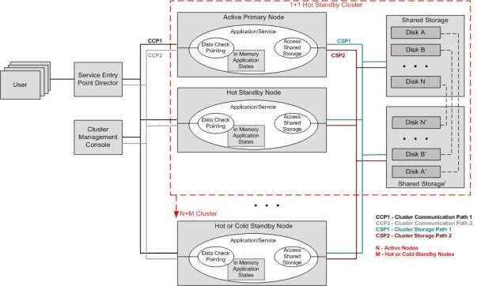

Availability Requirements Definition
....................................

Telecommunication customers expect their voice and data services to always be
available. System availability is dependent on the availability of individual
components in the system. To help ensure 24/7 service, it must be possible to
perform system maintenance and system expansion on running telecommunication
networks and servers without disrupting the services they implement. Systems
must be able to withstand component failures, making redundancy of components
such as power supplies, fans, network adapters, storage, and storage paths
essential. Software failures can also significantly impact the availability of a
compute node, so robust application software, middleware, and operating system
software is required for single node availability.

Single Node Availability Categories
===================================

This section is a collection of requirements that address the robustness of a
single computing node. Availability is further enhanced by clustering individual
computing nodes so that a node cannot represent a single point of failure. The
single node requirements in the Availability section can be categorized as:

   - On-line operations

   - Redundancy

   - Monitoring

   - Robustness

On-Line Operations
------------------

On-line operations enable the system to continue to provide a service while the
software or the hardware is replaced or upgraded on the system. For instance,
when a file system needs repair, repair procedures may require rebooting the
system. However, CGL requires that it be possible to forcibly un-mount a file
system, allowing repair and remounting without rebooting. The ability to replace
or upgrade hardware such as disks, processors, memory, or even entire
processor/memory blades without bringing down that node or the network
contributes significantly to continuous service availability.

Redundancy
----------

A highly available system must be composed of redundant components and must
be able to take advantage of redundant hardware such that the system continues
to function when a component fails. Ideally, designs can eliminate all single
points of failure from a system. Using redundant communication paths, such as
redundant network ports and host adapters, together with network fail-over
software capabilities, such as Ethernet bonding, improve network availability.
Redundant storage paths, such as redundant fiber channel ports and host
adapters used with multipath I/O, improve storage availability. Redundancy of
memory components may not be possible, but error detection and correction can
be used to mask memory cell failures; CGL requires software Error Correction
Code (ECC) support. Single bit errors are reported when they are detected in the
hardware and logged by the kernel. The kernel invokes a panic routine whenever
uncorrectable multi-bit errors are detected.

Monitoring
----------

Rapid detection of hardware or software failures requires health monitoring.
Health monitoring is also needed to check for hardware or software that is
beginning to fail, such as ECC memory checking, predictive analysis for disks,
and processes that do not respond in a predicted way. Examples of CGL
monitoring requirements include Non-Intrusive Monitoring of Processes and
Memory Over-commit Actions. The Non-Intrusive Monitoring of Processes
requirement detects abnormal behavior by a process, such as process death,
and initiates an action, such as the creation of a new process. The Memory Over-
commit Actions requirement monitors system memory usage and controls
process activity when memory usage exceeds specified thresholds.

Robustness
----------

A highly available system must be composed of redundant components and must
be able to take advantage of redundant hardware such that the system continues
to function when a component fails. Ideally, designs can eliminate all single
points of failure from a system. Using redundant communication paths, such as
redundant network ports and host adapters, together with network fail-over
software capabilities, such as Ethernet bonding, improve network availability.
Redundant storage paths, such as redundant fiber channel ports and host
adapters used with multipath I/O, improve storage availability. Redundancy of
memory components may not be possible, but error detection and correction can
be used to mask memory cell failures; CGL requires software Error Correction
Code (ECC) support. Single bit errors are reported when they are detected in the
hardware and logged by the kernel. The kernel invokes a panic routine whenever
uncorrectable multi-bit errors are detected.

Availability Requirements
=========================

AVL.2.0 Single-bit ECC handling
-------------------------------
+---------------+------------------------------------+--------------+----------+
| ID            |       Name                         |   Category   | Priority |
+===============+====================================+==============+==========+
| AVL.2.0       | Single-bit ECC handling            |    |avl|     |    P2    |
+---------------+------------------------------------+--------------+----------+
| CGL specifies that carrier grade Linux shall provide a mechanism for         |
| reporting when hardware error checking and correcting (ECC) detects and/or   |
| recovers from a single-bit ECC error.                                        |
+---------------+------------------------------------+--------------+----------+

AVL.2.1 Multi-bit ECC handling
------------------------------
+---------------+-------------------------------------+-------------+----------+
| ID            |       Name                          |   Category  | Priority |
+===============+=====================================+=============+==========+
| AVL.2.1       | Multi-bit ECC handling              |    |avl|    |    P2    |
+---------------+-------------------------------------+-------------+----------+
| CGL specifies that carrier grade Linux shall provide a panic trigger         |
| mechanism when hardware error checking and correcting (ECC) detects          |
| multi-bit ECC errors.                                                        |
+---------------+-------------------------------------+-------------+----------+

AVL.4.1 VM Strict Over-Commit
-----------------------------
+---------------+-------------------------------------+-------------+----------+
| ID            |       Name                          |   Category  | Priority |
+===============+=====================================+=============+==========+
| AVL.4.1       | VM Strict Over-Commit               |    |avl|    |    P1    |
+---------------+-------------------------------------+-------------+----------+
|  CGL specifies that carrier grade Linux shall provide the ability to         |
|  control kernel virtual memory allocation adjustments based on the           |
|  specific needs of the system. Control of virtual memory shall include but   |
|  not be limited to the following:                                            |
|                                                                              |
|  - Heuristic overcommit handling. Obvious overcommits of address space are   |
|    refused. Used for a typical system. It ensures a seriously wild           |
|    allocation fails while allowing overcommit to reduce swap usage.  root    |
|    is allowed to allocate slighly more memory in this mode. This is the      |
|    default.                                                                  |
|                                                                              |
|  - Always overcommit. Appropriate for some scientific applications.          |
|                                                                              |
|  - Don't overcommit. The total address space commit for the system is not    |
|    permitted to exceed swap + a configurable percentage (default is 50) of   |
|    physical RAM.  Depending on the percentage you use, in most situations    |
|    this means a process will not be killed while accessing pages but will    |
|    receive errors on memory allocation as appropriate.                       |
+---------------+-------------------------------------+-------------+----------+

AVL.5.3 Process-Level Non-Intrusive Application Monitor
-------------------------------------------------------
+---------------+-------------------------------------+-------------+----------+
| ID            |       Name                          |   Category  | Priority |
+===============+=====================================+=============+==========+
| AVL.5.3       | Process-Level Non-Intrusive         |    |avl|    |    P1    |
|               | Application Monitor                 |             |          |
+---------------+-------------------------------------+-------------+----------+
|  CGL specifies that carrier grade Linux shall provide control and            |
|  management capabilities for processes that cannot be altered to             |
|  incorporate a monitoring API. Such capabilities are known as                |
|  non-intrusive monitoring. These capabilities must be implemented            |
|  programmatically using commands or scripts.                                 |
|                                                                              |
|  Another issue for many such processes is that the start script itself may   |
|  spawn an application process that is not under the control of the           |
|  management process.  This sub-requirement assumes that this does not        |
|  happen, and the child process remains under the control of the management   |
|  entity.                                                                     |
|                                                                              |
|  Capabilities required:                                                      |
|                                                                              |
|  - The following capabilities must be enabled for controlling processes:     |
|                                                                              |
|    + The ability to start a process (or a list of processes)                 |
|    + The ability to stop a process (or a list of processes)                  |
|                                                                              |
|  - The following capabilities must be enabled for monitoring processes:      |
|                                                                              |
|    + The ability to detect the unexpected exit of a process                  |
|    + The ability to configure a set of actions in response to an             |
|      unexpected exit of a process                                            |
|                                                                              |
|  - The following services must be provided beyond those currently provided by|
|    inittab:                                                                  |
|                                                                              |
|    + The ability to configure whether to restart the application if the      |
|      process dies                                                            |
|    + A configurable amount of time to wait before restarting the application |
|    + A limit on the number of times to restart the application               |
+---------------+-------------------------------------+-------------+----------+

AVL.6.0 Disk Predictive Analysis
--------------------------------
+---------------+-------------------------------------+-------------+----------+
| ID            |       Name                          |   Category  | Priority |
+===============+=====================================+=============+==========+
| AVL.6.0       |   Disk Predictive Analysis          |    |avl|    |    P1    |
+---------------+-------------------------------------+-------------+----------+
|  CGL specifies that carrier grade Linux shall provide capabilities to        |
|  assist in monitoring storage systems. The aim of this support is to         |
|  assist in predicting situations likely to lead to failure of disks. This    |
|  allows preventive action to be taken to avoid the failure and resulting     |
|  disruption of service.                                                      |
+---------------+-------------------------------------+-------------+----------+

AVL.7.1.1 Multi-Path Access to Storage: Multi-Path Detection
------------------------------------------------------------
+---------------+-------------------------------------+-------------+----------+
| ID            |       Name                          |   Category  | Priority |
+===============+=====================================+=============+==========+
| AVL.7.1.1     | Multi-Path Access to Storage:       |    |avl|    |    P1    |
|               | Multi-Path Detection                |             |          |
+---------------+-------------------------------------+-------------+----------+
|  CGL specifies that carrier grade Linux shall provide a mechanism to enable  |
|  multiple access paths from a node to storage devices. The software shall    |
|  determine if multiple paths exist to the same port of the I/O device.       |
+---------------+-------------------------------------+-------------+----------+

AVL.7.1.2 Multi-Path Access to Storage: I/O Balancing
-----------------------------------------------------
+---------------+-------------------------------------+-------------+----------+
| ID            |       Name                          |   Category  | Priority |
+===============+=====================================+=============+==========+
| AVL.7.1.2     | Multi-Path Access to Storage:       |    |avl|    |    P1    |
|               | I/O Balancing                       |             |          |
+---------------+-------------------------------------+-------------+----------+
|  CGL specifies that carrier grade Linux shall provide a mechanism to enable  |
|  multiple access paths from a node to storage devices. The software shall    |
|  determine if multiple paths exist to the same port of the I/O device, and,  |
|  with configurable controls, balance I/O requests across multiple host bus   |
|  adapters.  If multiple paths exist to the same device over two separate     |
|  device ports on the same host bus adapter, those I/Os will not be balanced. |
+---------------+-------------------------------------+-------------+----------+

AVL.7.1.3 Multi-Path Access to Storage: Automatic Path Failover
---------------------------------------------------------------
+---------------+-------------------------------------+-------------+----------+
| ID            |       Name                          |   Category  | Priority |
+===============+=====================================+=============+==========+
| AVL.7.1.3     | Multi-Path Access to Storage:       |    |avl|    |    P1    |
|               | Automatic Path Failover             |             |          |
+---------------+-------------------------------------+-------------+----------+
|  CGL specifies that carrier grade Linux shall provide a mechanism to         |
|  enable multiple access paths from a node to storage devices.  Handling a    |
|  path failure must be automatic.                                             |
+---------------+-------------------------------------+-------------+----------+

AVL.7.1.4 Multi-Path Access to Storage: Failed Path Reactivation
----------------------------------------------------------------
+---------------+-------------------------------------+-------------+----------+
| ID            |       Name                          |   Category  | Priority |
+===============+=====================================+=============+==========+
| AVL.7.1.4     | Multi-Path Access to Storage:       |    |avl|    |    P1    |
|               | Failed Path Reactivation            |             |          |
+---------------+-------------------------------------+-------------+----------+
|  CGL specifies that carrier grade Linux shall provide a mechanism to         |
|  enable multiple access paths from a node to storage devices.  A             |
|  mechanism must be provided for the reactivation of failed paths,            |
|  allowing them to be placed back in service.                                 |
+---------------+-------------------------------------+-------------+----------+

AVL.7.1.5 Multi-Path Access to Storage: Automatic Path Configuration
--------------------------------------------------------------------
+---------------+-------------------------------------+-------------+----------+
| ID            |       Name                          |   Category  | Priority |
+===============+=====================================+=============+==========+
| AVL.7.1.5     | Multi-Path Access to Storage:       |    |avl|    |    P1    |
|               | Automatic Path Configuration        |             |          |
+---------------+-------------------------------------+-------------+----------+
|  CGL specifies that carrier grade Linux shall provide a mechanism to         |
|  enable multiple access paths from a node to storage devices.  It must be    |
|  possible to automatically determine and configure multiple paths.           |
+---------------+-------------------------------------+-------------+----------+

AVL.7.1.6 Multi-Path Access to Storage: Automatic Volume Configuration
----------------------------------------------------------------------
+---------------+-------------------------------------+-------------+----------+
| ID            |       Name                          |   Category  | Priority |
+===============+=====================================+=============+==========+
| AVL.7.1.6     | Multi-Path Access to Storage:       |    |avl|    |    P1    |
|               | Automatic Volume Configuration      |             |          |
+---------------+-------------------------------------+-------------+----------+
|  CGL specifies that carrier grade Linux shall provide a mechanism to         |
|  enable multiple access paths from a node to storage devices.  Automatic     |
|  configuration shall allow automatic multi-path configuration of complete    |
|  disks and partitions located on those disks.                                |
+---------------+-------------------------------------+-------------+----------+

AVL.7.1.7 Multi-Path Access to Storage: Root File System Hosting
----------------------------------------------------------------
+---------------+-------------------------------------+-------------+----------+
| ID            |       Name                          |   Category  | Priority |
+===============+=====================================+=============+==========+
| AVL.7.1.7     | Multi-Path Access to Storage:       |    |avl|    |    P1    |
|               | Root File System Hosting            |             |          |
+---------------+-------------------------------------+-------------+----------+
|  CGL specifies that carrier grade Linux shall provide a mechanism to         |
|  enable multiple access paths from a node to storage devices.  A             |
|  multipath device feature that allows multipath detection and mapping        |
|  early in the boot process must be provided so that the root file system     |
|  can exist on a multipath device.                                            |
+---------------+-------------------------------------+-------------+----------+

AVL.7.1.8 Multi-Path Access to Storage: Link Failure Reporting
--------------------------------------------------------------
+---------------+-------------------------------------+-------------+----------+
| ID            |       Name                          |   Category  | Priority |
+===============+=====================================+=============+==========+
| AVL.7.1.8     | Multi-Path Access to Storage:       |    |avl|    |    P1    |
|               | Link Failure Reporting              |             |          |
+---------------+-------------------------------------+-------------+----------+
|  CGL specifies that carrier grade Linux shall provide a mechanism to         |
|  enable multiple access paths from a node to storage devices. The            |
|  mechanism should implement error logging functions that clearly identify    |
|  the failing device path.                                                    |
+---------------+-------------------------------------+-------------+----------+

AVL.8.1 Fast Linux Restart Bypassing System Firmware
----------------------------------------------------
+---------------+-------------------------------------+-------------+----------+
| ID            |       Name                          |   Category  | Priority |
+===============+=====================================+=============+==========+
| AVL.8.1       | Fast Linux Restart Bypassing        |    |avl|    |    P1    |
|               | System Firmware                     |             |          |
+---------------+-------------------------------------+-------------+----------+
|  CGL specifies that carrier grade Linux shall provide a mechanism to         |
|  speed up operating system initialization by bypassing the system            |
|  firmware when one instance of Linux reboots to another instance of          |
|  Linux.                                                                      |
+---------------+-------------------------------------+-------------+----------+

AVL.9.0 Boot Image Fallback Mechanism
-------------------------------------
+---------------+-------------------------------------+-------------+----------+
| ID            |       Name                          |   Category  | Priority |
+===============+=====================================+=============+==========+
| AVL.9.0       | Boot Image Fallback Mechanism       |    |avl|    |    P2    |
+---------------+-------------------------------------+-------------+----------+
|  CGL specifies that carrier grade Linux shall provide a mechanism that       |
|  enables a system to fallback to a previous "known good" boot image in       |
|  the event of a catastrophic boot failure (i.e. failure to boot, panic on    |
|  boot, failure to initialize HW/SW). System images are captured from the     |
|  "known good" system and the system reboots to the latest good image.        |
|  This mechanism would allow an automatic fallback mechanism to protect       |
|  against problems resulting from system changes, such as program updates,    |
|  installations, kernel changes, and configuration changes."                  |
+---------------+-------------------------------------+-------------+----------+

AVL.10.0 Application Live Patching
----------------------------------
+---------------+-------------------------------------+-------------+----------+
| ID            |       Name                          |   Category  | Priority |
+===============+=====================================+=============+==========+
| AVL.10.0      | Application Live Patching           |    |avl|    |    P2    |
+---------------+-------------------------------------+-------------+----------+
|  CGL specifies that carrier grade Linux shall provide a mechanism and        |
|  framework by which a custom application can be built so that it can be      |
|  upgraded by replacing symbols in its live process. Dynamic replacement      |
|  of symbols allows a process to access upgraded functions or values          |
|  without requiring a process restart and in many circumstances can lead      |
|  to improved process availability and uptime. The mechanism should be        |
|  applied only to user applications. Patch to underlying distribution         |
|  software component may lose distribution support.                           |
+---------------+-------------------------------------+-------------+----------+

AVL.12.0 NFS Client Protection Across Server Failures
-----------------------------------------------------
+---------------+-------------------------------------+-------------+----------+
| ID            |       Name                          |   Category  | Priority |
+===============+=====================================+=============+==========+
| AVL.12.0      | NFS Client Protection Across Server |    |avl|    |    P2    |
|               | Failures                            |             |          |
+---------------+-------------------------------------+-------------+----------+
| CGL specifies that carrier grade Linux shall provide mechanisms that allow   |
| an NFS server to have failover capability to provide service continuity      |
| upon a node failure. The NFS service has to be resumed on another node       |
| without any impact on NFS clients other than the retransmission of pending   |
| requests (open files must remain open). Clients authenticated on the old     |
| server must remain authenticated on the new server.                          |
+---------------+-------------------------------------+-------------+----------+

AVL.13.1 Parallel User Initialization During Startup
----------------------------------------------------
+---------------+-------------------------------------+-------------+----------+
| ID            |       Name                          |   Category  | Priority |
+===============+=====================================+=============+==========+
| AVL.13.1      | Parallel User Initialization        |    |avl|    |    P2    |
|               | During Startup                      |             |          |
+---------------+-------------------------------------+-------------+----------+
| CGL specifies that the user initialization procedure executed by the         |
| program /sbin/init shall provide a mechanism to allow multiple init          |
| scripts to run in parallel. CGL further specifies that a service is only     |
| started once its dependent services have started.                            |
+---------------+-------------------------------------+-------------+----------+

AVL.15.0 Fast Application Restart Mechanism
-------------------------------------------
+---------------+-------------------------------------+-------------+----------+
| ID            |       Name                          |   Category  | Priority |
+===============+=====================================+=============+==========+
| AVL.15.0      | Fast Application Restart Mechanism  |    |avl|    |    P2    |
+---------------+-------------------------------------+-------------+----------+
| CGL specifies that carrier grade Linux shall provide a mechanism that        |
| enables a quick application restart. Typical applications in a carrier       |
| environment use multiple processes with inter-process communications. As     |
| applications become more complex, application initialization times become    |
| longer.                                                                      |
|                                                                              |
| To speed up application initialization, the mechanism shall provide the      |
| functionality to simultaneously save memory images of multiple processes     |
| (including the kernel resources used by each process) and to restore the     |
| images.                                                                      |
|                                                                              |
| When the application completes initialization, including making              |
| connections between processes and setting up kernel resources for            |
| inter-process communication, the application invokes a save function that    |
| makes a copy of the memory images of the process and kernel resources. If    |
| the application hangs, the mechanism restores the memory images and kernel   |
| resources and restarts the application.                                      |
+---------------+-------------------------------------+-------------+----------+

AVL.17.0 Multiple FIB Support
-----------------------------
+---------------+-------------------------------------+-------------+----------+
| ID            |       Name                          |   Category  | Priority |
+===============+=====================================+=============+==========+
| AVL.17.0      | Multiple FIB Support                |    |avl|    |    P2    |
+---------------+-------------------------------------+-------------+----------+
|  CGL specifies that Linux shall support multiple Forwarding Information      |
|  Base (FIB) quick look-up tables with forwarding addresses to allow          |
|  better server virtualization of overlapping addresses. An FIB is a table    |
|  that contains a copy of the forwarding information in the IP routing        |
|  table. All hooks/changes required to support multiple FIBs shall be         |
|  added.                                                                      |
+---------------+-------------------------------------+-------------+----------+

AVL.21.0 Ethernet link bonding using IPV4 
------------------------------------------
+---------------+-------------------------------------+-------------+----------+
| ID            |       Name                          |   Category  | Priority |
+===============+=====================================+=============+==========+
| AVL.21.0      | Ethernet link bonding using         |    |avl|    |    P1    |
|               | IPV4                                |             |          |
+---------------+-------------------------------------+-------------+----------+
|  CGL specifies that carrier grade Linux shall support bonding of multiple    |
|  Ethernet NICs within a single node using IPV4. The bonding supports the     |
|  following functions:                                                        |
|                                                                              |
|  - Ethernet link aggregation: Supports multiple Ethernet cards to be         |
|    bonded for bandwidth aggregation.                                         |
|                                                                              |
|  - Ethernet link failover: Supports automatic failover of an IP address      |
|    from one Ethernet NIC to another within a single node using the           |
|    Ethernet bonding.  Some mode of bonding requires IEEE 802.3ad support     |
|    on switches; however, other modes do not require special protocol         |
|    support.                                                                  |
+---------------+-------------------------------------+-------------+----------+

AVL.21.1 Ethernet link bonding using IPV6
-----------------------------------------
+---------------+-------------------------------------+-------------+----------+
| ID            |       Name                          |   Category  | Priority |
+===============+=====================================+=============+==========+
| AVL.21.1      | Ethernet link bonding using         |    |avl|    |    P1    |
|               | IPV6                                |             |          |
+---------------+-------------------------------------+-------------+----------+
|  CGL specifies that carrier grade Linux shall support bonding of multiple    |
|  Ethernet NICs within a single node using IPV6. The bonding supports the     |
|  following functions:                                                        |
|                                                                              |
|  - Ethernet link aggregation: Supports multiple Ethernet cards to be         |
|    bonded for bandwidth aggregation.                                         |
|                                                                              |
|  - Ethernet link failover: Supports automatic failover of an IP address      |
|    from one Ethernet NIC to another within a single node using the           |
|    Ethernet bonding.  Some modes of bonding require IEEE 802.3ad support     |
|    on switches; however, other modes do not require special protocol         |
|    support.                                                                  |
+---------------+-------------------------------------+-------------+----------+

AVL.22.0 Software RAID 1 support
--------------------------------
+---------------+-------------------------------------+-------------+----------+
| ID            |       Name                          |   Category  | Priority |
+===============+=====================================+=============+==========+
| AVL.22.0      | Software RAID 1 support             |    |avl|    |    P1    |
+---------------+-------------------------------------+-------------+----------+
|  CGL specifies that carrier grade Linux shall provide RAID 1(Mirroring)      |
|  support so that the OS maintains duplicate sets of all data on separate     |
|  disk drives.  RAID 1 support shall allow booting off of selected mirror     |
|  disk drive even if the other drive is failed. RAID 1 implementation         |
|  shall provide a user-controllable parameter to throttle the syncing         |
|  operation. Support can be configured out if desired.                        |
+---------------+-------------------------------------+-------------+----------+

AVL.23.0 Watchdog Timer Pre-Timeout Interrupt
---------------------------------------------
+---------------+-------------------------------------+-------------+----------+
| ID            |       Name                          |   Category  | Priority |
+===============+=====================================+=============+==========+
| AVL.23.0      | Watchdog Timer Pre-Timeout          |    |avl|    |    P1    |
|               | Interrupt                           |             |          |
+---------------+-------------------------------------+-------------+----------+
|  CGL specifies that carrier grade Linux shall provide support for a          |
|  watchdog timer pre-timeout interrupt. Where the hardware supports such a    |
|  capability an interrupt handler routine will be called before the real      |
|  timeout occurs.                                                             |
+---------------+-------------------------------------+-------------+----------+

AVL.24.0 Watchdog Timer Interface Requirements
----------------------------------------------
+---------------+-------------------------------------+-------------+----------+
| ID            |       Name                          |   Category  | Priority |
+===============+=====================================+=============+==========+
| AVL.24.0      | Watchdog Timer Interface            |    |avl|    |    P1    |
|               | Requirements                        |             |          |
+---------------+-------------------------------------+-------------+----------+
|  CGL specifies that carrier grade Linux shall provide the ability to use     |
|  an interface to reset the hardware watchdog timer, where the hardware       |
|  supports such a capability. This timeout value shall be a configurable      |
|  item. A configurable action can be performed when a timeout occurs.         |
+---------------+-------------------------------------+-------------+----------+

AVL.25.0 Application Heartbeat Monitor
--------------------------------------
+---------------+-------------------------------------+-------------+----------+
| ID            |       Name                          |   Category  | Priority |
+===============+=====================================+=============+==========+
| AVL.25.0      | Application Heartbeat Monitor       |    |avl|    |    P1    |
+---------------+-------------------------------------+-------------+----------+
|  CGL specifies that carrier grade Linux shall provide an application         |
|  heartbeat service that allows applications to register to be monitored      |
|  via specified APIs.  The mechanism shall use periodic synchronized          |
|  events (heartbeats) between an application and the monitor. If a            |
|  registered application fails to provide a heartbeat, the monitor shall      |
|  report the events. The application heartbeat service shall be available     |
|  to any process or sub-process (thread) entity on the system. A process      |
|  or thread may register for multiple heartbeats.                             |
+---------------+-------------------------------------+-------------+----------+

AVL.26.0 Resilient File System Support
--------------------------------------
+---------------+-------------------------------------+-------------+----------+
| ID            |       Name                          |   Category  | Priority |
+===============+=====================================+=============+==========+
| AVL.26.0      | Resilient File System Support       |    |avl|    |    P1    |
+---------------+-------------------------------------+-------------+----------+
|  CGL specifies that carrier grade Linux shall provide support for the        |
|  installation of a file system that is resilient against system failures     |
|  in terms of recovering rapidly upon reboot without requiring a full,        |
|  traditional fsck.  This is normally achieved using logging or journaling    |
|  techniques.                                                                 |
+---------------+-------------------------------------+-------------+----------+

AVL.27.0 Kernel Live Patching
-----------------------------
+---------------+-------------------------------------+-------------+----------+
| ID            |       Name                          |   Category  | Priority |
+===============+=====================================+=============+==========+
| AVL.27.0      | Kernel Live Patching                |    |avl|    |    P2    |
+---------------+-------------------------------------+-------------+----------+
|  CGL specifies that carrier grade Linux shall provide a mechanism for        |
|  symbols, functions, or variables within a running kernel to be replaced     |
|  with new symbols, functions, or variables. CGL further specifies this       |
|  operation be completed without a system shutdown or restart                 |
+---------------+-------------------------------------+-------------+----------+

AVL.28.1 File System De-fragmentation
-------------------------------------
+------------+----------------------------------+-----------------+------------+
|     ID     |               Name               |    Category     |  Priority  |
+============+==================================+=================+============+
| AVL.28.1   | File System De-fragmentation     |    |avl|        |    P1      |
+------------+----------------------------------+-----------------+------------+
| CGL specifies that carrier grade Linux shall provide support for a file      |
| system that allows for de-fragmentation of on-disk data. It is expected      |
| that the file system will not be mounted or otherwise in use at the time.    |
|                                                                              |
| Reference: SCOPE Alliance Carrier Grade Gap CGOS-1.6                         |
|                                                                              |
+------------+----------------------------------+-----------------+------------+

AVL.28.2 Multi-Architecture File System Support
-----------------------------------------------
+------------+-----------------------------------+----------------+------------+
|     ID     |               Name                |    Category    |  Priority  |
+============+===================================+================+============+
| AVL.28.2   | Multi-Architecture File System    |    |avl|       | P1         |
|            | Support                           |                |            |
+------------+-----------------------------------+----------------+------------+
| Linux Foundation CGL specifies that carrier grade Linux shall                |
| provide support for a file system where the metadata and data are stored     |
| independent of host CPU word length and endianness.                          |
|                                                                              |
| Reference: SCOPE Alliance Carrier Grade Gap CGOS-1.9                         |
|                                                                              |
| |PoC|: ext2, ext3, etc.                                                      |
+------------+-----------------------------------+----------------+------------+

AVL.28.3 File System Metadata Integrity Checksum
------------------------------------------------
+------------+-----------------------------------+----------------+------------+
|     ID     |               Name                |    Category    |  Priority  |
+============+===================================+================+============+
| AVL.28.3   | File System Metadata Integrity    |    |avl|       | P1         |
|            | Checksum                          |                |            |
+------------+-----------------------------------+----------------+------------+
| Linux Foundation CGL specifies that carrier grade Linux shall                |
| provide support for a file system that guarantees file system metadata and   |
| data consistency and fast recovery in the event of interrupted updates with  |
| checksums on all metadata.                                                   |
|                                                                              |
| Reference: SCOPE Alliance Carrier Grade Gap CGOS-1.2                         |
|                                                                              |
| |PoC|: ext4, BTRFS                                                           |
+------------+-----------------------------------+----------------+------------+

AVL.28.4 File System Block Checksumming
---------------------------------------
+------------+-----------------------------------+----------------+------------+
|     ID     |               Name                |    Category    |  Priority  |
+============+===================================+================+============+
| AVL.28.4   | File System Block Checksumming    |    |avl|       | P2         |
+------------+-----------------------------------+----------------+------------+
| Linux Foundation CGL specifies that carrier grade Linux shall                |
| provide support for a file system that provides end-to-end checksums of all  |
| blocks currently in use on the file system.                                  |
|                                                                              |
| Reference: SCOPE Alliance Carrier Grade Gap CGOS-1.1                         |
|                                                                              |
| |PoC|: BTRFS, ZFS on FUSE                                                    |
+------------+-----------------------------------+----------------+------------+

AVL.28.5 File System Multiple Access Protection
-----------------------------------------------
+------------+---------------------------------+-----------------+-------------+
|     ID     |              Name               |    Category     |  Priority   |
+============+=================================+=================+=============+
| AVL.28.5   | File System Multiple Access     |    |avl|        | P2          |
|            | Protection                      |                 |             |
+------------+---------------------------------+-----------------+-------------+
| Linux Foundation CGL specifies that carrier grade Linux shall                |
| provide support for shared, simultaneous read and write access to file       |
| system data that is assured protection against accidental corruption of the  |
| data and/or metadata.                                                        |
+------------+---------------------------------+-----------------+-------------+

AVL.28.6 File System Snapshots
------------------------------
+--------------+----------------------------+-------------------+--------------+
|      ID      |            Name            |     Category      |   Priority   |
+==============+============================+===================+==============+
| AVL.28.6     | File System Snapshots      |    |avl|          | P2           |
+--------------+----------------------------+-------------------+--------------+
| Linux Foundation CGL specifies that carrier grade Linux shall                |
| provide support for a file system that allows the creation of atomic         |
| snapshots of volumes while mounted.  These snapshots must be valid           |
| filesystem images that can be mounted as if they were the original volume at |
| the time of the snapshot.                                                    |
|                                                                              |
| Reference: SCOPE Alliance Carrier Grade Gap CGOS-1.7                         |
+--------------+----------------------------+-------------------+--------------+

AVL.28.7 File System Clones
---------------------------
+---------------+--------------------------+-------------------+---------------+
|      ID       |           Name           |     Category      |   Priority    |
+===============+==========================+===================+===============+
| AVL.28.7      | File System Clones       |    |avl|          | P2            |
+---------------+--------------------------+-------------------+---------------+
| Linux Foundation CGL specifies that carrier grade Linux shall                |
| provide support for a file system that allows atomic backups while the       |
| volume is mounted and in use.  These backups should be writable where        |
| subsequent updates to the file system will not be reflected in the original  |
| and therefore each can be considered a fork of a single, live file system    |
| image.                                                                       |
|                                                                              |
| Reference: SCOPE Alliance Carrier Grade Gap CGOS-1.7                         |
+---------------+--------------------------+-------------------+---------------+

Availability References
=======================

POSIX:
   - Open Group References:

     http://www.opengroup.org/

     http://www.unix.org/online.html

     http://www.opengroup.org/onlinepubs/007908799/

   - POSIX conformance data on Linux:

     http://posixtest.sf.net

   - POSIX Technical Corrigendum 1 text:

     http://www.opengroup.org/pubs/catalog/u057.htm

   - POSIX Specification with current Technical Corrigendum:

     http://www.unix.org/version3/

Linux Standard Base (LSB) http://www.linuxbase.org/

Free Standards Group http://www.freestandards.org/

Service Availability Forum (SAF) http://www.saforum.org/

Internet Engineering Task Force (IETF) http://www.ietf.org/rfc.html

Clustering Requirements Definition
..................................

The CGL working group conducted a clusters usage model study from which they
learned that no single clustering model meets the needs of all carrier
applications. So CGL takes a more general approach to defining clustering
requirements. CGL defines the functional components of a carrier grade High
Availability Cluster (HAC). The requirements for other cluster models, such as a
scalability cluster, a server consolidation cluster, and a High Performance
Computing (HPC) cluster, have been treated as secondary to requirements for
the HAC cluster model. See Illustration 3.

   Illustration 3: HAC Cluster View

A CGL high availability cluster is characterized by a set of two or more
computing nodes between which an application or workload can migrate depending
on a policy-based failover mechanism. Essentially, the cluster nodes can “cover”
for each other. Carrier grade services must maintain an uptime of 5 nines
(99.999%) or better and, quite often, a failing service must restart in
sub-second time frames to maintain continuous operation.

A loosely coupled cluster model with no shared storage is a basic clustering
technique that is suitable for many types of telecommunications applications
servers. This model eliminates the possibility of a failed shared component
affecting the availability of the service or the availability of system.

Whether shared storage is implied or not, a cluster provides the following
advantages:

   * Prevents a node from being a single point of failure. With hardware faults,
     the failing node can be replaced or repaired without affecting the service
     uptime (no unscheduled downtime)

   * Allows a software or kernel upgrade to be completed on each node separately
     without affecting the availability of the service

   * Isolates failing nodes from the cluster and enables service to continue
     using the remaining healthy nodes

   * Allows hardware upgrades on each node separately without affecting service
     availability

   * Enables increased capacity to meet load/traffic increases

CGL clustering functional requirements include support for redundancy (no single
point of failure), not only at the cluster node level, but at the hardware level
as well, including fans, power supplies, memory ECC, communication paths, and
storage paths. To support continuous operation of carrier grade services,
requirements are defined for node failure detection and various forms of service
failover, such as application, node address, and connections failovers.

The CGL clustering requirements are framed around industry standard programming
interfaces. The Service Availability Forum (SA Forum) has developed an
Application Interface Specification (AIS) that defines service interfaces for
clustered applications. The specification is OS-independent and is being used in
both proprietary and open source cluster developments. The SA Forum AIS
specifies a membership service API, a checkpoint service API, an event service
API, a message service API, and a lock service API. AIS also specify an
availability management framework (AMF) that provides resource management and
application failover policy in the cluster.

CGL Clustering Environment
==========================

As stated previously, we learned from our usage model study that no one
clustering model fits and meets the needs of all carrier applications. We are
not going to create such model. Instead, a more generalized CGL clustering model
is presented in this document that serves to identify the functional need of
each component of a High Availability Cluster environment. This general model is
illustrated in the diagram below, which shows the need for redundancy, stateful
failover, and shared storage in a cluster application. This diagram is *not* a
topology of any specific cluster deployment. It is up to application developers
and system administrators to determine the usage and configuration of their
cluster systems.

The functions shown in Illustration 3 are described below:

   * **1+1 Hot Standby Cluster** is composed of one active primary node and one
     hot standby node and possibly a set of shared storage. It includes
     redundant paths between cluster nodes and to the storage.

   * **Shared Storage** provides a set of mirrored disks (for redundant data)
     and can be achieved with software or hardware.

   * **Redundant Paths** include the multiple communication paths between
     cluster nodes (CCPs) and the multiple paths from a node to access the
     storage (CSPs).

   * **N+M Cluster** is the extension of a 1+1 hot standby cluster. In this
     model, the cluster can be configured with additional hot or cold standby
     nodes as needed by the application. Functional needs of the data check
     pointing capability and the access to the shared storage remain the same.

   * **Data Check Pointing** is part of the cluster services. It constantly
     synchronizes the in-memory states and data of an application allowing the
     cluster to provide stateful failover of the application from one node to
     another node.

   * **Access Shared Storage** – A cluster application stores and retrieves
     application data to and from the redundant shared storage. These data are
     persistent on the mirrored disks.

   * **Service Entry Point Director** routes and directs which cluster node
     shall provide the service to the service requester.

   * **Cluster Management Console** is a node in the system that manages all
     cluster nodes, but is not part of the cluster membership. It provides a
     view of the cluster to an operator. It monitors the hardware status of the
     cluster nodes and monitors cluster events such as cluster node failure. The
     operator can use it to perform some cluster node failure recovery
     functions, such as the re-boot of a cluster node allowing the node to re-
     join the cluster membership.

   * **Users** are the service requesters. A user can be a human being, an
     external device, or another computer system .

End users of carrier grade equipment have prioritized the need for HAC cluster
configurations as:

   * 2-node (active/hot standby) cluster that support
      * Checkpointing of in-memory application states for rapid application
        failover

      * Shared storage access from a single node at a time.

      * Redundant access to shared storage from a single node

      * Redundant inter-node communication paths

   * 2-node (active/active) cluster that support
      * Concurrent access to shared storage.

   * N node (active/active) cluster that support
      * Storage “scalability”

      * Improved service performance in accessing shared storage.

   * N+M node (active/hot or cold standby) cluster that support
      * Extension of active/standby pair.

Rationale for CGL Clustering Requirements
=========================================

The requirements described in this section are intended to be independent of
specific projects, products, or implementations.

The cluster requirements are framed around industry standard application
programming interfaces. For these clustering requirements, the SA Forum
Application Interface Specification will be used. The SA Forum AIS services that
apply to this specification are:

   * SA Cluster Membership Service API (Chapter 6)

   * SA Checkpoint Service API (Chapter 7)

   * SA Event Service API (Chapter 8)

   * SA Message Service API (Chapter 9)

   * SA Lock Service API (Chapter 10)

The Availability Management Framework API (Chapter 5) provides the following
services to SA-aware applications:

   * Registration and un-registration

   * Health monitoring

   * Availability management

   * Protection group management

   * Error reporting

Other requirements are described in this document are not related to cluster
application APIs, but define requirements that are needed in a cluster. These
include items such as shared storage support, synchronized time, and cluster
management functions such as monitoring, control, and diagnostics. Items such as
a clustered file system and clustered volume manager are also included in this
document as they are essential building blocks for HA clustering, although they
have no established APIs.

+----------------------------+---------------------------------+
| **CLUSTERING REQUIREMENT SUB-CATEGORIES**                    |
+----------------------------+---------------------------------+
| *Requirement Sub-Category* | *Sub-Category Description*      |
+----------------------------+---------------------------------+
|  CMS                       | Membership Service              |
+----------------------------+---------------------------------+
|  CES                       | Event Service                   |
+----------------------------+---------------------------------+
|  CCS                       | Checkpoint Service              |
+----------------------------+---------------------------------+
|  CCM                       | Communication and Messaging     |
+----------------------------+---------------------------------+
|  CLS                       | Lock Service                    |
+----------------------------+---------------------------------+
|  CAF                       | Availability Framework          |
+----------------------------+---------------------------------+
|  CMON                      | Monitoring                      |
+----------------------------+---------------------------------+
|  CCON                      | Control                         |
+----------------------------+---------------------------------+
|  DIAG                      | Diagnostics                     |
+----------------------------+---------------------------------+
|  CSM                       | Shared Storage Management       |
+----------------------------+---------------------------------+
|  CFH                       | Fault Handling                  |
+----------------------------+---------------------------------+

Cluster Requirements
====================

CFH.1.0 Cluster Node Failure Detection
--------------------------------------
+---------------+-------------------------------------+-------------+----------+
| ID            |       Name                          |   Category  | Priority |
+===============+=====================================+=============+==========+
| CFH.1.0       | Cluster Node Failure Detection      |    |clu|    |    P2    |
+---------------+-------------------------------------+-------------+----------+
|  CGL specifies that carrier grade Linux shall provide a fast,                |
|  communicationbased cluster node failure mechanism that is reflected in a    |
|  cluster membership service. At a minimum, the cluster node failure          |
|  mechanism maintains a list of the nodes that are currently active in the    |
|  cluster. Changes in cluster membership must result in a membership event    |
|  that can be monitored by cluster services, applications, and middleware     |
|  that register to be notified of membership events. Fast node failure        |
|  detection must not depend on a failing node reporting that the node is      |
|  failing. However, self-diagnosis may be leveraged to speed up failure       |
|  detection in the cluster. This requirement does not address the issue of    |
|  how to prevent failing nodes from accessing shared resources (see           |
|  CFH.3.0 Application Fail-Over Enabling).                                    |
|                                                                              |
|  Fast node failure detection shall include the following capabilities:       |
|                                                                              |
|  - Ability to provide cluster membership health monitoring through           |
|    cluster communication mechanisms.                                         |
|                                                                              |
|  - Support for multiple, redundant communication paths to check the          |
|    health of cluster nodes.                                                  |
|                                                                              |
|  - Support for fast failure detection. The guideline is a maximum of         |
|    250ms for failure detection. Since there is tradeoff between fast         |
|    failure detection and potentially false failures, the                     |
|    health-monitoring interval must be tunable.                               |
|                                                                              |
|  - Ability to provide a cluster-membership change event to middleware and    |
|    applications.                                                             |
|                                                                              |
|  Cluster node failure detection must use only a small percentage of the      |
|  total cluster communication bandwidth for membership health monitoring.     |
|  The guideline is that the bandwidth used by the health monitoring           |
|  mechanism shall be linear with respect to the number of bytes per second    |
|  per node.                                                                   |
+---------------+-------------------------------------+-------------+----------+

CFH.2.0 Prevent Failed Node From Corrupting Shared Resources
------------------------------------------------------------
+---------------+-------------------------------------+-------------+----------+
| ID            |       Name                          |   Category  | Priority |
+===============+=====================================+=============+==========+
| CFH.2.0       | Prevent Failed Node From            |    |clu|    |    P1    |
|               | Corrupting Shared Resources         |             |          |
+---------------+-------------------------------------+-------------+----------+
|  CGL specifies that carrier grade Linux shall provide a way to fence a       |
|  failed or errant node from shared resources, such as SAN storage, to        |
|  prevent the failed node from causing damage to shared resources. Since      |
|  the surviving nodes in the cluster will want to failover resources,         |
|  applications, and/or middleware to other surviving nodes in the cluster,    |
|  the cluster must make sure it is safe to do the failover. Killing the       |
|  failed node is the easiest and safest way to protect shared resources       |
|  from a failing node. If a failing node can detect that it is failing,       |
|  the failing node could kill itself (suicide) or disable its ability to      |
|  access shared resources to augment the node isolation process.  However,    |
|  the cluster cannot depend on the failing node to alter the cluster when     |
|  it is failing, so the cluster must be proactive in protecting shared        |
|  resources.                                                                  |
|                                                                              |
|  External Specification Dependencies: This requirement is dependent on       |
|  hardware to provide a mechanism to reset or isolate a failed or failing     |
|  node.                                                                       |
+---------------+-------------------------------------+-------------+----------+

CFH.3.0 Application Fail-Over Enabling
--------------------------------------
+---------------+-------------------------------------+-------------+----------+
| ID            |       Name                          |   Category  | Priority |
+===============+=====================================+=============+==========+
| CFH.3.0       | Application Fail-Over Enabling      |    |clu|    |    P2    |
+---------------+-------------------------------------+-------------+----------+
|  CGL specifies that carrier grade Linux shall provide mechanisms for         |
|  failing over applications in a cluster from one node to another.            |
|  Applications and nodes are monitored and a failover mechanism is invoked    |
|  when a failure is detected. Once a failure is detected, the application     |
|  failover mechanism must determine which policies apply to this failover     |
|  scenario and then begin the process to start a standby application or       |
|  initiate the re-spawn of an application within 1 second.                    |
|                                                                              |
|  *Note*: The full application failover time is dependent upon application    |
|  and node failure detection, the time to apply the failover policies, and    |
|  the time it takes to start or restart the application. The aggregate        |
|  failover time for an application must allow the cluster to maintain         |
|  carrier grade application availability.                                     |
+---------------+-------------------------------------+-------------+----------+

CSM.1.0 Storage Network Replication
-----------------------------------
+---------------+-------------------------------------+-------------+----------+
| ID            |       Name                          |   Category  | Priority |
+===============+=====================================+=============+==========+
| CSM.1.0       | Storage Network Replication         |    |clu|    |    P1    |
+---------------+-------------------------------------+-------------+----------+
|  CGL specifies that carrier grade Linux shall provide a mechanism for        |
|  storage network replication. The storage network replication shall          |
|  provide the following:                                                      |
|                                                                              |
|  - A network replication layer that enables RAID-1-like disk mirroring,      |
|    using a cluster-local network for data.                                   |
|                                                                              |
|  - Resynchronization of replicated data after node failure and recovery      |
|    such that replicated data remains available during resynchronization.     |
+---------------+-------------------------------------+-------------+----------+

CSM.2.0 Cluster-aware Volume Management for Shared Storage
----------------------------------------------------------
+---------------+-------------------------------------+-------------+----------+
| ID            |       Name                          |   Category  | Priority |
+===============+=====================================+=============+==========+
| CSM.2.0       | Cluster-aware Volume                |    |clu|    |    P2    |
|               | Management for Shared Storage       |             |          |
+---------------+-------------------------------------+-------------+----------+
|  CGL specifies that carrier grade Linux shall provide management of          |
|  logical volumes on shared storage from different cluster nodes. Volumes     |
|  in such an environment are usually on physical disks accessible to          |
|  multiple nodes. Volume management shall include the following:              |
|                                                                              |
|  - Enabling remote nodes to be informed of volume definition changes.        |
|                                                                              |
|  - Providing consistent and persistent cluster-wide volume names.            |
|                                                                              |
|  - Managing volumes from different cluster nodes consistently.               |
|                                                                              |
|  - Providing support for the striping and concatenation of storage.          |
|    Clustered mirroring of shared storage is not included in this             |
|    requirement (see CSM.3.0 Shared Storage Mirroring).                       |
+---------------+-------------------------------------+-------------+----------+

CSM.4.0 Redundant Cluster Storage Path
--------------------------------------
+---------------+-------------------------------------+-------------+----------+
| ID            |       Name                          |   Category  | Priority |
+===============+=====================================+=============+==========+
| CSM.4.0       | Redundant Cluster Storage Path      |    |clu|    |    P1    |
+---------------+-------------------------------------+-------------+----------+
|  CGL specifies that Linux shall provide each cluster node with the           |
|  ability to have redundant access paths to shared storage. CGL               |
|  Availability Requirement: AVL.7.1.x Multi-Path Access To Storage            |
+---------------+-------------------------------------+-------------+----------+

CSM.6.0 Cluster File System
---------------------------
+---------------+-------------------------------------+-------------+----------+
| ID            |       Name                          |   Category  | Priority |
+===============+=====================================+=============+==========+
| CSM.6.0       | Cluster File System                 |    |clu|    |    P1    |
+---------------+-------------------------------------+-------------+----------+
|  CGL specifies that carrier grade Linux shall provide a cluster-wide file    |
|  system.  A clustered file system must allow simultaneous access to          |
|  shared files by multiple computers. Node failure must be transparent to     |
|  file system users on all surviving nodes. A clustered file system must      |
|  provide the same user API and semantics as a file system associated with    |
|  private, single-node storage.                                               |
+---------------+-------------------------------------+-------------+----------+

CSM.7.0 Shared Storage Consistent Access
----------------------------------------
+---------------+-------------------------------------+-------------+----------+
| ID            |       Name                          |   Category  | Priority |
+===============+=====================================+=============+==========+
| CSM.7.0       | Shared Storage Consistent           |    |clu|    |    P1    |
|               | Access                              |             |          |
+---------------+-------------------------------------+-------------+----------+
|  CGL specifies that carrier grade Linux shall provide a consistent method    |
|  to access shared storage from different nodes to ensure partition           |
|  information isn't changed on one node while a partition is in use on        |
|  another node that would prevent the change.                                 |
+---------------+-------------------------------------+-------------+----------+

CCM.2.2 Cluster Communication Service: Fault Handling
-----------------------------------------------------
+---------------+-------------------------------------+-------------+----------+
| ID            |       Name                          |   Category  | Priority |
+===============+=====================================+=============+==========+
| CCM.2.2       | Cluster Communication Service:      |    |clu|    |    P1    |
|               | Fault Handling                      |             |          |
+---------------+-------------------------------------+-------------+----------+
|  CGL specifies that carrier grade Linux shall provide a reliable             |
|  communication service that detects a connection failure, aborts the         |
|  connection, and reports the connection failure. An established              |
|  connection must react to and report a problem to the application within     |
|  100 ms upon any kind of service failure, such as a process or node          |
|  crash. The connection failure detection requirement must offer              |
|  controls that allow it to be tailored to specific conditions in             |
|  different clusters. An example is to allow the specification of the         |
|  duration of timeouts or the number of lost packets before declaring         |
|  a connection failed.                                                        |
+---------------+-------------------------------------+-------------+----------+

CAF.2.1 Ethernet MAC Address Takeover
-------------------------------------
+---------------+-------------------------------------+-------------+----------+
| ID            |       Name                          |   Category  | Priority |
+===============+=====================================+=============+==========+
| CAF.2.1       | Ethernet MAC Address Takeover       |    |clu|    |    P1    |
+---------------+-------------------------------------+-------------+----------+
|  CGL specifies a mechanism to program and announce MAC addresses on          |
|  Ethernet interfaces so that when a SW Failure event occurs, redundant       |
|  nodes may begin receiving traffic for failed nodes.                         |
+---------------+-------------------------------------+-------------+----------+

CAF.2.2 IP Takeover
-------------------
+---------------+-------------------------------------+-------------+----------+
| ID            |       Name                          |   Category  | Priority |
+===============+=====================================+=============+==========+
| CAF.2.2       | IP Takeover                         |    |clu|    |    P1    |
+---------------+-------------------------------------+-------------+----------+
|  CGL specifies a mechanism to program and announce IP addresses (using       |
|  gratuitous ARP) so that when a SW Failure event occurs, redundant nodes     |
|  may begin receiving traffic for failed nodes.                               |
+---------------+-------------------------------------+-------------+----------+

CDIAG.2.1 Cluster-Wide Identified Application Core Dump
-------------------------------------------------------
+---------------+-------------------------------------+-------------+----------+
| ID            |       Name                          |   Category  | Priority |
+===============+=====================================+=============+==========+
| CDIAG.2.1     | Cluster-Wide Identified             |    |clu|    |    P1    |
|               | Application Core Dump               |             |          |
+---------------+-------------------------------------+-------------+----------+
|  CGL specifies that carrier grade Linux shall provide a cluster-aware        |
|  application core dump that uniquely identifies which node produced the      |
|  core dump. For instance, if a diskless node dumps core files to network     |
|  storage, the core dump will be uniquely identified as originating from      |
|  that node.                                                                  |
+---------------+-------------------------------------+-------------+----------+

CDIAG.2.2 Cluster-Wide Kernel Crash Dump
----------------------------------------
+---------------+-------------------------------------+-------------+----------+
| ID            |       Name                          |   Category  | Priority |
+===============+=====================================+=============+==========+
| CDIAG.2.2     | Cluster-Wide Kernel Crash Dump      |    |clu|    |    P1    |
+---------------+-------------------------------------+-------------+----------+
|  CGL specifies that carrier grade Linux shall provide a cluster-aware        |
|  kernel crash dump that uniquely identifies which node produced the crash    |
|  dump. For instance, if a diskless node dumps crash data to network          |
|  storage, the data will be uniquely identified as originating from that      |
|  node.                                                                       |
+---------------+-------------------------------------+-------------+----------+

CDIAG.2.3 Cluster Wide Log Collection
-------------------------------------
+---------------+-------------------------------------+-------------+----------+
| ID            |       Name                          |   Category  | Priority |
+===============+=====================================+=============+==========+
| CDIAG.2.3     | Cluster Wide Log Collection         |    |clu|    |    P1    |
+---------------+-------------------------------------+-------------+----------+
|  CGL specifies that carrier grade Linux shall provide a cluster-wide         |
|  logging mechanism. A cluster-wide log shall contain node identification,    |
|  message type, and cluster time identification. This cluster-wide log may    |
|  be implemented as a central log or as the collection of specific node       |
|  logs.                                                                       |
+---------------+-------------------------------------+-------------+----------+

CDIAG.2.4 Synchronized/Atomic Time Across Cluster
-------------------------------------------------
+---------------+-------------------------------------+-------------+----------+
| ID            |       Name                          |   Category  | Priority |
+===============+=====================================+=============+==========+
| CDIAG.2.4     | Synchronized/Atomic Time            |    |clu|    |    P1    |
|               | Across Cluster                      |             |          |
+---------------+-------------------------------------+-------------+----------+
|  CGL specifies that carrier grade Linux shall provide cluster wide time      |
|  synchronization within 500mS, and must synchronize within 10 seconds        |
|  once the time synchronization service is initiated. In a cluster, each      |
|  node must have be synchronized to the same wall-clock time to provide       |
|  consistency in access times to shared resources (i.e. clustered file        |
|  system modification and access times) as well as time stamps in             |
|  cluster-wide logs.                                                          |
+---------------+-------------------------------------+-------------+----------+

Clustering References
=====================

   * Birman, Kenneth P. 1997. Building Secure and Reliable Network Applications.
     Manning Publishing Company and Prentice Hall.

   * Birman, Ken, et al (circa 2000). “The Horus and Ensemble Projects:
     Accomplishments and Limitations.”

   * Chandra, Tushar, Vassos Hadzilacos, Sam Toueg. June 1996. “The Weakest
     Failure Detector for Solving Consensus”.

   * Davis, Roy G. 1993. VAX Cluster Principles. Digital Press.

   * Dolev, Danny, and Dalia Malki. 1996. “The Transis Approach to High
     Availability Cluster Communication.” Comm. of the ACM 39 (April): 64-70.

   * Pfister, Greg. 1998. “In Search of Clusters”, Second Edition, Prentice Hall
     PTR.

   * Simmons, Chuck, and Patty Greenwald. 1994. “Oracle Lock Manager
     Requirements,” Oracle Corporation.

   * Thomas, Kristin. 2001. “Programming Locking Applications,” IBM Corporation.

   * van Renesse, Robbert, Kenneth P. Birman, and Silvano Maffeis. 1996. “HORUS:
     A flexible Group Communication System.” Comm. of the ACM 39 (April): 76-83.

   * Service Availability Forum http://www.saforum.org/

   * Open Cluster Framework http://www.opencf.org

The following references discuss virtual synchrony:

   * Birman, Kenneth.1987. "Exploiting virtual synchrony in distributed systems"

   * Extended Virtual Synchrony: http://www.cs.jhu.edu/~yairamir/dcs-94.ps
 
The following cluster-related whitepapers can be found at
http://developer.osdl.org/cherry/cluster-whitepapers/.

   * OSDL Cluster Architecture (OSDL-cluster.html)

   * Carrier Grade Linux Clustering Model (cluster_alcatel.doc)

   * Ericsson Clustering Model Proposal (cluster_ericsson.pdf)

   * The Telecom System View (cluster_intel.pdf)

   * Foundational Components of Service Availability (cluster_mv.pdf)

   * NTT Clustering Model (cluster_ntt.pdf)

Definition of Cluster Terms
===========================

[ ] indicates a term that is defined elsewhere in the definitions of terms.

Application
-----------

A set of [processes], running on a computer [system], that provides a service to
the [users] of this [system]. An application is usually referred to as the non
operating system portion of the software in a [system].

Availability
------------

Availability is the amount of time that a [system] [service] is provided in
relation to the amount of time the [system] [service] is not provided. [System]
[service] downtime could be the result of [system] [failures] (unscheduled
downtime) or for things like upgrades, system relocation, or backups (scheduled
downtime). A [system] [service] is provided if the [service] is functioning at
an acceptable level of [performance] or [scalability].  Availability is commonly
expressed as a percentage (see [five-nines] or [six-nines]).

Percent Availability = (time service is provided / total time) X 100

Cluster
-------

Two or more computer [nodes] in a [system] used as a single computing entity to
provide a [service] or run an [application] for the purpose of [high
availability], [scalability], and distribution of tasks.

Communication
-------------

The exchange of information between [processes]. These [processes] can be
running on the same [node] (intra-node) or on different [nodes] (inter-nodes).
The information includes [events] and [messages].

Data
----

Numerical or other information represented in a form suitable for processing by
a [process].

Data Checkpointing
------------------

The mechanism by which [application] state is transmitted from an active
[service unit] to one or more standby [service units].

Event
-----

A [communication] with or without data which notifies a set of zero or more
[processes] that something took place. This communication can be either within a
[node] and/or between [nodes].

Event Service
-------------

A publish/subscribe event service that manages [events]. [Events] may be grouped
into named channels and handle attributes such as priority, ordering, retention
times, and persistence. A [subscriber] informs the event mechanism that it
wishes to receive a certain event. A [publisher] posts an event to the event
mechanism to be delivered to all [subscribers] of that event. This way the
[publisher] and [subscriber] are decoupled, they do not have to directly know
about each other, just about the event. Events may be asynchronous or
synchronous. A [publisher] posting a synchronous event will block or be informed
when all [subscribers] have received the event. The [publisher] of an
asynchronous event will not block waiting for delivery or be informed when the
event is delivered to any [process].

Failback
--------

The process to migrate back to a [node] after it has been [repaired]. It can be
controlled or automatic.

Failover
--------

The ability to automatically switch a [service] or capability to a [redundant]
[node], [system], or [network] upon the [failure] or abnormal termination of the
currently-active [node], [system], or [network].

Failure
-------

The inability of a [system] or [system] component to perform a required function
within specified limits. A failure may be produced when a [fault] is
encountered. Examples of failures include invalid data being provided, slow
response time, and the inability for a [service] to take a request. Causes of
failure can be hardware, firmware, software, network, or anything else that
interrupts the [service].

Failure Detection
-----------------

A failure is ultimately caused by an unmasked [fault] in the [system]. Failure
detection is the process, usually from external view, to detect a [failure] of
the [service] the [system] is providing.

Fault
-----

An error in a computer [system] or the [service] it provides. A fault may be
masked and not impact the [application] or the [service] it provides. A fault
can also be classified as transient or permanent. A fault is often associated
with a [system] defect in the software or hardware. A fault can be caused by
external stimulus to the [system].

Fault Confinement
-----------------

Equivalent to [fault isolation].

Fault Detection
---------------

Ability to detect an abnormal condition (device failure, temperature error,
etc.) in the [system].

Fault Diagnosis
---------------

The localization of a [fault] to its repair unit.

Fault Isolation
---------------

Ability to protect the rest of the [system] from the effects of a [fault].

Fault Prediction
----------------

Detecting or forecasting [faults].

Fault Tolerance
---------------

Ability for a [system] to mask a set of [failures] from impacting the [service]
it provides.

Five-Nines
----------

Five-nines is measured as 99.999% [service] [availability]. It is equivalent to
5 minutes a year of total planned and unplanned downtime of the [service]
provided by the [system].

Group Multicast
---------------

The sending of a single [message] to a set of destination [processes].

Hand-over
---------

Equivalent to [switch-over].

Lock Service
------------

The lock [service] is a distributed lock [service], suitable for use in a
[cluster], where [processes] in different [nodes] might compete with each other
for access to shared resources. A lock [service] may provide the following
capabilities: exclusive and shared access, synchronous and asynchronous calls,
lock timeout, trylock, deadlock detection, orphan locks, and notification of
waiters.

Message
-------

A [communication] with [data] in a form suitable for transmission. A message may
contain attributes of the [communication] such as source, destination, time
stamps, and authorization information, etc. It may also contain [application]
specific information.

MTTF
----

Mean Time To [Failure]. The interval in time which the [system] can provide
[service] without [failure].

MTTR
----

Mean Time To [Repair]. The interval in time it takes to resume [service] after a
[failure] has been experienced.

Network
-------

A connection of [nodes] which facilitates [communication] among them. Usually,
the connected nodes in a network use a well defined [network protocol] to
communicate with each other.

Network Protocols
-----------------

Rules for determining the format and transmission of data. Examples of network
protocols include TCP/IP, UDP, etc.

High Availability
-----------------

The state of a [system] having a very high ratio of [service] uptime compared to
[service] downtime. Highly available systems are typically rated in terms of
number of nines such as [five-nines] or [six-nines].

Node
----

A single computer unit, in a [network], that runs with one instance of a real or
virtual operating system.

Node Membership
---------------

The mechanism by which computer [nodes] join and leave a cluster as well as the
mechanism to detect [node] [failure]. A [node] is deemed to be a member if it
has joined the [cluster] successfully. A [node] is deemed to be a non-member if
it has not joined the cluster or if it has left the cluster. A detected
[failure] may result in the [node] leaving the cluster or being isolated from
the cluster, depending on node membership policy.

Performance
-----------

The efficiency of a [system] while performing tasks. Performance characteristics
include Performance total throughput of an operation and its impact to a
[system]. The combination of these characteristics determines the total number
of activities that can be accomplished over a given amount of time.

Process
-------

A single instance of a software program running on a single [node].

Process Group
-------------

A collection of processes registered within [cluster] software.

Process Group Membership
------------------------

The mechanism by which [process] registration, un-registration, and [failure
detection] is managed. A [process] is deemed to be a member if it has registered
with the [process group] successfully. A [process] is deemed to be a non-member
if it has not registered with the process group. A [detected] failure may cause
the [process] to become a non- member, depending on the process group membership
policy. A [process] can gracefully un-register to depart from the process group.
The process group membership also handles authorization to join the membership.
Process group membership depends upon [node membership] if process group
membership is available on multiple [nodes].  Process group membership is used
to execute application [failover] policy.

Publisher
---------

A [process] that sends [events].

RAS
---

[Reliability], [availability], and [serviceability]

Recovery
--------

To return a failing component, [node] or [system] to a working state. A failing
component can be a hardware or a software component of a [node] or [network].
Recovery can also be initiated to work around a [fault] that has been detected;
ultimately restoring the [service].

Redundancy
----------

Duplication of hardware, software, or network components in a [system] to avoid
[Single Points of Failure].

Reliability
-----------

The continuation of [service] in the absence of [failure]. Reliability is
commonly measured as the [MTTF] of a [system].

Repair
------

The process to remove a [fault].

Replication
-----------

A component, [node], or [system] which is configured identically to a base
component, [node] or [system] for the purpose of [fault tolerance],
[performance], or ease of [service].

Scalability
-----------

How well a solution to some problem will work when the size of the problem
increases?  In the CGL context, the scalability is defined as the ability of a
[system] to provide the same level of [high availability] performance when the
work load of the [service] increases. The solution to increase the [system] or
[service] scalability can be software or hardware oriented.

Service
-------

A set of functions provided by a computer [system]. Examples of communications
services include media gateway, signal, or soft switch types of applications.
Some general examples of services include web based or database transaction
types of applications.

Service Unit
------------
A collection of one or more software [processes] that provide [service] to a
[user].

Serviceability
--------------

The capability for a [system] to be maintained and updated. Often,
serviceability is measured by how easy a maintenance task can be performed or
how quickly a [system] [fault] can be tracked down and repaired so that the
[system] can resume the [service].

Single Point of Failure
-----------------------

Any component or [communication] path within a computer [system] that would
result in an interruption of the [service] if it failed.

SIX-NINES
---------

Six-nines is measured as 99.9999% [service] [availability]. It is equivalent to
30 seconds a year of total planned and unplanned downtime of the [service]
provided by the [system].

SUBSCRIBER
----------

A [process] that receives [events]. A [subscriber] may subscribe to one or many
[events]. A subscriber may join and leave an event subscription at any time
without involving the publishers.

SWITCH-OVER
-----------

Ability to switch to a [redundant] [node], [system], or [network] upon a normal
termination of the currently-active [node], [system], or [network]. Switch-over
can happen with or without human intervention.

SYSTEM
------

A computer system that consists of one computer [node] or many nodes connected
via a computer network mechanism.

USER
----

An external entity that acquires [service] from a computer [system]. It can be a
human being, an external device, or another computer [system].

Serviceability Requirements Definition
......................................

This section specifies a set of useful and necessary features for servicing and
maintaining a system. Telecommunication systems such as management servers,
signaling servers, and gateways must have the capability to be managed and
monitored remotely, have robust software package management for installations
and upgrades, and have mechanisms for capturing and analyzing failure
information. A single point of control is required for applications, software,
hardware, and data for functions such as data movement, security, backup, and
recovery.

CGL systems will support remote management standards such as Simple Network
Management Protocol (SNMP), Common Information Model (CIM), and Web-Based
Enterprise Management (WBEM). Local management standards include IPMI and the
Service Availability Forum's Hardware Platform Interface (HPI).

Debuggers, application and kernel dumpers, watchdog triggers, and error analysis
tools are needed to debug and isolate failures in a system. Diagnostic
monitoring of temperature controls, fans, power supplies, storage media, the
network, CPUs, and memory are needed for quick failure detection and failure
diagnosis.

+-----------------------------+------------------------------+
| **Serviceability Sub-Categories**                          |
+-----------------------------+------------------------------+
| *Requirement Sub-Category*  |  *Sub-Category Description*  |
+-----------------------------+------------------------------+
| SMM                         |  Management and Monitoring   |
+-----------------------------+------------------------------+
| SPM                         |  Software Package Management |
+-----------------------------+------------------------------+
| SFA                         |  Failure Analysis            |
+-----------------------------+------------------------------+

Serviceability Requirements
===========================

SMM.3.1 Serial Console Operation
--------------------------------
+---------------+-------------------------------------+-------------+----------+
| ID            |       Name                          |   Category  | Priority |
+===============+=====================================+=============+==========+
| SMM.3.1       | Serial Console Operation            |    |ser|    |    P1    |
+---------------+-------------------------------------+-------------+----------+
|  CGL specifies that carrier grade Linux shall provide support for a          |
|  connection to a system console via a serial port on the system where a      |
|  serial port exists. All output that would appear on a local console must    |
|  appear on the remote console.                                               |
+---------------+-------------------------------------+-------------+----------+

SMM.3.2 Network Console Operation
---------------------------------
+---------------+-------------------------------------+-------------+----------+
| ID            |       Name                          |   Category  | Priority |
+===============+=====================================+=============+==========+
| SMM.3.2       | Network Console Operation           |    |ser|    |    P1    |
+---------------+-------------------------------------+-------------+----------+
|  CGL specifies that Linux shall provide support for a management console     |
|  connection via a network port in addition to providing the standard         |
|  support for a management console connection via a serial port.              |
+---------------+-------------------------------------+-------------+----------+
 

SMM.4.0 Persistent Device Naming
--------------------------------
+---------------+-------------------------------------+-------------+----------+
| ID            |       Name                          |   Category  | Priority |
+===============+=====================================+=============+==========+
| SMM.4.0       | Persistent Device Naming            |    |ser|    |    P1    |
+---------------+-------------------------------------+-------------+----------+
|  CGL specifies that carrier grade Linux shall provide consistent device      |
|  naming functionality. The user-space system name of the device shall be     |
|  maintained when the device is removed and reinstalled even if the device    |
|  is plugged into a different bus, slot, or adapter. A device name shall      |
|  be assigned, based on hardware identification information using policies    |
|  set by the administrator.                                                   |
+---------------+-------------------------------------+-------------+----------+

SMM.5.0 Kernel Profiling
------------------------
+---------------+-------------------------------------+-------------+----------+
| ID            |       Name                          |   Category  | Priority |
+===============+=====================================+=============+==========+
| SMM.5.0       | Kernel Profiling                    |    |ser|    |    P1    |
+---------------+-------------------------------------+-------------+----------+
|  CGL specifies that Linux shall support profiling of a running kernel and    |
|  applications to identify bottlenecks and other kernel and application       |
|  statistics.                                                                 |
+---------------+-------------------------------------+-------------+----------+

SMM.5.1 Application Profiler (was AVL.19.0)
-------------------------------------------
+---------------+-------------------------------------+-------------+----------+
| ID            |       Name                          |   Category  | Priority |
+===============+=====================================+=============+==========+
| SMM.5.1       | Application Profiler (was AVL.19.0) |    |ser|    |    P1    |
+---------------+-------------------------------------+-------------+----------+
|  CGL specifies that carrier grade Linux shall provide a mechanism to         |
|  profile critical resources of the kernel and applications. The critical     |
|  resources that are profiled by this mechanism shall include (but are not    |
|  limited to):                                                                |
|                                                                              |
|  - Time used                                                                 |
|                                                                              |
|  - Memory used                                                               |
|                                                                              |
|  - Number of semaphores, mutexes, sockets, and threads/child processes in    |
|    use                                                                       |
|                                                                              |
|  - Number of open files.  Monitoring shall happen at configurable,           |
|    periodic intervals or as initiated by the user.                           |
+---------------+-------------------------------------+-------------+----------+

SMM.7.1 Temperature Monitoring
------------------------------
+---------------+-------------------------------------+-------------+----------+
| ID            |       Name                          |   Category  | Priority |
+===============+=====================================+=============+==========+
| SMM.7.1       | Temperature Monitoring              |    |ser|    |    P1    |
+---------------+-------------------------------------+-------------+----------+
|  CGL specifies that carrier grade Linux shall provide a capability that      |
|  supports the monitoring of system temperature settings and conditions.      |
+---------------+-------------------------------------+-------------+----------+

SMM.7.2 Fan Monitoring
----------------------
+---------------+-------------------------------------+-------------+----------+
| ID            |       Name                          |   Category  | Priority |
+===============+=====================================+=============+==========+
| SMM.7.2       | Fan Monitoring                      |    |ser|    |    P1    |
+---------------+-------------------------------------+-------------+----------+
|  CGL specifies that carrier grade Linux shall provide a capability that      |
|  supports the monitoring of system fan settings and conditions.              |
+---------------+-------------------------------------+-------------+----------+

SMM.7.3 Power Monitoring
------------------------
+---------------+-------------------------------------+-------------+----------+
| ID            |       Name                          |   Category  | Priority |
+===============+=====================================+=============+==========+
| SMM.7.3       | Power Monitoring                    |    |ser|    |    P1    |
+---------------+-------------------------------------+-------------+----------+
|  CGL specifies that carrier grade Linux shall provide a capability that      |
|  supports the monitoring of system power settings and conditions.            |
+---------------+-------------------------------------+-------------+----------+

SMM.7.4 Media Monitoring
------------------------
+---------------+-------------------------------------+-------------+----------+
| ID            |       Name                          |   Category  | Priority |
+===============+=====================================+=============+==========+
| SMM.7.4       | Media Monitoring                    |    |ser|    |    P1    |
+---------------+-------------------------------------+-------------+----------+
|  CGL specifies that carrier grade Linux shall provide a capability that      |
|  supports the monitoring of media settings and conditions for system         |
|  media, such as hard disks or hardware specific disk sub-systems.            |
+---------------+-------------------------------------+-------------+----------+

SMM.7.5 Network Monitoring
--------------------------
+---------------+-------------------------------------+-------------+----------+
| ID            |       Name                          |   Category  | Priority |
+===============+=====================================+=============+==========+
| SMM.7.5       | Network Monitoring                  |    |ser|    |    P1    |
+---------------+-------------------------------------+-------------+----------+
|  CGL specifies that carrier grade Linux shall provide a capability that      |
|  supports the monitoring of system network settings and conditions.          |
+---------------+-------------------------------------+-------------+----------+

SMM.7.6 CPU Monitoring
----------------------
+---------------+-------------------------------------+-------------+----------+
| ID            |       Name                          |   Category  | Priority |
+===============+=====================================+=============+==========+
| SMM.7.6       | CPU Monitoring                      |    |ser|    |    P1    |
+---------------+-------------------------------------+-------------+----------+
|  CGL specifies that carrier grade Linux shall provide a capability that      |
|  supports the monitoring of CPU settings and conditions, such as current     |
|  utilization totals, per process totals and trends, and current speed        |
|  settings.                                                                   |
+---------------+-------------------------------------+-------------+----------+

SMM.7.7 Memory Monitoring
-------------------------
+---------------+-------------------------------------+-------------+----------+
| ID            |       Name                          |   Category  | Priority |
+===============+=====================================+=============+==========+
| SMM.7.7       | Memory Monitoring                   |    |ser|    |    P2    |
+---------------+-------------------------------------+-------------+----------+
|  CGL specifies that carrier grade Linux shall provide a capability that      |
|  supports the monitoring of memory conditions, such as current               |
|  utilization totals, and per process totals and trends.                      |
+---------------+-------------------------------------+-------------+----------+

SMM.8.1 Kernel Message Structuring
----------------------------------
+---------------+-------------------------------------+-------------+----------+
| ID            |       Name                          |   Category  | Priority |
+===============+=====================================+=============+==========+
| SMM.8.1       | Kernel Message Structuring          |    |ser|    |    P1    |
+---------------+-------------------------------------+-------------+----------+
|  CGL specifies that carrier grade Linux shall provide support that allows    |
|  the structuring of kernel messages using an event log format to provide     |
|  more information to identify the problem and its severity, and to allow     |
|  client applications registered for the fault event to take policy-based     |
|  corrective action.                                                          |
+---------------+-------------------------------------+-------------+----------+

SMM.8.2 Platform Signal Handler
-------------------------------
+---------------+-------------------------------------+-------------+----------+
| ID            |       Name                          |   Category  | Priority |
+===============+=====================================+=============+==========+
| SMM.8.2       | Platform Signal Handler             |    |ser|    |    P1    |
+---------------+-------------------------------------+-------------+----------+
|  CGL specifies that carrier grade Linux shall provide an infrastructure      |
|  to allow "hardware errors" to be logged using the event logging mechanism.  |
|  A default handler shall be provided.                                        |
+---------------+-------------------------------------+-------------+----------+

SMM.8.3 Remote Access to Event Log
----------------------------------
+---------------+-------------------------------------+-------------+----------+
| ID            |       Name                          |   Category  | Priority |
+===============+=====================================+=============+==========+
| SMM.8.3       | Remote Access to Event Log          |    |ser|    |    P2    |
+---------------+-------------------------------------+-------------+----------+
|  CGL specifies that carrier grade Linux shall provide support for a          |
|  remote access capability that allows a centralized system to access the     |
|  Linux OS event log information of a remote system.                          |
+---------------+-------------------------------------+-------------+----------+

SMM.9.0 Disk and Volume Management
----------------------------------
+---------------+-------------------------------------+-------------+----------+
| ID            |       Name                          |   Category  | Priority |
+===============+=====================================+=============+==========+
| SMM.9.0       | Disk and Volume Management          |    |ser|    |    P1    |
+---------------+-------------------------------------+-------------+----------+
|  CGL specifies that carrier grade Linux shall provide support for the        |
|  installation of a subsystem that supports hard disks to be managed          |
|  without incurring downtime:                                                 |
|                                                                              |
|  - Physical disks can be grouped into volumes and the volume definitions     |
|    can be modified without downtime.                                         |
|                                                                              |
|  - Filesystems that are defined within volumes can be enlarged without       |
|    requiring unmounting.                                                     |
|                                                                              |
|  - Support can be configured out if desired.                                 |
+---------------+-------------------------------------+-------------+----------+

SMM.12.0 Remote Boot Support (was PMT.2.0)
------------------------------------------
+---------------+-------------------------------------+-------------+----------+
| ID            |       Name                          |   Category  | Priority |
+===============+=====================================+=============+==========+
| SMM.12.0      | Remote Boot Support (was            |    |ser|    |    P1    |
|               | PMT.2.0)                            |             |          |
+---------------+-------------------------------------+-------------+----------+
|  CGL specifies that carrier grade Linux shall provide support for remote     |
|  booting across common LAN and WAN communication media to support            |
|  diskless systems.                                                           |
+---------------+-------------------------------------+-------------+----------+

SMM.13.0 Diskless Systems (was PMS.4.0)
---------------------------------------
+---------------+-------------------------------------+-------------+----------+
| ID            |       Name                          |   Category  | Priority |
+===============+=====================================+=============+==========+
| SMM.13.0      | Diskless Systems (was PMS.4.0)      |    |ser|    |    P1    |
+---------------+-------------------------------------+-------------+----------+
|  CGL specifies that carrier grade Linux shall provide for Linux on           |
|  diskless systems.                                                           |
+---------------+-------------------------------------+-------------+----------+

SMM.15 Thread Naming
--------------------
+----------------+---------------------+----------------------+----------------+
|       ID       |        Name         |       Category       |    Priority    |
+================+=====================+======================+================+
| SMM.15         | Thread Naming       |     |ser|            | P2             |
+----------------+---------------------+----------------------+----------------+
| Linux Foundation CGL specifies that carrier grade Linux shall                |
| provide the ability to uniquely identify threads with a symbolic name in     |
| addition to the existing process and thread ID mechanism.  These symbolic    |
| names can be assigned via an API exposed to applications and can be assigned |
| either at process / thread creation time or at any time after the process /  |
| thread has been started.                                                     |
|                                                                              |
| Reference: SCOPE Alliance Carrier Grade Gap CGOS_V3-3.0                      |
|                                                                              |
| |PoC|: Linux kernel                                                          |
+----------------+---------------------+----------------------+----------------+

SMM.16 System Black Box
-----------------------
+-------------+------------------------+----------------------+----------------+
|     ID      |          Name          |       Category       |    Priority    |
+=============+========================+======================+================+
| SMM.16      | System Black Box       |     |ser|            | P2             |
+-------------+------------------------+----------------------+----------------+
| Linux Foundation CGL specifies that carrier grade Linux shall                |
| provide a system-wide monitoring and logging facility, a system black box,   |
| with at least the following attributes:                                      |
|                                                                              |
|   * Kernel and operating system events must be logged to the black box.      |
|   * An API must be provided for applications to log events to the black box. |
|   * An API must be provided that allows controlling which events are logged  |
|     and from what facilities.                                                |
|   * All logged events must be stored in a way that will available following  |
|     a system crash / reboot.                                                 |
|   * Tools must be provided that can be used to analyze events following a    |
|     system crash / reboot.                                                   |
|                                                                              |
| Reference: SCOPE Alliance Carrier Grade Gap CGOS_V3-4.0                      |
+-------------+------------------------+----------------------+----------------+

SMM.17 Discovery of Platform CPU Architecture
---------------------------------------------
+------------+-------------------------------+-------------------+-------------+
|     ID     |             Name              |     Category      |  Priority   |
+============+===============================+===================+=============+
| SMM.17     | Discovery of Platform CPU     |     |ser|         | P1          |
|            | Architecture                  |                   |             |
+------------+-------------------------------+-------------------+-------------+
| Linux Foundation CGL specifies that carrier grade Linux shall                |
| provide a mechanism for applications to discover at runtime the number of    |
| caches and the sizes of each.  This mechanism must present such              |
| architectural information in a format that is uniform across platforms.      |
|                                                                              |
| Reference: SCOPE Alliance Carrier Grade Gap CGOS-6.1                         |
|                                                                              |
| |PoC|: sysfs                                                                 |
+------------+-------------------------------+-------------------+-------------+

SMM.18 API for Non-Uniform Memory Architectures
-----------------------------------------------
+------------+--------------------------------+-------------------+------------+
|     ID     |              Name              |     Category      |  Priority  |
+============+================================+===================+============+
| SMM.18     | API for Non-Uniform Memory     |     |ser|         | P1         |
|            | Architectures                  |                   |            |
+------------+--------------------------------+-------------------+------------+
| Linux Foundation CGL specifies that carrier grade Linux shall                |
| implement the notion of a latency domain, defined as a set of CPUs with      |
| directly attached, local memory.  All systems shall have at least one        |
| latency domain, representing a uniform memory architecture.  Additional      |
| latency domains can exist for non-uniform memory architectures, in which     |
| case carrier grade Linux will provide an API that allows a process to:       |
|                                                                              |
|   * Identify the NUMA topology of the system including:                      |
|        * The latency of each latency domain                                  |
|        * The number of CPUs                                                  |
|        * The amount of memory in the latency domain                          |
|                                                                              |
|   * Specify the desired memory allocation policy including:                  |
|        * Local: Memory allocations will first occur from the local latency   |
|          domain.                                                             |
|        * Specific: Memory allocations will first occur from the specified    |
|          latency domains.                                                    |
|        * Interleaved: Memory allocations will be spread across all latency   |
|          domains.                                                            |
|                                                                              |
| Reference: SCOPE Alliance Carrier Grade Gap CGOS-6.2                         |
|                                                                              |
| |PoC|: libnuma                                                               |
+------------+--------------------------------+-------------------+------------+

SPM.1.0 Remote Package Update and Installation
----------------------------------------------
+---------------+-------------------------------------+-------------+----------+
| ID            |       Name                          |   Category  | Priority |
+===============+=====================================+=============+==========+
| SPM.1.0       | Remote Package Update and           |    |ser|    |    P1    |
|               | Installation                        |             |          |
+---------------+-------------------------------------+-------------+----------+
|  CGL specifies that carrier grade Linux shall provide a remote software      |
|  package update feature. The package shall include functions that allow      |
|  kernel modules and application software to be installed or upgraded         |
|  remotely, while minimizing downtime of the system. The use of the term      |
|  "remotely" does not imply a central package management platform, nor        |
|  does it preclude such a system. This requirement only necessitates that     |
|  a single device may be upgraded without requiring the administrator to      |
|  be physically at the device. Note: Due to the wide range of platforms       |
|  and applications in use, CGL does not specify a specific downtime limit     |
|  metric. Downtime targets will vary based on the system application.         |
+---------------+-------------------------------------+-------------+----------+

SPM.2.0 No System Reboot for Upgrade of Kernel Modules
------------------------------------------------------
+---------------+-------------------------------------+-------------+----------+
| ID            |       Name                          |   Category  | Priority |
+===============+=====================================+=============+==========+
| SPM.2.0       | No System Reboot for Upgrade        |    |ser|    |    P2    |
|               | of Kernel Modules                   |             |          |
+---------------+-------------------------------------+-------------+----------+
|  CGL specifies that carrier grade Linux shall provide remote software        |
|  installation and upgrade mechanisms that requiring no system reboots:       |
|                                                                              |
|  - No reboot shall be required to upgrade kernel modules.                    |
|                                                                              |
|  - Remote software installation and upgrade mechanisms will not require      |
|    more reboots than the same upgrade done using the console.                |
+---------------+-------------------------------------+-------------+----------+

SPM.2.1 No System Reboot for Application Package Update
-------------------------------------------------------
+---------------+-------------------------------------+-------------+----------+
| ID            |       Name                          |   Category  | Priority |
+===============+=====================================+=============+==========+
| SPM.2.1       | No System Reboot for                |    |ser|    |    P1    |
|               | Application Package Update          |             |          |
+---------------+-------------------------------------+-------------+----------+
|  CGL specifies that carrier grade Linux shall provide remote software        |
|  installation and upgrade mechanisms that require no system reboots:         |
|                                                                              |
|  - No reboot shall be required to upgrade user-space applications            |
|    provided by CGL system software.                                          |
+---------------+-------------------------------------+-------------+----------+

SPM.3.0 Version and Dependency Checking via Package Management
--------------------------------------------------------------
+---------------+-------------------------------------+-------------+----------+
| ID            |       Name                          |   Category  | Priority |
+===============+=====================================+=============+==========+
| SPM.3.0       | Version and Dependency              |    |ser|    |    P1    |
|               | Checking via Package                |             |          |
|               | Management                          |             |          |
+---------------+-------------------------------------+-------------+----------+
|  CGL specifies that carrier grade Linux shall provide remote software        |
|  installation and upgrade capabilities that include provisions for           |
|  version compatibility and dependency checking at the package level.         |
+---------------+-------------------------------------+-------------+----------+

SPM.4.0 Upgrade Log
-------------------
+---------------+-------------------------------------+-------------+----------+
| ID            |       Name                          |   Category  | Priority |
+===============+=====================================+=============+==========+
| SPM.4.0       | Upgrade Log                         |    |ser|    |    P2    |
+---------------+-------------------------------------+-------------+----------+
|  CGL specifies that carrier grade Linux shall provide remote software        |
|  installation and upgrade mechanisms that perform transaction logging of     |
|  dates, times, changes, and the identity of the user performing a change.    |
+---------------+-------------------------------------+-------------+----------+

SFA.1.0 Kernel Panic Handler Enhancements
-----------------------------------------
+---------------+-------------------------------------+-------------+----------+
| ID            |       Name                          |   Category  | Priority |
+===============+=====================================+=============+==========+
| SFA.1.0       | Kernel Panic Handler                |    |ser|    |    P1    |
|               | Enhancements                        |             |          |
+---------------+-------------------------------------+-------------+----------+
|  CGL specifies that carrier grade Linux shall provide enriched               |
|  capabilities in response to a system panic. Currently the default system    |
|  panic behavior is to print a short message to the console and halt the      |
|  system. CGL systems shall provide a set of configurable functions,          |
|  including:                                                                  |
|                                                                              |
|  - Logging the panic event to the system event log                           |
|                                                                              |
|  - Cycling power (rebooting) or powering off                                 |
|                                                                              |
|  - Forcing a crash dump                                                      |
|                                                                              |
|  CGL shall support enhanced kernel panic                                     |
|  reporting, at a minimum supporting proper resolution of in-kernel           |
|  symbols. This will make kernel panic reports useful to administrators       |
|  that do not have access to the kernel for which the report was              |
|  generated.                                                                  |
+---------------+-------------------------------------+-------------+----------+

SFA.2.1 Live Kernel Remote Debugger
-----------------------------------
+---------------+-------------------------------------+-------------+----------+
| ID            |       Name                          |   Category  | Priority |
+===============+=====================================+=============+==========+
| SFA.2.1       | Live Kernel Remote Debugger         |    |ser|    |    P1    |
+---------------+-------------------------------------+-------------+----------+
|  CGL specifies that carrier grade Linux shall provide support for remote     |
|  debugging of a live kernel. This shall include support over serial and/or   |
|  local Ethernet.                                                             |
+---------------+-------------------------------------+-------------+----------+

SFA.2.2 Dynamic Probe Insertion
-------------------------------
+---------------+-------------------------------------+-------------+----------+
| ID            |       Name                          |   Category  | Priority |
+===============+=====================================+=============+==========+
| SFA.2.2       | Dynamic Probe Insertion             |    |ser|    |    P1    |
+---------------+-------------------------------------+-------------+----------+
|  CGL specifies that carrier grade Linux shall provide support for the        |
|  ability to dynamically insert software instrumentation into a running       |
|  system in the kernel or applications.                                       |
|                                                                              |
|  - The instrumentation must be insertable to any part of the kernel.         |
|                                                                              |
|  - The instrumentation should allow control to be passed to a                |
|    user-provided module.                                                     |
|                                                                              |
|  - The instrumentation should not require interactive direction, i.e., no    |
|    user sitting at the kernel debugger.                                      |
|                                                                              |
|  - The user-provided modules should have access to data the kernel would     |
|    normally be expected to have access to, e.g., hardware registers,         |
|    kernel                                                                    |
+---------------+-------------------------------------+-------------+----------+

SFA.2.3 User Space Debug Support for Threads
--------------------------------------------
+---------------+-------------------------------------+-------------+----------+
| ID            |       Name                          |   Category  | Priority |
+===============+=====================================+=============+==========+
| SFA.2.3       | User Space Debug Support for        |    |ser|    |    P1    |
|               | Threads                             |             |          |
+---------------+-------------------------------------+-------------+----------+
|  CGL specifies that carrier grade Linux shall provide support to fully       |
|  enable debugging of multi-t hreaded programs. This support should allow     |
|  any actions available for debugging a single-threaded (non-threaded)        |
|  process be extended to be available for every thread in a multi-threaded    |
|  process. CGL shall provide specific additional debugging capabilities       |
|  that are unique to multi-threaded applications:                             |
|                                                                              |
|  - Automatic notification of a new thread.                                   |
|                                                                              |
|  - List of threads and the ability to switch among them.                     |
|                                                                              |
|  - Apply specific debug commands to a list of threads.                       |
+---------------+-------------------------------------+-------------+----------+

SFA.2.4 Multithreaded Core Dump Support for Threaded Applications
-----------------------------------------------------------------
+---------------+-------------------------------------+-------------+----------+
| ID            |       Name                          |   Category  | Priority |
+===============+=====================================+=============+==========+
| SFA.2.4       | Multithreaded Core Dump             |    |ser|    |    P1    |
|               | Support for Threaded                |             |          |
|               | Applications                        |             |          |
+---------------+-------------------------------------+-------------+----------+
|  CGL specifies that carrier grade Linux shall provide support for            |
|  correctly storing core dumps of multi-threaded user-space applications.     |
+---------------+-------------------------------------+-------------+----------+

SFA.3.0 Kernel Dump: Analysis
-----------------------------
+---------------+-------------------------------------+-------------+----------+
| ID            |       Name                          |   Category  | Priority |
+===============+=====================================+=============+==========+
| SFA.3.0       | Kernel Dump: Analysis               |    |ser|    |    P1    |
+---------------+-------------------------------------+-------------+----------+
|  CGL specifies that carrier grade Linux shall provide support for tools      |
|  to enable enhanced analysis of kernel dumps. These enhancements must        |
|  include, but not be limited to, the following capabilities:                 |
|                                                                              |
|  - Access to kernel structures                                               |
|                                                                              |
|  - Virtual-to-physical address translation                                   |
|                                                                              |
|  - Module access                                                             |
|                                                                              |
|  - Preserve all tools and CPU states                                         |
+---------------+-------------------------------------+-------------+----------+

SFA.4.0 Kernel Dump: Limit Scope
--------------------------------
+---------------+-------------------------------------+-------------+----------+
| ID            |       Name                          |   Category  | Priority |
+===============+=====================================+=============+==========+
| SFA.4.0       | Kernel Dump: Limit Scope            |    |ser|    |    P1    |
+---------------+-------------------------------------+-------------+----------+
|  CGL specifies that carrier grade Linux shall provide support for            |
|  configuring the amount of system information that is retained. The          |
|  minimum type of configuration would be only kernel memory or all system     |
|  memory. A way must be provided for a system administrator to specify        |
|  which type of system dump should be performed.                              |
+---------------+-------------------------------------+-------------+----------+

SFA.8.0 Kernel Flat/Graph Execution Profiling
---------------------------------------------
+---------------+-------------------------------------+-------------+----------+
| ID            |       Name                          |   Category  | Priority |
+===============+=====================================+=============+==========+
| SFA.8.0       | Kernel Flat/Graph Execution         |     |ser|   |    P1    |
|               | Profiling                           |             |          |
+---------------+-------------------------------------+-------------+----------+
|   CGL specifies that carrier grade Linux shall provide support for           |
|   profiling of the running kernel using a prof or gprof style of             |
|   recording trace information during system execution.                       |
+---------------+-------------------------------------+-------------+----------+

SFA.10.0 Kernel Dump: Configurable Destinations
-----------------------------------------------
+---------------+-------------------------------------+-------------+----------+
| ID            |       Name                          |   Category  | Priority |
+===============+=====================================+=============+==========+
| SFA.10.0      | Kernel Dump: Configurable           |    |ser|    |    P1    |
|               | Destinations                        |             |          |
+---------------+-------------------------------------+-------------+----------+
|  CGL specifies that carrier grade Linux shall provide support for            |
|  producing and storing kernel dumps as follows:                              |
|                                                                              |
|  - It must be possible to store kernel dumps to disk and across a            |
|    network.                                                                  |
|                                                                              |
|  - Regardless of the specific dump target, dumps must be preserved across    |
|    the next system boot.                                                     |
+---------------+-------------------------------------+-------------+----------+

Performance Requirements Definition
...................................

This section is a collection of requirements for the Linux operating system that
describe the performance and scalability requirements of typical communications
systems. Key requirements include a system's ability to meet service deadlines;
to scale in order to take advantage of symmetric multiprocessing (SMP),
simultaneous multithreading (SMT) technology, and large memory systems; and to
provide efficient, low latency communication.

Without predictable execution latencies, it is possible that service deadlines
would not be met, resulting in dropped calls, unreasonable call-response
characteristics, or even dropping the entire service from active operation. Soft
real-time scheduling provides predictable CPU scheduling latencies within
defined loads. Latency and scheduling parameters are required to be configurable
at runtime, including the scheduling quantum being configurable to 1ms or less.
However, the services use many resources other than the CPU; therefore,
protection against priority inversion, priority inheritance to system resources,
and appropriate system resource scheduling are also required to maintain
predictable scheduling.

To take advantage of scalable hardware architectures, CGL specifies support for
SMP and SMT, which includes process affinity, task exclusive binding to logical
CPUs and interrupt affinity capabilities. Large memory systems of more than 4GB
of physical memory are needed to handle the memory demands of scalable
communication applications.

Protocol stacks are required to be prioritized so certain protocols may take
scheduling priority over less important network protocols. To improve latency
and reduce CPU usage in network communications, zero-copy network protocols may
be needed. IPv6 forwarding tables are required to be compact and use a small
amount of memory. Support in the Linux Kernel for a 9000 byte Maximum Transfer
Unit (MTU) is required.

Performance Focus Areas
=======================

Real-Time Processing
--------------------

Scope
#####

The telecommunications application market faces new technical challenges with
the introduction of architectures such as Next Generation Networks and IP
multimedia services for mobile networks.

Real-time behavior is a major issue for new applications and protocol classes
based on IP services such as VoIP, SIGTRAN, and RTP, where real time behavior
drives the quality of service for end-users. Enhancements in real-time behavior
would allow Linux to be used for some applications that are currently run on
other real-time operating systems.

This document does not make a distinction between hard real-time and soft real-
time support in the Linux kernel. Real-time capabilities are defined in terms
such as maximum scheduling latency.

High Resolution Timers
######################

Incorporating high-resolution timers based on a 1 ms tick, rather than the
currently supported 10 ms tick, will enhance the real-time task scheduling
capabilities of Linux. If hardware platform support is provided for a 1 ms tick,
the kernel will no longer be required to program a specific timer to elapse
after 1 ms, eliminating overhead.

This feature enables:

   * A 1 ms quantum to be managed for task scheduling.

   * A 1 ms timer to be managed without requiring the kernel to program a
     specific clock. Configuring the kernel with a 1 ms tick value rather than
     the current 10 ms tick value allows rescheduling to occur every 1 ms in
     response to a periodic clock timer interrupt.

POSIX Real-Time Features
########################

POSIX real-time and advanced real-time features enable better support for real-
time, portable applications at the API level.

Protection Against Priority Inversion
#####################################

Priority inversion is an issue for real-time application programming because
scheduling priorities defined by design may be inverted causing unexpected
latencies. Priority inversion happens when a lower priority thread blocks a
higher priority one. The most general case is when a lower priority thread holds
a resource needed by the higher priority thread.

Priority inversion protection can be provided in the Linux kernel by dynamically
modifying the thread scheduling priority when lower priority threads are holding
resources.

Transitive priority inheritance is required to deal with cases where several
mutexes are used by several threads.

Scheduling policy can also be dynamically modified by the protection mechanism.
For example, time-sharing threads can be promoted to real-time FIFO threads.
This can have undesired consequences, however, as timesharing processes are
generally not coded with FIFO policy in mind. A means should be provided for the
client application to specify priority inheritance or priority protection
capabilities for the internal mutexes that they use.

APIs providing this capability should be implemented in such a way so that they
will perform correctly if they are promoted to real-time policies.

Message Queues with Priority Promotion
######################################

The priority inheritance protection mechanism can be extended by using a dynamic
priority promotion system for message queues. In such a system, the priority of
the receiver thread is promoted by the scheduler according to the message
priority, enabling processing of urgent messages with high scheduling priority.

Handling Interrupts as Kernel Threads
#####################################

Since interrupt service routines are not allowed to sleep, preemption locks in
interrupt handlers normally can‟t be changed to mutexes. To change preemption
locks that are placed in interrupt service routines, interrupt service routines
(aside from the timer interrupt routines) could be handled by kernel threads.

Mapping interrupt service routines onto real-time kernel threads enables
interrupt handlers to be assigned priorities and soft real-time processes to be
given higher priorities than interrupt handlers, allowing better designs. An
additional benefit is the reduction of critical sections in interrupt handlers.

Symmetric Multi-Processing
--------------------------

Reducing SMP Contention
#######################

Improving performance and scalability in an SMP system can be accomplished by
reducing resource contention through process affinity interrupt affinity, and
Hyper-Threading support.

SMP kernel critical sections can be handled by:

   * A spin-lock

   * A mutex, if not used in an interrupt handler

Generally, the spin-lock option is the faster in terms of CPU time, but it
requires that preemption be disabled and introduces processor-level latency when
the resource is already locked. The mutex option adds mutex and context
switching costs, but latency remains at the process level.

Using spin-lock with a high number of processors can lead to high latency
depending on the critical section length.

Quality of service must be taken into account for following cases:

   * When timers are armed in parallel on several processors

   * When concurrent file accesses occur

   * When shared-memory is accessed by several processors

Process Affinity
################

Process affinity provides for load balancing at the application level. When
process affinity is used, it provides more efficient caching. For example, it
must be possible to bind real-time processes to specified processors. Other
processes in the systems do not need to be assigned to specified processors.

Interrupt Handler Affinity
##########################

Assigning the top half of interrupt handlers to a single processor enables load
balancing of interrupt handlers. The bottom half and top half of each interrupt
handler should be assigned to the same CPU to reduce inter-processor contention.

Hyper-Threading Support
#######################

Because the logical Hyper-Threaded processors share a cache, the scheduler only
needs to keep threads attached to one of the adjacent logical processors.  The
scheduler can move threads between adjacent logical processors with no
performance degradation because the cache is stable between the two logical
processors.

Memory Usage
------------

As CPU capabilities increase, memory demands also increase as more communication
contexts can be handled per system. Memory related requirements are oriented
toward high physical memory (HIGHMEM) and virtual memory.

Support of More Than 4G Physical Memory
#######################################

Support for more than 4G of physical memory is a requirement for 32-bit and 64-
bit processor architectures.

COMMUNICATION SERVICE
---------------------

Communication services have a major impact on performance of telecommunications
applications. Performance of Linux stacks should be evaluated as follows:

   * Message delivery latency and throughput

   * Resource usage including CPU and memory usage

   * Load balancing capability on an SMP system

IPV4, IPV6, MIPV6 Forwarding Tables Fast Access and Compact Memory
##################################################################

The speed at which packets can be routed is limited by the time it takes to
perform the forwarding table lookup for each packet.

When a basic lookup method is used, such as the BSD binary trie, the number of
nodes equal to the length of the address in bits is potentially traversed in the
forwarding table, generating an equivalent number of memory accesses. The
current Linux implementation is not highly scalable.

Methods faster than those currently available should be implemented to support
2000 routes updated per second and up to 500,000 routes with low lookup latency.
The tradeoff between memory and access latency should also be addressed.

See “Survey and taxonomy of IP address lookup algorithms “ at
http://mia.ece.uic.edu/~papers/Surveys/pdf00000.pdf .

CLUSTER COMMUNICATION SERVICE
#############################

A cluster benefits from a cluster specific communication service that addresses
specific issues such as latency, ordering, and recovery. A cluster communication
service can achieve better performance than a general communication service when
used in a cluster, because it has knowledge of the local topology, including the
cluster membership.

DIFFSERV Support
################

Support should be provided for Differentiated Services (RFCs 2474 and 2475) for
IPv4 to enable quality of service and traffic control.

Prioritized Protocol Processing
###############################

A prioritized protocol processing mechanism enables a high-priority process to
quickly obtain data from the network even if massive packets arrive for multiple
processes. It is based on a protocol priority assignment mechanism that allows a
higher scheduling priority to be given to the protocol with higher priority.

I/O and File Systems
--------------------

Network Storage Replication
###########################

A network storage replication service uses local network and device resources.
Performance depends on the local network and storage devices used.

A network storage replication service provides a lower performance level
compared to local storage access. The relative difference must be less than 30%
in terms of user throughput in normal conditions when mirrored devices are
synchronized.

Upon device resynchronization, the user throughput should not be reduced more
than 25% compared to normal conditions.

Availability and Initialization
-------------------------------

Application Pre-Loading
#######################

The CGL 2.0 requirement for application pre-loading should be extended to
enhance dynamic loading performance. Often, several seconds are spent in the
dynamic ELF loader for symbol relocation.

Performance Requirements
========================

PRF.1.4 High-Resolution Timers
------------------------------
+---------------+-------------------------------------+-------------+----------+
| ID            |       Name                          |   Category  | Priority |
+===============+=====================================+=============+==========+
| PRF.1.4       | High-Resolution Timers              |    |per|    |    P1    |
+---------------+-------------------------------------+-------------+----------+
|  CGL specifies that carrier grade Linux shall provide high-resolution        |
|  timer support. As specified by POSIX 1003.1b section 14, Clocks and         |
|  Timers API.                                                                 |
+---------------+-------------------------------------+-------------+----------+

PRF.1.7 Handling Interrupts As Threads
--------------------------------------
+---------------+-------------------------------------+-------------+----------+
| ID            |       Name                          |   Category  | Priority |
+===============+=====================================+=============+==========+
| PRF.1.7       | Handling Interrupts As Threads      |    |per|    |    P2    |
+---------------+-------------------------------------+-------------+----------+
|  CGL specifies that carrier grade Linux shall enable handling of             |
|  interrupt handlers (top half and bottom half) as a task-based process       |
|  rather than in interrupt processing routine mechanism to allow:             |
|                                                                              |
|  - A mutex-based critical section inside an interrupt handler.               |
|                                                                              |
|  - The ability for an interrupt handler to sleep.                            |
|                                                                              |
|  - Prioritization of an interrupt handler based on real-time scheduling      |
|    priorities.                                                               |
|                                                                              |
|  - Affinity and load-balancing in an SMP.  Context switching overhead        |
|    should be considered case by case in the application design. The          |
|    interrupts are divided into a critical urgent part that kernel needs      |
|    to execute quickly, and deferrable part. The thread based interrupt       |
|    handler should be applied at deferrable part.                             |
+---------------+-------------------------------------+-------------+----------+

PRF.2.1 Enabling Process Affinity
---------------------------------
+---------------+-------------------------------------+-------------+----------+
| ID            |       Name                          |   Category  | Priority |
+===============+=====================================+=============+==========+
| PRF.2.1       | Enabling Process Affinity           |    |per|    |    P1    |
+---------------+-------------------------------------+-------------+----------+
|  CGL specifies that carrier grade Linux shall enable process affinity.       |
|  Process affinity enables a process to run on an explicitly designated       |
|  processor. When process affinity is used, it provides more efficient        |
|  caching. For example, it must be possible to bind real-time processes to    |
|  specified processors.                                                       |
+---------------+-------------------------------------+-------------+----------+

PRF.2.2 Enabling Interrupt CPU Affinity
---------------------------------------
+---------------+-------------------------------------+-------------+----------+
| ID            |       Name                          |   Category  | Priority |
+===============+=====================================+=============+==========+
| PRF.2.2       | Enabling Interrupt CPU Affinity     |    |per|    |    P1    |
+---------------+-------------------------------------+-------------+----------+
|  CGL specifies that carrier grade Linux shall enable interrupt CPU           |
|  affinity. The interrupts are divided into a critical urgent part that       |
|  the kernel needs to execute quickly and a deferrable part. CGL should       |
|  enable interrupt CPU affinity on the critical urgent part. Note: The        |
|  latest stable kernel enables interrupt affinity based on the /proc          |
|  configuration interface.                                                    |
+---------------+-------------------------------------+-------------+----------+

PRF.2.3 (Hyper-Threading) Optimized SMT Support
-----------------------------------------------
+---------------+-------------------------------------+-------------+----------+
| ID            |       Name                          |   Category  | Priority |
+===============+=====================================+=============+==========+
| PRF.2.3       | (Hyper-Threading) Optimized         |    |per|    |    P1    |
|               | SMT Support                         |             |          |
+---------------+-------------------------------------+-------------+----------+
|  CGL specifies that carrier grade Linux shall enable optimized symmetric     |
|  multi-threading (SMT) processors and interrupt migration between logical    |
|  processors. Note: The latest stable kernel enables this feature.            |
+---------------+-------------------------------------+-------------+----------+

PRF.4.2 Support of Gigabit Ethernet Jumbo MTU
---------------------------------------------
+---------------+-------------------------------------+-------------+----------+
| ID            |       Name                          |   Category  | Priority |
+===============+=====================================+=============+==========+
| PRF.4.2       | Support of Gigabit Ethernet         |    |per|    |    P1    |
|               | Jumbo MTU                           |             |          |
+---------------+-------------------------------------+-------------+----------+
|  CGL specifies that carrier grade Linux shall enable support for a 9000      |
|  byte Maximum Transmission Unit (MTU) for the Gigabit Ethernet protocol      |
|  to enable lower CPU overhead and better throughput. This shall be a         |
|  configurable option as some applications may prefer low latency to large    |
|  message sizes. Hardware support is required.                                |
+---------------+-------------------------------------+-------------+----------+

PRF.5.0 Efficient Low-Level Asynchronous Events
-----------------------------------------------
+---------------+-------------------------------------+-------------+----------+
| ID            |       Name                          |   Category  | Priority |
+===============+=====================================+=============+==========+
| PRF.5.0       | Efficient Low-Level                 |    |per|    |    P1    |
|               | Asynchronous Events                 |             |          |
+---------------+-------------------------------------+-------------+----------+
|  CGL specifies that carrier grade Linux shall provide an API for             |
|  applications that allows asynchronous notifications to be delivered based   |
|  either level or edge triggers.                                              |
+---------------+-------------------------------------+-------------+----------+

PRF.6.0 Managing Transient Data
-------------------------------
+---------------+-------------------------------------+-------------+----------+
| ID            |       Name                          |   Category  | Priority |
+===============+=====================================+=============+==========+
| PRF.6.0       | Managing Transient Data             |    |per|    |    P1    |
+---------------+-------------------------------------+-------------+----------+
|  CGL specifies that carrier grade Linux shall provide support for a          |
|  self resizing, file system stored in virtual memory for transient data that |
|  can be limited to a maximum size.                                           |
+---------------+-------------------------------------+-------------+----------+

PRF.7.0 Interruptless Ethernet Delivery
---------------------------------------
+---------------+-------------------------------------+-------------+----------+
| ID            |       Name                          |   Category  | Priority |
+===============+=====================================+=============+==========+
| PRF.7.0       | Interruptless Ethernet              |    |per|    |    P1    |
|               | Delivery                            |             |          |
+---------------+-------------------------------------+-------------+----------+
|  CGL specifies that carrier grade Linux shall provide for the capability     |
|  for Ethernet drivers to operate in a pure polling mode in which they do     |
|  not generate interrupts for arriving frames. This is to prevent             |
|  interrupt-storms from consuming too many CPU cycles. This is primarily      |
|  an issue for gigabit Ethernet.                                              |
+---------------+-------------------------------------+-------------+----------+

PRF.8.0 Network Storage block level Replication Performances
------------------------------------------------------------
+---------------+-------------------------------------+-------------+----------+
| ID            |       Name                          |   Category  | Priority |
+===============+=====================================+=============+==========+
| PRF.8.0       | Network Storage block level         |    |per|    |    P2    |
|               | Replication Performances            |             |          |
+---------------+-------------------------------------+-------------+----------+
|  CGL specifies that carrier grade Linux shall provide a network storage      |
|  replication service with the following performance levels:                  |
|                                                                              |
|  - Less than 30% decrease in user throughput compared to local storage       |
|    access using a network interface and with full available network          |
|    bandwidth.                                                                |
|                                                                              |
|  - Less than 25% decrease in user throughput during resynchronization of     |
|    redundant devices compared with normal throughput when devices are        |
|    synchronized.                                                             |
+---------------+-------------------------------------+-------------+----------+

PRF.14.0 RAID 0 Support
-----------------------
+---------------+-------------------------------------+-------------+----------+
| ID            |       Name                          |   Category  | Priority |
+===============+=====================================+=============+==========+
| PRF.14.0      | RAID 0 Support                      |    |per|    |    P1    |
+---------------+-------------------------------------+-------------+----------+
|  CGL specifies that carrier grade Linux shall provide RAID 0 (striping)      |
|  support that stripes data across multiple disks without any redundant       |
|  information to enhance performance in either a request-rate-intensive or    |
|  transfer-rate-intensive environment.                                        |
+---------------+-------------------------------------+-------------+----------+

Performance References
======================

   * Linux Scheduler latency, Clark Williams, Red Hat, Inc. March 2002
     http://www.linuxdevices.com/files/article027/rh-rtpaper.pdf

   * The Linux scalability Project
     http://www.citi.umich.edu/techreports/reports/citi-tr-99-4.pdf

   * Scalable statistic counter project
     http://lse.sourceforge.net/counters/statctr.html

   * Linux 2.5 Timer scalability study from Andy Pfiffer
     http://developer.osdl.org/andyp/timers/

   * LK SCTP / TCP performance comparison
     http://datatag.web.cern.ch/datatag/WP3/sctp/tests.htm

   * kernel 2.6 includes some scalability enhancements that are referenced in
     http://www.kernelnewbies.org/status/Status-08-Aug-2003.html

   * lmbench: Portable Tools for performance analysis:
     http://www.usenix.org/publications/library/proceedings/sd96/full_papers/mcvoy.pdf

   * Time-critical tasks in Linux 2.6. Concept to increase the preemptability of
     the Linux kernel.
     http://inf3-www.informatik.unibw-muenchen.de/research/linux/hannover/automation_conf04.pdf

   * CELF-RT working group
     http://tree.celinuxforum.org/pubwiki/moin.cgi/RealTimeWorkingGroup

   * Integration New Capabilities into NetPIPE:
     http://www.scl.ameslab.gov/netpipe/np_euro.pdf

Standards Requirements Definition
.................................

One goal of the CGL effort to achieve high reliability, availability, and
serviceability (RAS), and application portability is to leverage mature and
well- established industry standards that are common and relevant to the
carrier-grade environment and include them as part of the CGL requirements.

Open standards are important because they are freely available for anyone or any
organization to use and because open standards can evolve with wide community
feedback and validation. The CGL WG is actively working with recognized standard
bodies, such as the Linux Standard Base (LSB – a workgroup of the Linux
Foundation) and the Service Availability Forum (SA Forum). These organizations
are producing standards and specifications that address the RAS and application
portability gaps between Linux as it exists today and where it needs to be to
support highly available communications applications.

The first requirement in this section shows the CGL working group's desire to
work alongside recognized standards bodies::

   CGL specifies the need for compliance to the Linux Standard Base (LSB)
   version 3.0 to ensure a CGL 5.0 distribution will have the support for the
   same level of the application binary compatibility as is required by the LSB
   standard.

CGL 5.0 requires implementation of the latest interface specifications from the
SA Forum to provide a common set of standards and building blocks for high
availability architectures and platform management. The SA Forum provides
standards specifications that define interfaces for cluster-aware applications
(Application Interface Specification - AIS version B.01.01) and for platform
management applications (Hardware Platform Interface - HPI version B.01.01).
See the SA Forum site (www.saforum.org) for the B.01.01 versions of the AIS and
HPI specifications.

Continuing from previous versions of the CGL specifications, the CGL Standards
Definition adds more POSIX compliance requirements based on IEEE Std
1003.1-2001. These additional areas of POSIX compliance are intended to bridge
the application portability gaps as mainstream communications applications are
ported to Linux application environments.

A variety of other standards requirements are included in the CGL Standards
Definition to address the networking, communications, and platform needs of
carrier environments. Standards requirements such as Stream Control Transfer
Protocol (SCTP), Internet Protocols (Ipv4/IPv6), Mobile Internet Protocol
(MIPv6), Simple Network Management Protocol (SNMP), Intelligent Platform
Management Interface (IPMI), IEEE 801.Q (virtual LAN), Diameter, Common
Information Model (CIM), Web-Based Enterprise Management (WBEM), Advanced
Configuration and Power Interface (ACPI), and PCI Express, are included.

More open industry standards will become mature and recognized over time. The
CGL working group will evaluate them for consideration in future versions of the
CG requirements. The CGL working group believes that the adoption of open
standards in mainline Linux offerings will benefit application developers and
solution providers and will carry Linux to the next level of popularity in the
communications industry as well as the general Linux user community.

Standards Requirements
======================

STD.1.0 Linux Standard Base Compliance
--------------------------------------
+---------------+-------------------------------------+-------------+----------+
| ID            |       Name                          |   Category  | Priority |
+===============+=====================================+=============+==========+
| STD.1.0       | Linux Standard Base Compliance      |    |std|    |    P1    |
+---------------+-------------------------------------+-------------+----------+
|  http://www.linuxbase.org CGL specifies that carrier grade Linux shall be    |
|  compliant with the Linux Standard Base (LSB) 5.0 The LSB 5.0 specification  |
|  has been split into several modules.  Required LSB 5.0 modules for CGL are: |
|                                                                              |
|  - Generic LSB-Core                                                          |
|                                                                              |
|  - For each supported architecture, one LSB-Core module                      |
|                                                                              |
|  The developer may choose to implement more than one architecture            |
|  platform. In this case, each supported architecture platform shall          |
|  contain an implementation of at least one architecture specific LSB-Core    |
|  module.                                                                     |
+---------------+-------------------------------------+-------------+----------+

STD.3.1 SCTP - Base Features
----------------------------
+---------------+-------------------------------------+-------------+----------+
| ID            |       Name                          |   Category  | Priority |
+===============+=====================================+=============+==========+
| STD.3.1       | SCTP: Base Features                 |    |std|    |    P1    |
+---------------+-------------------------------------+-------------+----------+
|  CGL specifies that carrier grade Linux shall provide the functionality      |
|  listed in the RFCs below.                                                   |
|                                                                              |
|  - RFC 2960_ - The base standard for SCTP.                                   |
|                                                                              |
|  - RFC 3309_ - An RFC that corrects a weakness in the original SCTP for      |
|    very small packets.                                                       |
+---------------+-------------------------------------+-------------+----------+

STD.3.2.1 SCTP: Additional Features
-----------------------------------
+---------------+-------------------------------------+-------------+----------+
| ID            |       Name                          |   Category  | Priority |
+===============+=====================================+=============+==========+
| STD.3.2.1     | SCTP: Additional Features           |    |std|    |    P2    |
+---------------+-------------------------------------+-------------+----------+
|  CGL specifies that carrier grade Linux shall provide the functionality      |
|  listed in the RFCs below:                                                   |
|                                                                              |
|  - RFC 4460_ - Stream Control Transmission Protocol (SCTP) Specification     |
|                Errata and Issues                                             |
+---------------+-------------------------------------+-------------+----------+

STD.3.2.2 Extensions to BSD Sockets to support SCTP
---------------------------------------------------
+---------------+-------------------------------------+-------------+----------+
| ID            |       Name                          |   Category  | Priority |
+===============+=====================================+=============+==========+
| STD.3.2.2     | Extensions to BSD Sockets to        |    |std|    |    P2    |
|               | support SCTP                        |             |          |
+---------------+-------------------------------------+-------------+----------+
|  CGL specifies that carrier grade Linux shall provide the functionality      |
|  listed in the Internet draft below:                                         |
|                                                                              |
|  - draft-ietf-tsvwg-sctpsocket-13.txt                                        |
|                                                                              |
|  Carrier Grade Linux Standards Requirements Definition Version 4.0           |
+---------------+-------------------------------------+-------------+----------+

STD.3.2.3 RFC 3873 MIB for SCTP
-------------------------------
+---------------+-------------------------------------+-------------+----------+
| ID            |       Name                          |   Category  | Priority |
+===============+=====================================+=============+==========+
| STD.3.2.3     | RFC 3873 MIB for SCTP               |    |std|    |    P2    |
+---------------+-------------------------------------+-------------+----------+
|  CGL specifies that carrier grade Linux shall provide the functionality      |
|  listed in the Internet draft below.                                         |
|                                                                              |
|  - RFC 3873_, MIB for SCTP                                                   |
+---------------+-------------------------------------+-------------+----------+

STD.3.2.4 Extension for adding IP addresses to SCTP association
---------------------------------------------------------------
+---------------+-------------------------------------+-------------+----------+
| ID            |       Name                          |   Category  | Priority |
+===============+=====================================+=============+==========+
| STD.3.2.4     | Extension for adding IP             |    |std|    |    P2    |
|               | addresses to SCTP association       |             |          |
+---------------+-------------------------------------+-------------+----------+
|  CGL specifies that carrier grade Linux shall provide the functionality      |
|  listed in the Internet draft below:                                         |
|                                                                              |
|  - draft-ietf-tsvwg-addip-sctp-15.txt: An extension to SCTP that allows      |
|    adding and removing IP addresses to an existing SCTP association. This    |
|    extension is needed to allow for associations that last longer than       |
|    expiring IPv6 addresses.                                                  |
+---------------+-------------------------------------+-------------+----------+

STD.3.2.5 RFC 3758 Partial reliability
--------------------------------------
+---------------+-------------------------------------+-------------+----------+
| ID            |       Name                          |   Category  | Priority |
+===============+=====================================+=============+==========+
| STD.3.2.5     | RFC 3758 Partial reliability        |    |std|    |    P2    |
+---------------+-------------------------------------+-------------+----------+
|  CGL specifies that carrier grade Linux shall provide the functionality      |
|  listed in the RFC below:                                                    |
|                                                                              |
|  - RFC 3758_ - An extension to SCTP allowing for partial reliability.        |
|    Introduces a mechanism for canceling messages no longer worth sending.    |
+---------------+-------------------------------------+-------------+----------+

STD.3.2.6 SCTP Threats
----------------------
+---------------+-------------------------------------+-------------+----------+
| ID            |       Name                          |   Category  | Priority |
+===============+=====================================+=============+==========+
| STD.3.2.6     | SCTP Threats                        |    |std|    |    P2    |
+---------------+-------------------------------------+-------------+----------+
|  CGL specifies that carrier grade Linux shall provide the functionality      |
|  listed in the Internet draft below:                                         |
|                                                                              |
|  - draft-ietf-tsvwg-sctpthreat-02.txt: Documents additional security         |
|    issues that implementers need to address.                                 |
+---------------+-------------------------------------+-------------+----------+

STD.4.1 IPv6 Base Features
--------------------------
+---------------+-------------------------------------+-------------+----------+
| ID            |       Name                          |   Category  | Priority |
+===============+=====================================+=============+==========+
| STD.4.1       | IPv6 Base Features                  |    |std|    |    P1    |
+---------------+-------------------------------------+-------------+----------+
|  CGL specifies that carrier grade Linux shall provide the IPv6               |
|  functionality listed in the RFCs below:                                     |
|                                                                              |
|  - RFC 2460_: IPv6 Specification                                             |
|                                                                              |
|  - RFC 2463_: ICMPv6 for IPv6 Specification                                  |
|                                                                              |
|  - RFC 2461_: Neighbor Discovery for IP Version 6 (IPv6)                     |
|                                                                              |
|  - RFC 2462_: IPv6 Stateless Address Autoconfiguration                       |
|                                                                              |
|  - RFC 1981_: Path MTU Discovery for IP version 6                            |
|                                                                              |
|  - RFC 3493_: Basic Socket Interface Extensions for IPv6                     |
|                                                                              |
|  - RFC 3542_: Advanced Sockets Application Program Interface (API) for       |
|    IPv6                                                                      |
|                                                                              |
|  - RFC 3587_: Global Unicast IPv6 Address Format                             |
|                                                                              |
|  - RFC 2710_: Multicast Listener Discovery for IPv6                          |
|                                                                              |
|  - RFC 3810_: Multicast Listener Discovery Version 2                         |
+---------------+-------------------------------------+-------------+----------+

STD.4.2.1 IPv6 Additional Features: RFC 2451 Ciphers
----------------------------------------------------
+---------------+-------------------------------------+-------------+----------+
| ID            |       Name                          |   Category  | Priority |
+===============+=====================================+=============+==========+
| STD.4.2.1     | IPv6 Additional Features: RFC       |    |std|    |    P2    |
|               | 2451 Ciphers                        |             |          |
+---------------+-------------------------------------+-------------+----------+
|  CGL specifies that carrier grade Linux shall provide the functionality      |
|  listed in the RFCs and internet drafts below:                               |
|                                                                              |
|  - RFC 2451_: The ESP CBC-Mode Cipher Algorithms                             |
+---------------+-------------------------------------+-------------+----------+

STD.4.2.2 IPv6 Additional Features: RFC 4213/2893 Tunnels
---------------------------------------------------------
+---------------+-------------------------------------+-------------+----------+
| ID            |       Name                          |   Category  | Priority |
+===============+=====================================+=============+==========+
| STD.4.2.2     | IPv6 Additional Features: RFC       |    |std|    |    P2    |
|               | 4213/2893 Tunnels                   |             |          |
+---------------+-------------------------------------+-------------+----------+
|  CGL specifies that carrier grade Linux shall provide the functionality      |
|  listed in the RFCs and internet drafts below:                               |
|                                                                              |
|  - RFC 4213_ which replaces                                                  |
|                                                                              |
|  - RFC 2893_: Transition Mechanisms for IPv6 Hosts and Routers (IPv6 over    |
|    IPv4 Tunnel)                                                              |
+---------------+-------------------------------------+-------------+----------+

STD.4.2.3 IPv6 Additional Features: RFC 3484 Default Address Selection
----------------------------------------------------------------------
+---------------+-------------------------------------+-------------+----------+
| ID            |       Name                          |   Category  | Priority |
+===============+=====================================+=============+==========+
| STD.4.2.3     | IPv6 Additional Features: RFC       |    |std|    |    P2    |
|               | 3484 Default Address Selection      |             |          |
+---------------+-------------------------------------+-------------+----------+
|  CGL specifies that carrier grade Linux shall provide the functionality      |
|  listed in the RFCs and internet drafts below:                               |
|                                                                              |
|  - RFC 3484_: Default Address Selection for Internet Protocol version 6      |
|    (IPv6).                                                                   |
+---------------+-------------------------------------+-------------+----------+

STD.4.2.4 IPv6 Additional Features: RFC 3315 Dynamic Host Configuration
-----------------------------------------------------------------------
+---------------+-------------------------------------+-------------+----------+
| ID            |       Name                          |   Category  | Priority |
+===============+=====================================+=============+==========+
| STD.4.2.4     | IPv6 Additional Features: RFC       |    |std|    |    P2    |
|               | 3315 Dynamic Host                   |             |          |
|               | Configuration                       |             |          |
+---------------+-------------------------------------+-------------+----------+
|  CGL specifies that carrier grade Linux shall provide the functionality      |
|  listed in the RFCs and internet drafts below:                               |
|                                                                              |
|  - RFC 3315_: Dynamic Host Configuration Protocol for IPv6 (DHCPv6).         |
+---------------+-------------------------------------+-------------+----------+

STD.4.2.5 IPv6 Additional Features: RFC 3633 Prefix Options for Dynamic Host Configuration Protocol
---------------------------------------------------------------------------------------------------
+---------------+-------------------------------------+-------------+----------+
| ID            |       Name                          |   Category  | Priority |
+===============+=====================================+=============+==========+
| STD.4.2.5     | IPv6 Additional Features: RFC       |    |std|    |    P2    |
|               | 3633 Prefix Options for             |             |          |
|               | Dynamic Host                        |             |          |
|               | Configuration Protocol              |             |          |
+---------------+-------------------------------------+-------------+----------+
|  CGL specifies that carrier grade Linux shall provide the functionality      |
|  listed in the RFCs and internet drafts below:                               |
|                                                                              |
|  - RFC 3633_: IPv6 Prefix Options for Dynamic Host Configuration Protocol    |
|    (DHCP) version 6                                                          |
+---------------+-------------------------------------+-------------+----------+

STD.4.2.6 IPv6 Additional Features: RFC 4191_ Default Router Preferences
------------------------------------------------------------------------
+---------------+-------------------------------------+-------------+----------+
| ID            |       Name                          |   Category  | Priority |
+===============+=====================================+=============+==========+
| STD.4.2.6     | IPv6 Additional Features: RFC       |    |std|    |    P2    |
|               | 4191_ Default Router                |             |          |
|               | Preferences                         |             |          |
+---------------+-------------------------------------+-------------+----------+
|  CGL specifies that carrier grade Linux shall provide the functionality      |
|  listed in the RFCs and internet drafts below:                               |
|                                                                              |
|  - RFC 4191_: Default Router Preferences, More-Specific Routes, and Load     |
|    Sharing                                                                   |
+---------------+-------------------------------------+-------------+----------+

STD.4.2.7 IPv6 Additional Features: RFC 2428 FTP Extensions
-----------------------------------------------------------
+---------------+-------------------------------------+-------------+----------+
| ID            |       Name                          |   Category  | Priority |
+===============+=====================================+=============+==========+
| STD.4.2.7     | IPv6 Additional Features: RFC       |    |std|    |    P2    |
|               | 2428 FTP Extensions                 |             |          |
+---------------+-------------------------------------+-------------+----------+
|  CGL specifies that carrier grade Linux shall provide the functionality      |
|  listed in the RFCs and internet drafts below:                               |
|                                                                              |
|  - RFC 2428_: FTP Extensions for IPv6 and NATs                               |
+---------------+-------------------------------------+-------------+----------+

STD.4.2.8 IPv6 Additional Features: RFC 3596 DNS Extensions
-----------------------------------------------------------
+---------------+-------------------------------------+-------------+----------+
| ID            |       Name                          |   Category  | Priority |
+===============+=====================================+=============+==========+
| STD.4.2.8     | IPv6 Additional Features: RFC       |    |std|    |    P2    |
|               | 3596 DNS Extensions                 |             |          |
+---------------+-------------------------------------+-------------+----------+
|  CGL specifies that carrier grade Linux shall provide the functionality      |
|  listed in the RFCs and internet drafts below:                               |
|                                                                              |
|  - RFC 1886_: DNS Extensions to support IP version 6                         |
+---------------+-------------------------------------+-------------+----------+

STD.4.2.9 IPv6 Additional Features: RFC 2874 DNS Address Aggregation and Renumbering
------------------------------------------------------------------------------------
+---------------+-------------------------------------+-------------+----------+
| ID            |       Name                          |   Category  | Priority |
+===============+=====================================+=============+==========+
| STD.4.2.9     | IPv6 Additional Features: RFC       |    |std|    |    P2    |
|               | 2874 DNS Address Aggregation        |             |          |
|               | and Renumbering                     |             |          |
+---------------+-------------------------------------+-------------+----------+
|  CGL specifies that carrier grade Linux shall provide the functionality      |
|  listed in the RFCs and internet drafts below:                               |
|                                                                              |
|  - RFC 2874_: DNS Extensions to Support IPv6 Address Aggregation and         |
|    Renumbering                                                               |
+---------------+-------------------------------------+-------------+----------+

STD.4.2.10 IPv6 Additional Features: RFC 3646_ DNS options for DHCP
-------------------------------------------------------------------
+---------------+-------------------------------------+-------------+----------+
| ID            |       Name                          |   Category  | Priority |
+===============+=====================================+=============+==========+
| STD.4.2.10    | IPv6 Additional Features: RFC       |    |std|    |    P2    |
|               | 3646 DNS options for DHCP           |             |          |
+---------------+-------------------------------------+-------------+----------+
|  CGL specifies that carrier grade Linux shall provide the functionality      |
|  listed in the RFCs and internet drafts below:                               |
|                                                                              |
|  - RFC 3646_: DNS options for Dynamic Host Configuration Protocol for        |
|    IPv6 (DHCPv6)                                                             |
+---------------+-------------------------------------+-------------+----------+

STD.4.2.13 IPv6 Additional Features: NFS
----------------------------------------
+--------------+-----------------------------------+--------------+------------+
|      ID      |               Name                |   Category   |  Priority  |
+==============+===================================+==============+============+
| STD.4.2.13   | IPv6 Additional Features: NFS     |   |std|      | P2         |
+--------------+-----------------------------------+--------------+------------+
| Linux Foundation CGL specifies that carrier grade Linux shall                |
| provide support for IPv6-based NFS.                                          |
|                                                                              |
| Reference: SCOPE Alliance Carrier Grade Gap CGOS-5.2                         |
|                                                                              |
| |PoC|: Mainline kernel and NFSv4                                             |
| / http://wiki.linux-nfs.org/wiki/index.php/Ipv6PlanningDocument              |
+--------------+-----------------------------------+--------------+------------+

STD.5.1 IPSec Major CGL Features
--------------------------------
+---------------+-------------------------------------+-------------+----------+
| ID            |       Name                          |   Category  | Priority |
+===============+=====================================+=============+==========+
| STD.5.1       | IPSec Major CGL Features            |    |std|    |    P1    |
+---------------+-------------------------------------+-------------+----------+
|  CGL specifies that carrier grade Linux shall provide the functionality      |
|  listed in the RFCs below.                                                   |
|                                                                              |
|  - RFC 2367_: PF_KEY Key Management API, Version 2                           |
|                                                                              |
|  - RFC 2401_: Security Architecture for the Internet Protocol                |
|                                                                              |
|  - RFC 2402_: IP Authentication Header                                       |
|                                                                              |
|  - RFC 2406_: IP Encapsulating Security Payload (ESP)                        |
|                                                                              |
|  - RFC 2403_: The Use of HMAC-MD5-96 within ESP and AH                       |
|                                                                              |
|  - RFC 2404_: The Use of HMAC-SHA -1-96 within ESP and AH                    |
|                                                                              |
|  - RFC 2405_: The ESP DES-CBC Cipher Algorithm With Explicit IV              |
|                                                                              |
|  - RFC 2409_: Support for IKE daemon                                         |
|                                                                              |
|  - RFC 2410_: The NULL Encryption Algorithm and Its Use With Ipsec           |
|                                                                              |
|  - RFC 2451_: The ESP CBC-Mode Cipher Algorithms                             |
+---------------+-------------------------------------+-------------+----------+

STD.5.2.1 IPSec Minor CGL Features: RFC 4301 Security Architecture for IP
-------------------------------------------------------------------------
+---------------+-------------------------------------+-------------+----------+
| ID            |       Name                          |   Category  | Priority |
+===============+=====================================+=============+==========+
| STD.5.2.1     | IPSec Minor CGL Features: RFC       |    |std|    |    P2    |
|               | 4301 Security Architecture for      |             |          |
|               | IP                                  |             |          |
+---------------+-------------------------------------+-------------+----------+
|  CGL specifies that carrier grade Linux shall provide the functionality      |
|  listed in the RFCs and internet drafts below:                               |
|                                                                              |
|  - RFC 4301_: Security Architecture for the Internet Protocol (obsoletes     |
|    2401)NEPS/Motorola flush needed RFCs.                                     |
+---------------+-------------------------------------+-------------+----------+

STD.5.2.2 IPSec Minor CGL Features: RFC 4302 IP Authentication Header
---------------------------------------------------------------------
+---------------+-------------------------------------+-------------+----------+
| ID            |       Name                          |   Category  | Priority |
+===============+=====================================+=============+==========+
| STD.5.2.2     | IPSec Minor CGL Features: RFC       |    |std|    |    P2    |
|               | 4302 IP Authentication Header       |             |          |
+---------------+-------------------------------------+-------------+----------+
|  CGL specifies that carrier grade Linux shall provide the functionality      |
|  listed in the RFCs and internet drafts below:                               |
|                                                                              |
|  - RFC 4302_: IP Authentication Header (obsoletes 2402)                      |
+---------------+-------------------------------------+-------------+----------+

STD.5.2.3 IPSec Minor CGL Features: RFC 4303 IP Encapsulating Security Payload
------------------------------------------------------------------------------
+---------------+-------------------------------------+-------------+----------+
| ID            |       Name                          |   Category  | Priority |
+===============+=====================================+=============+==========+
| STD.5.2.3     | IPSec Minor CGL Features: RFC       |    |std|    |    P2    |
|               | 4303 IP Encapsulating Security      |             |          |
|               | Payload                             |             |          |
+---------------+-------------------------------------+-------------+----------+
|  CGL specifies that carrier grade Linux shall provide the functionality      |
|  listed in the RFCs and internet drafts below:                               |
|                                                                              |
|  - RFC 4303_: IP Encapsulating Security Payload (ESP) (obsoletes 2406)       |
+---------------+-------------------------------------+-------------+----------+

STD.5.2.4 IPSec Minor CGL Features: RFC 4305 Cryptographic Algorithm Requirements
---------------------------------------------------------------------------------
+---------------+-------------------------------------+-------------+----------+
| ID            |       Name                          |   Category  | Priority |
+===============+=====================================+=============+==========+
| STD.5.2.4     | IPSec Minor CGL Features: RFC       |    |std|    |    P2    |
|               | 4305 Cryptographic Algorithm        |             |          |
|               | Requirements                        |             |          |
+---------------+-------------------------------------+-------------+----------+
|  CGL specifies that carrier grade Linux shall provide the functionality      |
|  listed in the RFCs and internet drafts below:                               |
|                                                                              |
|  - RFC 4305_: Cryptographic Algorithm Implementation Requirements for        |
|    Encapsulating Security Payload (ESP) and Authentication Header (AH)       |
|    (obsoletes 2402_ and 2406_)                                               |
+---------------+-------------------------------------+-------------+----------+

STD.5.2.5 IPSec Minor CGL Features: RFC 4307 Cryptographic Algorithms for Use in IKE
------------------------------------------------------------------------------------
+---------------+-------------------------------------+-------------+----------+
| ID            |       Name                          |   Category  | Priority |
+===============+=====================================+=============+==========+
| STD.5.2.5     | IPSec Minor CGL Features: RFC       |    |std|    |    P2    |
|               | 4307 Cryptographic Algorithms       |             |          |
|               | for Use in IKE                      |             |          |
+---------------+-------------------------------------+-------------+----------+
|  CGL specifies that carrier grade Linux shall provide the functionality      |
|  listed in the RFCs and internet drafts below:                               |
|                                                                              |
|  - RFC 4307_: Cryptographic Algorithms for Use in the Internet Key           |
|    Exchange Version 2                                                        |
+---------------+-------------------------------------+-------------+----------+

STD.5.2.6 IPSec Minor CGL Features: RFC 4322 Opportunistic Encryption using IKE
-------------------------------------------------------------------------------
+---------------+-------------------------------------+-------------+----------+
| ID            |       Name                          |   Category  | Priority |
+===============+=====================================+=============+==========+
| STD.5.2.6     | IPSec Minor CGL Features: RFC       |    |std|    |    P2    |
|               | 4322 Opportunistic Encryption       |             |          |
|               | using IKE                           |             |          |
+---------------+-------------------------------------+-------------+----------+
|  CGL specifies that carrier grade Linux shall provide the functionality      |
|  listed in the RFCs and internet drafts below:                               |
|                                                                              |
|  - RFC 4322_: Opportunistic Encryption using the Internet Key Exchange       |
|    (IKE) -- This document is not part of the basic set of standards          |
|    required to support IPSec, but is useful if a customer wants to set up    |
|    IPSec tunnels without coordinating with the administrators at the         |
|    other end of the tunnels.                                                 |
+---------------+-------------------------------------+-------------+----------+

STD.5.2.7 IPSec Minor CGL Features: RFC 4434 AES Algorithm for IKE
------------------------------------------------------------------
+---------------+-------------------------------------+-------------+----------+
| ID            |       Name                          |   Category  | Priority |
+===============+=====================================+=============+==========+
| STD.5.2.7     | IPSec Minor CGL Features: RFC       |    |std|    |    P2    |
|               | 4434 AES Algorithm for IKE          |             |          |
+---------------+-------------------------------------+-------------+----------+
|  CGL specifies that carrier grade Linux shall provide the functionality      |
|  listed in the RFCs and internet drafts below:                               |
|                                                                              |
|  - RFC 4434_: The AES-XCBC-PRF-128 Algorithm for the Internet Key            |
|    Exchange Protocol (IKE)                                                   |
+---------------+-------------------------------------+-------------+----------+

STD.6.1 MIPv6 CGL Major Features
--------------------------------
+---------------+-------------------------------------+-------------+----------+
| ID            |       Name                          |   Category  | Priority |
+===============+=====================================+=============+==========+
| STD.6.1       | MIPv6 CGL Major Features            |    |std|    |    P1    |
+---------------+-------------------------------------+-------------+----------+
|  CGL specifies that carrier grade Linux shall provide the functionality      |
|  listed in the RFC below.                                                    |
|                                                                              |
|  - RFC 3775_: Mobility Support in IPv6                                       |
+---------------+-------------------------------------+-------------+----------+

STD.6.2 MIPv6 Minor CGL Features
--------------------------------
+---------------+-------------------------------------+-------------+----------+
| ID            |       Name                          |   Category  | Priority |
+===============+=====================================+=============+==========+
| STD.6.2       | IPv6 Minor CGL Features             |    |std|    |    P2    |
+---------------+-------------------------------------+-------------+----------+
|  CGL specifies that carrier grade Linux shall provide the functionality      |
|  listed in the RFCs below.                                                   |
|                                                                              |
|  - RFC 3776_: Using IPsec to Protect Mobile IPv6 Signaling Between Mobile    |
|    Nodes and Home Agents.                                                    |
+---------------+-------------------------------------+-------------+----------+

STD.7.1 SNMP v1, v2, v3
-----------------------
+---------------+-------------------------------------+-------------+----------+
| ID            |       Name                          |   Category  | Priority |
+===============+=====================================+=============+==========+
| STD.7.1       | SNMP v1, v2, v3                     |    |std|    |    P1    |
+---------------+-------------------------------------+-------------+----------+
|  CGL specifies that carrier grade Linux shall provide SNMPv1, SNMPv2, and    |
|  SNMPv3 functionality as defined in the RFCs listed below.                   |
|                                                                              |
|  - SNMPv1 - RFC 1155_ through 1157_                                          |
|                                                                              |
|  - Community-based SNMPv2 - RFCs 1901_ through 1908_                         |
|                                                                              |
|  - SNMPv3 - RFC 2571_ through  2575_                                         |
+---------------+-------------------------------------+-------------+----------+

STD.7.2 SNMP MIBs for IPv6/IPv4
-------------------------------
+---------------+-------------------------------------+-------------+----------+
| ID            |       Name                          |   Category  | Priority |
+===============+=====================================+=============+==========+
| STD.7.2       | SNMP MIBs for IPv6/IPv4             |    |std|    |    P2    |
+---------------+-------------------------------------+-------------+----------+
|  CGL specifies that carrier grade Linux shall provide the functionality      |
|  for the SNMP IPv6/IPv4 MIBs as defined by the RFCs listed below:            |
|                                                                              |
|  - RFC 3411_ SNMP-FRAMEWORK-MIB.txt                                          |
|                                                                              |
|  - RFC 3412_ SNMP-MPD-MIB.txt                                                |
|                                                                              |
|  - RFC 3413_ SNMP-TARGET-MIB.txt, SNMP-NOTIFICATION-MIB.txt,                 |
|    SNMP-PROXY-MIB.txt                                                        |
|                                                                              |
|  - RFC 3414_ SNMP-USER-BASED-SM- MIB.txt                                     |
|                                                                              |
|  - RFC 3415_ SNMP-VIEW-BASED-ACM- MIB.txt                                    |
|                                                                              |
|  - RFC 2576_ SNMP-COMMUNITY -MIB.txt                                         |
|                                                                              |
|  - RFC 2578_ SNMPv2-SMI.txt                                                  |
|                                                                              |
|  - RFC 2579_ SNMPv2-TC.txt                                                   |
|                                                                              |
|  - RFC 2580_ SNMPv2-CONF.txt                                                 |
|                                                                              |
|  - RFC 3417_ SNMPv2-TM.txt                                                   |
|                                                                              |
|  - RFC 3418_ SNMPv2-MIB.txt                                                  |
|                                                                              |
|  - RFC 2742_ AGENTX-MIB.txt                                                  |
|                                                                              |
|  - RFC 1227_ SMUX-MIB.txt                                                    |
|                                                                              |
|  - RFC 3231_ DISMAN-SCHEDULE-MIB.txt                                         |
|                                                                              |
|  - RFC 3165_ DISMAN-SCRIPT-MIB.txt                                           |
|                                                                              |
|  - RFC 2863_ IF-MIB.txt                                                      |
|                                                                              |
|  - RFC 2864_ IF-INVERTED-STACK-MIB.txt                                       |
|                                                                              |
|  - RFC 2856_ HCNUM-TC.txt                                                    |
|                                                                              |
|  - RFC 3291_ INET-ADDRESS-MIB.txt                                            |
|                                                                              |
|  - RFC 2665_ EtherLike-MIB.txt                                               |
|                                                                              |
|  - RFC 2011_ IP-MIB.txt                                                      |
|                                                                              |
|  - RFC 2096_ IP-FORWARD-MIB.txt                                              |
|                                                                              |
|  - RFC 2012_ TCP-MIB.txt                                                     |
|                                                                              |
|  - RFC 2013_ UDP -MIB.txt                                                    |
|                                                                              |
|  - RFC 2465_ IPV6-TC.txt IPV6-MIB.txt                                        |
|                                                                              |
|  - RFC 2466_ IPV6-ICMP-MIB.txt                                               |
|                                                                              |
|  - RFC 2452_ IPV6-TCP-MIB.txt                                                |
|                                                                              |
|  - RFC 2454_ IPV6-UDP-MIB.txt                                                |
|                                                                              |
|  - RFC 2790_ HOST-RESOURCES-MIB.txt, HOST-RESOURCES-TYPES.txt                |
|                                                                              |
|  - RFC 2819_ RMON-MIB.txt                                                    |
|                                                                              |
|  - RFC 2788_ NETWORK -SERVICES- MIB.txt                                      |
|                                                                              |
|  - RFC 2789_ MTA -MIB.txt                                                    |
|                                                                              |
|  - RFC 1155_ -SMI.txt                                                        |
|                                                                              |
|  - RFC 1213_ -MIB.txt                                                        |
|                                                                              |
|  Note: There is currently an ongoing effort within IETF to combine IPv4      |
|  and IPv6 MIBs into unified MIBs. The developer may choose to implement      |
|  RFC 2011_, RFC 2466_.                                                       |
+---------------+-------------------------------------+-------------+----------+

STD.8.1 SA Forum AIS http://www.saforum.org
-------------------------------------------
+---------------+-------------------------------------+-------------+----------+
| ID            |       Name                          |   Category  | Priority |
+===============+=====================================+=============+==========+
| STD.8.1       | SA Forum AIS                        |    |std|    |    P2    |
|               | http://www.saforum.org              |             |          |
+---------------+-------------------------------------+-------------+----------+
|  CGL specifies that carrier grade Linux shall provide the APIs as defined    |
|  by the SA Forum AIS Release 5 or a subsequent level of the relevant AIS     |
|  specification                                                               |
+---------------+-------------------------------------+-------------+----------+

STD.8.8 SA Forum HPI http://www.saforum.org
-------------------------------------------
+---------------+-------------------------------------+-------------+----------+
| ID            |       Name                          |   Category  | Priority |
+===============+=====================================+=============+==========+
| STD.8.8       | SA Forum HPI                        |    |std|    |    P1    |
|               | http://www.saforum.org              |             |          |
+---------------+-------------------------------------+-------------+----------+
|  CGL specifies that carrier grade Linux shall provide the functionality      |
|  defined in the SA Forum HPI B.02.01 specification or a subsequent level     |
|  of the relevant HPI specification.                                          |
+---------------+-------------------------------------+-------------+----------+

STD.9.0 IPMI 
-------------
+---------------+-------------------------------------+-------------+----------+
| ID            |       Name                          |   Category  | Priority |
+===============+=====================================+=============+==========+
| STD.9.0       | IPMI                                |    |std|    |    P1    |
+---------------+-------------------------------------+-------------+----------+
|  CGL specifies that carrier grade Linux shall provide the System Management  |
|  Software (SMS) functionality to interface with the below-listed levels of   |
|  the Intelligent Platform Management Interface (IPMI):                       |
|                                                                              |
|  - IPMI v1.5 specification                                                   |
|                                                                              |
|  - IPMI v2.0 specification                                                   |
+---------------+-------------------------------------+-------------+----------+

STD.10.0 802.1Q VLAN Endpoint
-----------------------------
+---------------+-------------------------------------+-------------+----------+
| ID            |       Name                          |   Category  | Priority |
+===============+=====================================+=============+==========+
| STD.10.0      | 802.1Q VLAN Endpoint                |    |std|    |    P1    |
+---------------+-------------------------------------+-------------+----------+
|  CGL specifies that carrier grade Linux shall provide the functionality      |
|  defined in the IEEE Std 802.1Q-1998 specification. This standard defines    |
|  the operation of virtual LAN (VLAN) endpoints that permit the definition,   |
|  operation and administration of Virtual LAN topologies within a LAN         |
|  infrastructure.                                                             |
|                                                                              |
|  http://www.ieee802.org/1/pages/802.1Q.html                                  |
+---------------+-------------------------------------+-------------+----------+

STD.11.1 Diameter Protocol CGL Major Features
---------------------------------------------
+---------------+-------------------------------------+-------------+----------+
| ID            |       Name                          |   Category  | Priority |
+===============+=====================================+=============+==========+
| STD.11.1      | Diameter Protocol CGL Major         |    |std|    |    P2    |
|               | Features                            |             |          |
+---------------+-------------------------------------+-------------+----------+
|  CGL specifies that carrier grade Linux shall provide the functionality      |
|  defined in the following RFCs and Internet drafts.                          |
|                                                                              |
|  - RFC 3588_ (Diameter Base Protocol)                                        |
|                                                                              |
|  - draft-ietf-eap-rfc2284bis-07.txt                                          |
|                                                                              |
|  - draft-ietf-aaa-eap-03.txt                                                 |
+---------------+-------------------------------------+-------------+----------+

STD.11.2 Diameter Protocol Minor CGL Features
---------------------------------------------
+---------------+-------------------------------------+-------------+----------+
| ID            |       Name                          |   Category  | Priority |
+===============+=====================================+=============+==========+
| STD.11.2      | Diameter Protocol Minor CGL         |    |std|    |    P2    |
|               | Features                            |             |          |
+---------------+-------------------------------------+-------------+----------+
|  CGL specifies that carrier grade Linux shall provide the functionality      |
|  defined in the following Internet drafts.                                   |
|                                                                              |
| RFC 4004                                                                     |
+---------------+-------------------------------------+-------------+----------+

STD.17.1 iSCSI Support: RFC 3270 iSCSI 
---------------------------------------
+---------------+-------------------------------------+-------------+----------+
| ID            |       Name                          |   Category  | Priority |
+===============+=====================================+=============+==========+
| STD.17.1      | iSCSI Support: RFC 3270 iSCSI       |    |std|    |    P1    |
+---------------+-------------------------------------+-------------+----------+
|  CGL specifies that carrier grade Linux shall provide support for            |
|  Internet Small Computer Systems Interface (iSCSI) Initiators. The iSCSI     |
|  Initiators shall support IPv6, SNMP MIBs, error handling, target            |
|  discovery, and multiple sessions. This functionality is defined in the      |
|  following RFCs:                                                             |
|                                                                              |
|  - RFC 3720_ - Internet Small Computer Systems Interface (iSCSI)reqs,        |
|    determine which are P1                                                    |
+---------------+-------------------------------------+-------------+----------+

STD.17.2 iSCSI Support: RFC 3271 iSCSI Naming & Discovery
---------------------------------------------------------
+---------------+-------------------------------------+-------------+----------+
| ID            |       Name                          |   Category  | Priority |
+===============+=====================================+=============+==========+
| STD.17.2      | iSCSI Support: RFC 3271 iSCSI       |    |std|    |    P1    |
|               | Naming & Discovery                  |             |          |
+---------------+-------------------------------------+-------------+----------+
|  CGL specifies that carrier grade Linux shall provide support for            |
|  Internet Small Computer Systems Interface (iSCSI) Initiators. The iSCSI     |
|  Initiators shall support IPv6, SNMP MIBs, error handling, target            |
|  discovery, and multiple sessions. This functionality is defined in the      |
|  following RFCs:                                                             |
|                                                                              |
|  - RFC 3721_ - Internet Small Computer Systems Interface (iSCSI) Naming      |
|    and Discovery                                                             |
+---------------+-------------------------------------+-------------+----------+

STD.17.3 iSCSI Support: RFC 3273 iSCSI Securing Block Storage Protocols over IP
-------------------------------------------------------------------------------
+---------------+-------------------------------------+-------------+----------+
| ID            |       Name                          |   Category  | Priority |
+===============+=====================================+=============+==========+
| STD.17.3      | iSCSI Support: RFC 3273 iSCSI       |    |std|    |    P1    |
|               | Securing Block Storage              |             |          |
|               | Protocols over IP                   |             |          |
+---------------+-------------------------------------+-------------+----------+
|  CGL specifies that carrier grade Linux shall provide support for            |
|  Internet Small Computer Systems Interface (iSCSI) Initiators. The iSCSI     |
|  Initiators shall support IPv6, SNMP MIBs, error handling, target            |
|  discovery, and multiple sessions. This functionality is defined in the      |
|  following RFCs:                                                             |
|                                                                              |
|  - RFC 3723_ - Securing Block Storage Protocols over IP                      |
+---------------+-------------------------------------+-------------+----------+

STD.18.1 Differentiated Services: RFC 2474 Definition
-----------------------------------------------------
+---------------+-------------------------------------+-------------+----------+
| ID            |       Name                          |   Category  | Priority |
+===============+=====================================+=============+==========+
| STD.18.1      | Differentiated Services: RFC        |    |std|    |    P2    |
|               | 2474 Definition                     |             |          |
+---------------+-------------------------------------+-------------+----------+
|  CGL specifies that carrier grade Linux shall provide support for            |
|  differentiated services for IPv4 protocol as defined by the RFCs below.     |
|  Differentiated services provide network traffic with different levels of    |
|  service to enable quality of service and traffic control.                   |
|                                                                              |
|  - RFC 2474_ - Definition of the Differentiated Services Field (DS Field)    |
|    in the IPv4 and IPv6 Headers                                              |
+---------------+-------------------------------------+-------------+----------+

STD.18.2 Differentiated Services: RFC 2475 Definition
-----------------------------------------------------
+---------------+-------------------------------------+-------------+----------+
| ID            |       Name                          |   Category  | Priority |
+===============+=====================================+=============+==========+
| STD.18.2      | Differentiated Services: RFC        |    |std|    |    P2    |
|               | 2475 Definition                     |             |          |
+---------------+-------------------------------------+-------------+----------+
|  CGL specifies that carrier grade Linux shall provide support for            |
|  differentiated services for IPv4 protocol as defined by the RFCs below.     |
|  Differentiated services provide network traffic with different levels of    |
|  service to enable quality of service and traffic control.                   |
|                                                                              |
|  - RFC 2475_ - An Architecture for Differentiated Services                   |
+---------------+-------------------------------------+-------------+----------+

STD.20.1 PKI CA: RFC 2527 X.509 PKI
-----------------------------------
+---------------+-------------------------------------+-------------+----------+
| ID            |       Name                          |   Category  | Priority |
+===============+=====================================+=============+==========+
| STD.20.1      | PKI CA: RFC 2527 X.509 PKI          |    |std|    |  P2      |
+---------------+-------------------------------------+-------------+----------+
| CGL specifies that carrier grade Linux shall provide the functionality for   |
| private key infrastructure (PKI) support as defined in the standards:        |
|                                                                              |
|    - RFC 2527_ – Internet X.509 Public Key Infrastructure                    |
+---------------+-------------------------------------+-------------+----------+

STD.20.2 PKI CA: RFC 2527 X.509 PKI Protocols FTP and HTTP
----------------------------------------------------------
+---------------+-------------------------------------+-------------+----------+
| ID            |       Name                          |   Category  | Priority |
+===============+=====================================+=============+==========+
| STD.20.2      | PKI CA: RFC 2527 X.509 PKI          |    |std|    |  P2      |
+---------------+-------------------------------------+-------------+----------+
| CGL specifies that carrier grade Linux shall provide the functionality for   |
| private key infrastructure (PKI) support as defined in the standards:        |
|                                                                              |
|    - RFC 2585_ – Internet X.509 Public Key Infrastructure Operational        |
|      Protocols: FTP and HTTP                                                 |
+---------------+-------------------------------------+-------------+----------+

STD.20.3 PKI CA: RFC 3279 Algorithms for X.509 PKI
--------------------------------------------------
+---------------+-------------------------------------+-------------+----------+
| ID            |       Name                          |   Category  | Priority |
+===============+=====================================+=============+==========+
| STD.20.3      | PKI CA: RFC 3279 Algorithms for     |    |std|    |  P2      |
|               | X.509 PKI                           |             |          |
+---------------+-------------------------------------+-------------+----------+
|  CGL specifies that carrier grade Linux shall provide the functionality      |
|  for private key infrastructure (PKI) support as defined in the              |
|  standards:                                                                  |
|                                                                              |
|                                                                              |
|  RFC 3279 - Algorithms and Identifiers for the Internet X.509 Public Key     |
|  Infrastructure                                                              |
+---------------+-------------------------------------+-------------+----------+

STD.20.4 PKI CA: RFC 3280 X.509 PKI Certificate Stuff
-----------------------------------------------------
+---------------+-------------------------------------+-------------+----------+
| ID            |       Name                          |   Category  | Priority |
+===============+=====================================+=============+==========+
| STD.20.4      | PKI CA: RFC 3280 X.509 PKI          |     |std|   |  P2      |
|               | Certificate Stuff                   |             |          |
+---------------+-------------------------------------+-------------+----------+
|  CGL specifies that carrier grade Linux shall provide the functionality      |
|  for private key infrastructure (PKI) support as defined in the              |
|  standards:                                                                  |
|                                                                              |
|  RFC 3280 - Internet X.509 Public Key Infrastructure Certificate and         |
|  Certificate Revocation List (CRL) Profile                                   |
+---------------+-------------------------------------+-------------+----------+

STD.26.1 Layer 2 Tunneling Protocol Support
-------------------------------------------
+-----------+---------------------------------------+-------------+------------+
|    ID     |                 Name                  |  Category   |  Priority  |
+===========+=======================================+=============+============+
| STD.26.1  | Layer 2 Tunneling Protocol Support    |   |std|     | P1         |
+-----------+---------------------------------------+-------------+------------+
| Linux Foundation CGL specifies that carrier grade Linux shall                |
| provide support for Layer 2 Tunneling Protocol (L2TP) as described in RFC    |
| 2661: Layer Two Tunneling Protocol "L2TP".                                   |
|                                                                              |
| Reference: SCOPE Alliance Carrier Grade Gap CGOS-5.3                         |
|                                                                              |
| |PoC|: Mainline kernel.                                                      |
+-----------+---------------------------------------+-------------+------------+

STD.26.2 Layer 2 Tunneling Protocol Support Version 3
-----------------------------------------------------
+-----------+---------------------------------------+-------------+------------+
|    ID     |                 Name                  |  Category   |  Priority  |
+===========+=======================================+=============+============+
| STD.26.2  | Layer 2 Tunneling Protocol Support    |   |std|     | P1         |
|           | Version 3                             |             |            |
+-----------+---------------------------------------+-------------+------------+
| Linux Foundation CGL specifies that carrier grade Linux shall                |
| provide support for Layer 2 Tunneling Protocol (L2TP) as described in RFC    |
| 3931: Layer Two Tunneling Protocol - Version 3 (L2TPv3).                     |
|                                                                              |
| Reference: SCOPE Alliance Carrier Grade Gap CGOS-5.3                         |
|                                                                              |
| |PoC|: Mainline kernel.                                                      |
+-----------+---------------------------------------+-------------+------------+

Security Requirements Definition
................................

The telecommunications environment is different from a general-purpose computing
environment. The most salient differences to consider in developing a CGL threat
model are:

   * CGL systems do not have many user accounts.

   * User accounts do not reflect individual users.

   * CGL systems are configured through custom user interfaces.

   * CGL systems are typically configured without shell access.

   * Administrators are trusted and competent.

The major threat to the telecommunications environment is, therefore,
unauthorized access to management and control interfaces by outsiders. These
outsiders can gain access by subverting the operating system or one of the
applications it is running.

A severe potential security threat arises when applications need to touch
multiple security planes. Many telecommunication services can be provisioned
remotely by the end-user.

Many ISPs that offer domain hosting allow customers to create new mailboxes or
route incoming calls to 5-digit work extensions to any telephone number in the
world with just a few clicks on a web page. Facilities like these create a new
set of risks:

   * Unauthorized rerouting of email and telephone calls by disgruntled
     associates or unscrupulous competitors.

   * Exploitation of vulnerabilities in software to “jump” from one security
     plane to another, which can lead to many types of risks.

Mitigating these risks will require some forethought such that users of these
systems are properly authenticated and authorized and that information traveling
between planes passes through narrowly defined interfaces that protect against
unauthorized access.

Security Design
===============

The security objectives and requirements in this document are aimed at analyzing
and mitigating threats and improving resiliency to attacks on CGL systems. The
requirements in this section attempt to implement security objectives for CGL
systems and are based on an intersection of assumptions about CGL systems:

   * Intended use

   * Environment

   * Security policies

   * Exposure to expected threats and vulnerabilities

The security requirements are firmly rooted in sound security practices. These
practices and terminology borrow heavily from [CSPP-OS03], an example Common
Criteria profile for common off the shelf (COTS) operating systems.

Given the environment described in the previous section, the significant threat
to carrier grade systems is unauthorized access to management and control
interfaces by intruders.

The CGL Security Requirements have been based upon the Common Criteria
Protection Profiles:

   * Identify the assumptions about CGL systems based upon their use and their
     environment.

   * Draft a set of security policies to which CGL systems shall adhere.

   * Identify common threats to which CGL systems are exposed.

   * Derive the set of functional objectives that CGL systems shall implement.

   * Derive a coherent set of requirements that address the functional
     objectives.

Design Objectives
-----------------

This section identifies the security objectives met by the requirements in this
specification. A more complete list from which these security objectives were
taken is found in section 10.7. A Target of Evaluation (TOE) is the system and
environment to which these objectives are applied.

The following table specifies the security objectives met by requirements listed
in section of this document.

+------------------------+-----------------------------------------------+
| *Security Objective*   | *Description*                                 |
+------------------------+-----------------------------------------------+
| O.DETECT-SOPHISTICATED | The environment must provide the ability to   |
|                        | detect sophisticated attacks and the results  |
|                        | of such attacks (e.g. corrupted system        |
|                        | state).                                       |
+------------------------+-----------------------------------------------+
| O.ENTRY-NON-TECHNICAL  | The environment must provide sufficient       |
|                        | protection against non-technical attacks by   |
|                        | other than authenticated users.               |
+------------------------+-----------------------------------------------+
| O.PHYSICAL             | Those responsible for the system must ensure  |
|                        | that those parts of the system critical to    |
|                        | security policy are protected from physical   |
|                        | attack that might compromise security.        |
+------------------------+-----------------------------------------------+
| O.ACCESS-TOE           | The system must provide public access and     |
|                        | access by authenticated users to those        |
|                        | resources and actions for which they have     |
|                        | been authorized.                              |
+------------------------+-----------------------------------------------+
| O.ACCOUNT-TOE          | The system must ensure, for actions under its |
|                        | control or knowledge, that all users can      |
|                        | subsequently be held accountable for their    |
|                        | security relevant actions. It is anticipated  |
|                        | that individual accountability might not be   |
|                        | achieved for some actions.                    |
+------------------------+-----------------------------------------------+
| O.AUTHORIZE-TOE        | The system must provide the ability to        |
|                        | specify and manage user and system process    |
|                        | access rights to individual processing        |
|                        | resources and data elements under its         |
|                        | control, supporting the organization‟s        |
|                        | security policy for access control.           |
+------------------------+-----------------------------------------------+
| O.BYPASS-TOE           | The system must prevent errant or             |
|                        | non-malicious, authorized software or users   |
|                        | from bypassing or circumventing security      |
|                        | policy enforcement. NOTE: This objective is   |
|                        | limited to "non-malicious" because CSPP-OS    |
|                        | controls are not expected to provide          |
|                        | sufficient mitigation for the greater         |
|                        | negative impact that "malicious" implies.     |
+------------------------+-----------------------------------------------+
| O.DETECT-TOE           | The system must enable the detection of a     |
|                        | specified set of vulnerabilities.             |
+------------------------+-----------------------------------------------+
| O.ENTRY-TOE            | The system must prevent logical entry to      |
|                        | itself using unsophisticated technical        |
|                        | methods by persons without authority for such |
|                        | access.                                       |
+------------------------+-----------------------------------------------+
| O.KNOWN-TOE            | The system must ensure that, for all actions  |
|                        | under its control and except for a            |
|                        | well-defined set of allowed actions, all      |
|                        | users are identified and authenticated before |
|                        | being granted access.                         |
+------------------------+-----------------------------------------------+
| O.OBSERVE-TOE          | The system must ensure that its security      |
|                        | status is not misrepresented to the           |
|                        | administrator or user. This is a combination  |
|                        | of prevention and detection.                  |
+------------------------+-----------------------------------------------+
| O.RESOURCES            | The system must protect itself from user or   |
|                        | system errors that result in shared resource  |
|                        | exhaustion.                                   |
+------------------------+-----------------------------------------------+
| O.APPLICATION-TOOLS    | The system must provide a reasonable,         |
|                        | up-to-date set of security tools and          |
|                        | libraries for use by applications.            |
+------------------------+-----------------------------------------------+
| O.ACCESS-MALICIOUS     | System and environmental controls are         |
|                        | required to sufficiently mitigate the threat  |
|                        | of malicious actions by authenticated users.  |
+------------------------+-----------------------------------------------+
| O.DETECT-SYSTEM        | The system, in conjunction with other         |
|                        | entities in the environment, must enable the  |
|                        | detection of system insecurities.             |
+------------------------+-----------------------------------------------+
| O.NETWORK              | The system must be able to meet its security  |
|                        | objectives in a distributed environment.      |
+------------------------+-----------------------------------------------+
| O.ENTRY-SOPHISTICATED  | The system and environment must sufficiently  |
|                        | mitigate the threat of an individual (other   |
|                        | than an authenticated user) gaining           |
|                        | unauthorized access via sophisticated,        |
|                        | technical attack.                             |
+------------------------+-----------------------------------------------+
| O.CONTAINMENT          | The system and environment must provide the   |
|                        | ability to contain the effect of a security   |
|                        | failure of an application to that             |
|                        | application.                                  |
+------------------------+-----------------------------------------------+

The following table specifies the security objectives not met by requirements in
section of this document.

+------------------------+------------------------------------------------+
| *Security Objective*   | *Rationale for not including in specification* |
+------------------------+------------------------------------------------+
| O.ACCESS-NON-TECHNICAL | The environment must provide sufficient        |
|                        | protection against non-technical attacks by    |
|                        | authenticated users for non-malicious          |
|                        | purposes.                                      |
+------------------------+------------------------------------------------+
| O.AVAILABLE-TOE        | The system must protect itself from            |
|                        | unsophisticated denial-of-service attacks.     |
+------------------------+------------------------------------------------+
| O.INFO-FLOW            | The environment must ensure that any           |
|                        | information flow control policies are          |
|                        | enforced between system components and at the  |
|                        | system external interfaces.                    |
+------------------------+------------------------------------------------+
| O.RECOVER-TOE,         | Fail-secure is not something that CGL can      |
| O.RECOVER-SYSTEM       | provide.                                       |
+------------------------+------------------------------------------------+
| O.COMPLY               | There are many regulations that might apply    |
|                        | to CGL. It is not the responsibility of this   |
|                        | specification to enumerate requirements to     |
|                        | conform to this myriad of regulations.         |
+------------------------+------------------------------------------------+
| O.DUE-CARE             | It is the responsibility of the                |
|                        | administrative personnel to properly secure    |
|                        | and maintain a system.                         |
+------------------------+------------------------------------------------+
| O.MANAGE               | It is the responsibility of administrative     |
|                        | personnel to properly secure and maintain a    |
|                        | system. This includes periodic audits of       |
|                        | system configuration (not log analysis).       |
|                        | However, no such software is being required    |
|                        | by CGL.                                        |
+------------------------+------------------------------------------------+
| O.OPERATE              | Mostly this is the responsibility of           |
|                        | administrative personnel.  Secure default      |
|                        | configuration settings will not be listed in   |
|                        | this specification.                            |
+------------------------+------------------------------------------------+
| O.DENIAL-SOPHISTICATED | CGL is not directly able to mitigate most      |
|                        | denial of service attacks, as mitigating them  |
|                        | would require redesign of protocols and        |
|                        | interfaces.                                    |
+------------------------+------------------------------------------------+

Security Requirements
=====================

SEC.1.1 Dynamic Kernel Security Module Mechanism
------------------------------------------------
+---------------+-------------------------------------+-------------+----------+
| ID            |       Name                          |   Category  | Priority |
+===============+=====================================+=============+==========+
| SEC.1.1       | Dynamic Kernel Security Module      |    |sec|    |    P1    |
|               | Mechanism                           |             |          |
+---------------+-------------------------------------+-------------+----------+
|  CGL specifies that carrier grade Linux shall support an interface that      |
|  allows the addition of new access control policy implementations to the     |
|  kernel without requiring patching or recompilation. This support must       |
|  allow for the dynamic loading of such policy implementations. The           |
|  mechanism must govern all of the kernel objects. This requirement does      |
|  not specify any particular policies.                                        |
+---------------+-------------------------------------+-------------+----------+

SEC.1.2 Process Containment using File System Restrictions
----------------------------------------------------------
+---------------+-------------------------------------+-------------+----------+
| ID            |       Name                          |   Category  | Priority |
+===============+=====================================+=============+==========+
| SEC.1.2       | Process Containment using File      |    |sec|    |    P1    |
|               | System Restrictions                 |             |          |
+---------------+-------------------------------------+-------------+----------+
|  CGL specifies that carrier grade Linux shall provide support for            |
|  constraining the privileges and access to system resources of a process     |
|  independently of the user account under which the process runs by           |
|  limiting a process' access to a subset of the file system hierarchy.        |
|  This limits the effects of a security compromise of a process (such as a    |
|  buffer overflow exploit).                                                   |
+---------------+-------------------------------------+-------------+----------+

SEC.1.3 Process Containment Using MAC-based Mechanism
-----------------------------------------------------
+---------------+-------------------------------------+-------------+----------+
| ID            |       Name                          |   Category  | Priority |
+===============+=====================================+=============+==========+
| SEC.1.3       | Process Containment Using           |    |sec|    |    P1    |
|               | MAC-based Mechanism                 |             |          |
+---------------+-------------------------------------+-------------+----------+
|  CGL specifies that carrier grade Linux shall provide support for            |
|  constraining the privileges and access to system resources of a process     |
|  independently of the user account under which the process runs, using a     |
|  mandatory access control (MAC) mechanism. This limits the effects of a      |
|  security compromise of a process, such as a buffer overflow exploit,        |
|  even if it running as root.                                                 |
+---------------+-------------------------------------+-------------+----------+

SEC.1.3.1 MAC-based Policy Administration Tools
-----------------------------------------------
+---------------+-------------------------------------+-------------+----------+
| ID            |       Name                          |   Category  | Priority |
+===============+=====================================+=============+==========+
| SEC.1.3.1     | MAC-based Policy                    |    |sec|    |    P2    |
|               | Administration Tools                |             |          |
+---------------+-------------------------------------+-------------+----------+
|  CGL specifies that carrier grade Linux shall provide tools for the          |
|  administration of MAC-based access control policies. These tools should     |
|  facilitate the creation, maintenance, and management of policies. The       |
|  tools should provide at least one of a command line or graphical            |
|  interface.                                                                  |
+---------------+-------------------------------------+-------------+----------+

SEC.1.4 Buffer Overflow Protection
----------------------------------
+---------------+-------------------------------------+-------------+----------+
| ID            |       Name                          |   Category  | Priority |
+===============+=====================================+=============+==========+
| SEC.1.4       | Buffer Overflow Protection          |    |sec|    |    P1    |
+---------------+-------------------------------------+-------------+----------+
|  CGL specifies that carrier grade Linux shall provide at least one           |
|  mechanism to protect against the exploitation of software bugs that         |
|  exploit the lack of boundary checking in many programs and give an          |
|  attacker some access to a task's address space by writing outside of        |
|  buffer bounds.                                                              |
+---------------+-------------------------------------+-------------+----------+

SEC.1.5 Access Control List Support for File Systems
----------------------------------------------------
+---------------+-------------------------------------+-------------+----------+
| ID            |       Name                          |   Category  | Priority |
+===============+=====================================+=============+==========+
| SEC.1.5       | Access Control List Support         |    |sec|    |    P1    |
|               | for File Systems                    |             |          |
+---------------+-------------------------------------+-------------+----------+
|  CGL specifies that carrier grade Linux shall provide access control list    |
|  (ACL) capabilities on file systems that allow the specification of          |
|  access rights for multiple users and groups.                                |
+---------------+-------------------------------------+-------------+----------+

SEC.2.1 Generic Authentication Modules
--------------------------------------
+---------------+-------------------------------------+-------------+----------+
| ID            |       Name                          |   Category  | Priority |
+===============+=====================================+=============+==========+
| SEC.2.1       | Generic Authentication Modules      |    |sec|    |    P1    |
+---------------+-------------------------------------+-------------+----------+
|  CGL specifies that carrier grade Linux shall support a mechanism for        |
|  implementing new operating system authentication mechanisms. This           |
|  support must allow for the dynamic loading of authentication modules.       |
+---------------+-------------------------------------+-------------+----------+

SEC.2.2 Password Integrity Checking
-----------------------------------
+---------------+-------------------------------------+-------------+----------+
| ID            |       Name                          |   Category  | Priority |
+===============+=====================================+=============+==========+
| SEC.2.2       | Password Integrity Checking         |    |sec|    |    P1    |
+---------------+-------------------------------------+-------------+----------+
|  CGL specifies that carrier grade Linux shall provide tools to check         |
|  passwords to ensure they cannot be cracked using common attack methods.     |
|  These tools shall support at least the DES cipher text format and allow     |
|  the user to specify rules for rejecting passwords.                          |
+---------------+-------------------------------------+-------------+----------+

SEC.3.1 Auditing
----------------
+---------------+-------------------------------------+-------------+----------+
| ID            |       Name                          |   Category  | Priority |
+===============+=====================================+=============+==========+
| SEC.3.1       | Auditing                            |    |sec|    |    P1    |
+---------------+-------------------------------------+-------------+----------+
|  CGL specifies that carrier grade Linux shall provide auditing mechanisms    |
|  that flag security-relevant events and alert a system administrator.        |
+---------------+-------------------------------------+-------------+----------+

SEC.3.2 Secure Transport of Log Information
-------------------------------------------
+---------------+-------------------------------------+-------------+----------+
| ID            |       Name                          |   Category  | Priority |
+===============+=====================================+=============+==========+
| SEC.3.2       | Secure Transport of Log             |    |sec|    |    P1    |
|               | Information                         |             |          |
+---------------+-------------------------------------+-------------+----------+
|  CGL specifies that carrier grade Linux shall provide secure transport of    |
|  log information over a network to the log files. The transport mechanism    |
|  shall ensure that the information remains confidential, cannot be           |
|  modified, is not a replay of an earlier log message, and originated at      |
|  the source it claims.                                                       |
+---------------+-------------------------------------+-------------+----------+

SEC.3.3 Periodic Automated Log Analysis
---------------------------------------
+---------------+-------------------------------------+-------------+----------+
| ID            |       Name                          |   Category  | Priority |
+===============+=====================================+=============+==========+
| SEC.3.3       | Periodic Automated Log              |    |sec|    |    P1    |
|               | Analysis                            |             |          |
+---------------+-------------------------------------+-------------+----------+
|  CGL specifies that carrier grade Linux shall provide a mechanism for        |
|  periodically and automatically analyzing log files. This mechanism shall    |
|  be able to generate reports if any suspicious or unrecognized log entry     |
|  is detected.                                                                |
+---------------+-------------------------------------+-------------+----------+

SEC.3.4 Active Log Monitoring
-----------------------------
+---------------+-------------------------------------+-------------+----------+
| ID            |       Name                          |   Category  | Priority |
+===============+=====================================+=============+==========+
| SEC.3.4       | Active Log Monitoring               |    |sec|    |    P1    |
+---------------+-------------------------------------+-------------+----------+
|  CGL specifies that carrier grade Linux shall provide a mechanism for        |
|  automatically analyzing security-relevant log information. This             |
|  mechanism shall be able to generate alarms if criteria set by a system      |
|  administrator are met.                                                      |
+---------------+-------------------------------------+-------------+----------+

SEC.3.5 Log Integrity and Origin Authentication
-----------------------------------------------
+---------------+-------------------------------------+-------------+----------+
| ID            |       Name                          |   Category  | Priority |
+===============+=====================================+=============+==========+
| SEC.3.5       | Log Integrity and Origin            |    |sec|    |  P1      |
|               | Authentication                      |             |          |
+---------------+-------------------------------------+-------------+----------+
|  CGL specifies that carrier grade Linux shall provide a mechanism to         |
|  check that log files have not been modified (integrity), even by most       |
|  insiders. In addition, CGL specifies that carrier grade Linux shall         |
|  provide a mechanism to verify the origin of a log message. CGL              |
|  specifies that carrier grade Linux shall provide a mechanism to prevent     |
|  replay attacks of a log message.                                            |
+---------------+-------------------------------------+-------------+----------+

SEC.4.1 IPsec
-------------
+---------------+-------------------------------------+-------------+----------+
| ID            |       Name                          |   Category  | Priority |
+===============+=====================================+=============+==========+
| SEC.4.1       | IPsec                               |    |sec|    |    P1    |
+---------------+-------------------------------------+-------------+----------+
|  CGL specifies that carrier grade Linux shall provide IPsec support for      |
|  network level confidentiality and integrity. The implementation shall       |
|  conform to RFC 2401_, 2402_, 2406_ and at least one encapsulating           |
|  security payload (ESP) algorithm such as specified by RFC 2451_.            |
+---------------+-------------------------------------+-------------+----------+

SEC.4.2 IKE
-----------
+---------------+-------------------------------------+-------------+----------+
| ID            |       Name                          |   Category  | Priority |
+===============+=====================================+=============+==========+
| SEC.4.2       | IKE                                 |    |sec|    |    P1    |
+---------------+-------------------------------------+-------------+----------+
|  CGL specifies that carrier grade Linux shall provide an Internet Key        |
|  Exchange (IKE) service to perform standards-based key exchange for          |
|  IPsec. The service shall conform to RFC 2409_.                              |
+---------------+-------------------------------------+-------------+----------+

SEC.4.3 PF_KEY Version 2
------------------------
+---------------+-------------------------------------+-------------+----------+
| ID            |       Name                          |   Category  | Priority |
+===============+=====================================+=============+==========+
| SEC.4.3       | PF_KEY Version 2                    |    |sec|    |    P1    |
+---------------+-------------------------------------+-------------+----------+
|  CGL specifies that carrier grade Linux shall provide PF_KEY support, as     |
|  defined by RFC 2367_, for key management for the IPsec module and the       |
|  IKE service.                                                                |
+---------------+-------------------------------------+-------------+----------+

SEC.4.4 PKI Support for Applications
------------------------------------
+---------------+-------------------------------------+-------------+----------+
| ID            |       Name                          |   Category  | Priority |
+===============+=====================================+=============+==========+
| SEC.4.4       | PKI Support for Applications        |    |sec|    |    P1    |
+---------------+-------------------------------------+-------------+----------+
|  CGL specifies that carrier grade Linux shall provide basic PKI features,    |
|  which shall conform to the IETF PKIX standards, specifically RFC 2527_,     |
|  3279_ and 3280_. Support for processing certification revocation lists      |
|  (CRLs) is required, although a specified delivery mechanism such            |
|  as HTTP/FTP RFC 2585_) is not specified.                                    |
+---------------+-------------------------------------+-------------+----------+

SEC.4.5 SSL/TLS Support for Applications
----------------------------------------
+---------------+-------------------------------------+-------------+----------+
| ID            |       Name                          |   Category  | Priority |
+===============+=====================================+=============+==========+
| SEC.4.5       | SSL/TLS Support for                 |    |sec|    |    P1    |
|               | Applications                        |             |          |
+---------------+-------------------------------------+-------------+----------+
|  CGL specifies that carrier grade Linux shall provide basic SSL/TLS          |
|  support, which shall conform to the legacy SSL and IETF TLS standards.      |
+---------------+-------------------------------------+-------------+----------+

SEC.4.6 PKI Certificate Authority (CA)
--------------------------------------
+---------------+-------------------------------------+-------------+----------+
| ID            |       Name                          |   Category  | Priority |
+===============+=====================================+=============+==========+
| SEC.4.6       | PKI Certificate Authority (CA)      |    |sec|    |    P1    |
+---------------+-------------------------------------+-------------+----------+
|  CGL specifies that carrier grade Linux shall provide a basic PKI CA         |
|  service.  This service shall conform to the IETF PKIX standards,            |
|  specifically RFC 2527_, RFC 3279_ and 3280_. Support for the management     |
|  of certification revocation lists (CRLs) is required. Certificate           |
|  management and request protocols as defined by RFC 2527_ 3279_, and         |
|  3280_, are not requirements.                                                |
+---------------+-------------------------------------+-------------+----------+

SEC.5.1 Periodic User-Level File Integrity Checking
---------------------------------------------------
+---------------+-------------------------------------+-------------+----------+
| ID            |       Name                          |   Category  | Priority |
+===============+=====================================+=============+==========+
| SEC.5.1       | Periodic User-Level File            |    |sec|    |    P1    |
|               | Integrity Checking                  |             |          |
+---------------+-------------------------------------+-------------+----------+
|  CGL specifies that carrier grade Linux shall provide a mechanism to         |
|  enable a periodic checking of the integrity of files at user-level.         |
|  Files to be checked are both binary files, which should not change after    |
|  installation, and text files, such as configuration and log files, which    |
|  may change. File integrity checks shall be able to be scheduled at any      |
|  time of the day. The checking mechanism shall be able to send alarms to     |
|  a system administrator when inconsistencies are detected.                   |
+---------------+-------------------------------------+-------------+----------+

SEC.7.1 Memory Limits
---------------------
+---------------+-------------------------------------+-------------+----------+
| ID            |       Name                          |   Category  | Priority |
+===============+=====================================+=============+==========+
| SEC.7.1       | Memory Limits                       |    |sec|    |    P1    |
+---------------+-------------------------------------+-------------+----------+
|  CGL specifies that carrier grade Linux shall provide support for            |
|  per-process limits for the use of system memory.                            |
+---------------+-------------------------------------+-------------+----------+

SEC.7.2 File System Quotas
--------------------------
+---------------+-------------------------------------+-------------+----------+
| ID            |       Name                          |   Category  | Priority |
+===============+=====================================+=============+==========+
| SEC.7.2       | File System Quotas                  |    |sec|    |    P1    |
+---------------+-------------------------------------+-------------+----------+
|  CGL specifies that carrier grade Linux shall provide support for            |
|  per-user file system quotas.                                                |
+---------------+-------------------------------------+-------------+----------+

SEC.7.3 Process Quotas
----------------------
+---------------+-------------------------------------+-------------+----------+
| ID            |       Name                          |   Category  | Priority |
+===============+=====================================+=============+==========+
| SEC.7.3       | Process Quotas                      |    |sec|    |    P1    |
+---------------+-------------------------------------+-------------+----------+
|  CGL specifies that carrier grade Linux shall provide support for            |
|  per-user quotas on the number of processes which may be created.            |
+---------------+-------------------------------------+-------------+----------+

SEC.8 Trusted Platform Module (TPM) Support
-------------------------------------------
+---------------+-------------------------------------+-------------+----------+
| ID            |       Name                          |   Category  | Priority |
+===============+=====================================+=============+==========+
| SEC.8         | Trusted Platform Module (TPM)       |    |sec|    |    P2    |
|               | Support                             |             |          |
+---------------+-------------------------------------+-------------+----------+
|  CGL specifies that, if and only if it is installed and executing on a       |
|  TPMenabled platform, carrier grade Linux shall provide OS support for       |
|  the TPM hardware, as defined in TCG TPM Specification, version 2.           |
+---------------+-------------------------------------+-------------+----------+

SEC.9.1 Role-Based Access Control
---------------------------------
+--------------+---------------------------------+--------------+--------------+
|      ID      |              Name               |   Category   |   Priority   |
+==============+=================================+==============+==============+
| SEC.9.1      | Role-Based Access Control       |  |sec|       | P1           |
+--------------+---------------------------------+--------------+--------------+
| Linux Foundation CGL specifies that carrier grade Linux shall                |
| provide a mechanism to associate a name with a set of privileges and         |
| commands to be executed, defining a role within the system.  It must be      |
| possible to assign a list of authorized users to a role, to remove users     |
| from a role and to log and audit actions performed within the role.  Each    |
| role must have a symbolic name and be able to be uniquely identified within  |
| the system.                                                                  |
|                                                                              |
| Reference: SCOPE Alliance Carrier Grade Gap CGOS-3.4                         |
|                                                                              |
| |PoC|: SELinux                                                               |
+--------------+---------------------------------+--------------+--------------+

SEC.9.2 Advanced Role-Based Access Control
------------------------------------------
+--------------+---------------------------------+--------------+--------------+
|      ID      |              Name               |   Category   |   Priority   |
+==============+=================================+==============+==============+
| SEC.9.2      | Advanced Role-Based Access      |  |sec|       | P2           |
|              | Control                         |              |              |
+--------------+---------------------------------+--------------+--------------+
| Linux Foundation CGL specifies that carrier grade Linux shall                |
| implement the Common Criteria Role-Based Access Control protection           |
| profile, version 1.0.                                                        |
|                                                                              |
| Reference: SCOPE Alliance Carrier Grade Gap CGOS-3.4,                        |
| http://www.commoncriteriaportal.org/files/ppfiles/RBAC_987.pdf               |
|                                                                              |
| |PoC|: SELinux                                                               |
+--------------+---------------------------------+--------------+--------------+

SEC.10 Tamper-Resistant Storage
-------------------------------
+--------------+-------------------------------+---------------+---------------+
|      ID      |             Name              |   Category    |   Priority    |
+==============+===============================+===============+===============+
| SEC.10       | Tamper-Resistant Storage      |  |sec|        | P2            |
+--------------+-------------------------------+---------------+---------------+
| Linux Foundation CGL specifies that carrier grade Linux shall                |
| provide secure, tamper-resistant storage for security-relevant data such as  |
| keys and certificates.  It must be possible for both kernel and user space   |
| to request validation of such data and to receive an assessment whether such |
| data has been modified either via the operating system or some external      |
| source.                                                                      |
|                                                                              |
| Reference: SCOPE Alliance Carrier Grade Gap CGOS-3.3                         |
+--------------+-------------------------------+---------------+---------------+

SEC.11.1 File Access Tracing
----------------------------
+--------------+----------------------------+-----------------+----------------+
|      ID      |            Name            |    Category     |    Priority    |
+==============+============================+=================+================+
| SEC.11.1     | File Access Tracing        |  |sec|          | P1             |
+--------------+----------------------------+-----------------+----------------+
| Linux Foundation CGL specifies that carrier grade Linux shall                |
| provide the ability to record and report, via the normal system event        |
| reporting mechanism, file access events.  At least the following file access |
| events must be recorded and reported:                                        |
|                                                                              |
|   * File open                                                                |
|   * File close                                                               |
|   * File read                                                                |
|   * File write                                                               |
|   * File deletion                                                            |
|   * File attribute changes                                                   |
|                                                                              |
| The reports must at least include the event that is being recorded and some  |
| uniquely identifiable information about the issuer of the operation.         |
|                                                                              |
| Reference: SCOPE Alliance Carrier Grade Gap CGOS_V3-2.0                      |
|                                                                              |
| |PoC|: Linux Audit Framework                                                 |
+--------------+----------------------------+-----------------+----------------+

SEC.11.2 File Access Tracing: Limiting
--------------------------------------
+-------------+-----------------------------------+-------------+--------------+
|     ID      |               Name                |  Category   |  Priority    |
+=============+===================================+=============+==============+
| SEC.11.2    | File Access Tracing: Limiting     |  |sec|      | P2           |
+-------------+-----------------------------------+-------------+--------------+
| Linux Foundation CGL specifies that carrier grade Linux shall                |
| provide the ability to record and report file access events.  It must be     |
| possible to include or exclude arbitrary files and/or directory hierarchies  |
| from the file access tracing and the types of events that shall be logged.   |
|                                                                              |
| Reference: SCOPE Alliance Carrier Grade Gap CGOS_V3-2.0                      |
|                                                                              |
| |PoC|: AIDE, Samhain, GRSecurity                                             |
+-------------+-----------------------------------+-------------+--------------+

SECURITY DESIGN PRINCIPLES
==========================

+---------------------------------+----------------------------------------+
|  *Principle*                    | *Description*                          |
+---------------------------------+----------------------------------------+
|  Relevance                      | The requirement must be relevant and   |
|                                 | implement the function CGL objectives. |
+---------------------------------+----------------------------------------+
|  Correctness of Implementation  | The requirement must faithfully        |
|                                 | implement the security model upon      |
|                                 | which it is based.                     |
+---------------------------------+----------------------------------------+
|  Simplicity                     | The requirements should be simple to   |
|                                 | implement.  Complexity is the enemy of |
|                                 | security. Common uses should be easy   |
|                                 | to handle and defaults should be       |
|                                 | sensible.                              |
+---------------------------------+----------------------------------------+
|  Robustness                     | The implementations of the             |
|                                 | requirements should be difficult to    |
|                                 | configure incorrectly, fail in secure  |
|                                 | ways, and produce useful error         |
|                                 | messages.                              |
+---------------------------------+----------------------------------------+
|  Orthogonality                  | Requirements should be useful          |
|                                 | individually without significant       |
|                                 | overlap in functionality.              |
+---------------------------------+----------------------------------------+
|  Interface Stability            | Changes and additions to the Linux     |
|                                 | APIs should be done with backward      |
|                                 | compatibility in mind for both source  |
|                                 | code and binary code.                  |
+---------------------------------+----------------------------------------+
|  Provision of Defense-in-Depth  | Multiple security mechanisms should    |
|                                 | exist to provide additional security   |
|                                 | protection.                            |
+---------------------------------+----------------------------------------+
|  Designed for Testing           | A test suite should be provided for    |
|                                 | unit testing of the requirement        |
|                                 | implementations.                       |
+---------------------------------+----------------------------------------+

ITU-T Recommendation X.805 et. al.
==================================

The International Telecommunications Union (ITU) has published many standards
that are relevant to the security of telecommunications systems. The
specification defers to the ITU standards for telecommunications-specific
security requirements. The CGL Security Requirements Definition is limited to
issues relating to security of the underlying operating system.

The X.805 Security Framework
----------------------------

X.805 defines security in terms of two major concepts which are layers and
planes.

The three layers are:
   #. Infrastructure - security of routers, switches, servers, communication
         links, etc.

   #. Services - security of services offered to the customer, such as leased
         lines, e-mail, SMS.

   #. Application - security of customer applications using services.

The three planes are:
   #. Management - security of OAM&P

   #. Control - security of signaling, i.e. Session creation and modification

   #. End-user - security of end-user data flows

Layers and planes intersect, forming a 3 by 3 matrix. Orthogonal to this, X.805
defines eight security dimensions:

   * Privacy and data confidentiality

   * Authentication

   * Integrity

   * Non-repudiation

   * Access Control

   * Communication

   * Availability

These dimensions touch each of the cells of the layers/planes matrix.  For
brevity's sake, we refer to the definitions in [ITU03].

Many of the issues addressed by X.805 are not relevant to our analysis, because
they are outside the scope of an operating system.

Risks, Threats, and Vulnerabilities
-----------------------------------

All discussion of security revolves around risk. Risks are created when a
security vulnerability is combined with the threat of that vulnerability being
exploited. In the common buffer overflow attack scenario vulnerability (the lack
of input validation in the software) and a threat (the attacker using software
that exploit the vulnerability), creates the risk of a successful attack. The
risk can be mitigated in different ways. The vulnerability is removed by fixing
the software.  The vulnerability is also removed by preventing the attack.

Risks do not necessarily have to be mitigated in software, but that the
environment in which a system is embedded can also mitigate them. This is an
important point because it is nearly impossible to construct systems that are
invulnerable to attack.

All Software Contains Vulnerabilities
-------------------------------------

All software contains vulnerabilities and it is impractical to find and remove
all of them in a system. Some methods for lowering the risks relating to
vulnerabilities are:

   * **Not exposing the system running the software to insecure networks.**
     This is practical for certain limited purposes, for instance controlling a
     power plant. In the CGL environment one could segregate network traffic
     from different security planes, which would eliminate the threat of
     intruders attacking software operating in the management and control plane.

   * **Overflow detection through the use of programming languages and
     development tools.** One example is the gcc compiler using the stack
     protection (previously known as ProPolice) extension. Most stack buffer
     overflows will result in the premature termination of a program. This
     termination transforms the risk of a successful buffer overflow attack into
     a denial of service attack.

   * **Limiting software privileges.** A common approach is the use of 'chroot'
     jails, a method of restricting a program's access to a very limited part of
     the file system. Another approach is the use of a security manager that
     decides whether an application is allowed to perform certain operations. A
     common example is the Java sandbox which prevents access of applets to most
     system resources.

   * **Restricting network access using a DMZ.** The application and the system
     running it may still be compromised, but the problem is somewhat contained.

The solution of many security problems will be a combination of the correct
application of OS facilities, and a correct design of the environment in which
the systems operate.

Applications Accessing Multiple Planes
--------------------------------------

A particular issue exists where applications need to access multiple security
planes. Many CGL services can be provisioned remotely by the end-user. Many ISPs
that offer domain hosting allow the creation of new mailboxes by the customer.
These facilities create new risks:

   * Unauthorized rerouting of e-mail and telephone calls by disgruntled
     employees or unscrupulous competitors.

   * Exploitation of vulnerabilities in software to 'jump' from one security
     plane to another.

Mitigating these risks requires forethought.

   * The users of these systems need to be properly authenticated and
     authorized.

   * Information traveling between planes should pass through narrowly defined
     interfaces that protect against unauthorized access to the control and
     management planes from the end-user plane. A security failure in an exposed
     part of the system should not result in failure of the system as a whole.

Facilities that limit information flow between planes are not commonly
available.  Possible approaches could be:

   * Running software on multiple hosts, with very limited connectivity between
     them.

   * Running multiple processes on the same host, using operating system
     facilities to contain each process in its own security domain.

Privilege Minimization and Fine-Grained Access Controls
-------------------------------------------------------

Unix-like systems such as Linux share a few common security facilities:

   * Discretionary access control using user IDs, group IDs, and file system
     privileges.

   * Restriction of processes to a portion of the filesystem.  Some Unix-like
     systems provide additional facilities which can be useful under certain
     circumstances, such as:

   * Access Control Lists: Some access control policies are difficult to
     implement with the classical Unix access control mechanism. ACLs provide a
     more powerful mechanism to describe access rules. The lack of users on
     typical carrier grade equipment makes ACLs not overly useful.

   * Role Based Access Control: Users of the system can be assigned 'roles'
     which grant privileges to resources. The role 'help desk' for example could
     include privileges to change passwords for non-administrative users.  RBAC
     is most useful if there are many instances of the role. This is not
     commonly the case for CGL systems.

To mitigate risks precipitated by software design or implementation errors, CGL
requires a much more fine-grained control over system privileges. The common way
to handle programs that need certain privileges is to give them full privileges
at start-up time and let the program drop all the privileges they don't need.
This causes a few problems. The privileges that need to be dropped are not
necessarily the same on all systems, and there becomes a proliferation of
privilege-manipulation code on the system. Tools that allow the designer or
administrator to start software with the minimal set of privileges is required.

Another issue is that Linux systems do not have a sufficiently fine-grained
privilege model. For example, it is impossible to restrict the use of a specific
IP address and/or port range to a limited number of processes. Ideally, it
should be possible to allow a specific process to bind to port 80 (WWW) on a
single interface. Multi-level security (MLS) implementations can be used to
prohibit processes from accessing network interfaces they do not need to access.

Security Environment
====================

The following sections borrow heavily from [CSPP-OS03], an example Common
Criteria profile for COTS operating systems.

Targets of Evaluation
---------------------

+------------------------+----------------------------------+--------------------------------+
| *Name*                 | *Assumption*                     | *Rationale*                    |
+------------------------+----------------------------------+--------------------------------+
| A.COTS                 | The TOE is constructed from      | This follows from the charter  |
|                        | near-term achievable off the     | of CGL.                        |
|                        | shelf Linux technology.          |                                |
+------------------------+----------------------------------+--------------------------------+
| A.MALICIOUS-INSIDER    | The TOE is not expected to be    | In CGL environments the        |
|                        | able to sufficiently mitigate    | primary threats are network-   |
|                        | the risks resulting from the     | based attacks, so the focus is |
|                        | malicious abuse of authorized    | on this type of threat.        |
|                        | privileges.                      |                                |
+------------------------+----------------------------------+--------------------------------+
| A.SOPHISTICATED-ATTAC K| The TOE is expected to be able   | Internet-based CGL             |
|                        | to mitigate risks resulting from | applications are subject to    |
|                        | the application of moderately    | network-based attacks, and     |
|                        | sophisticated attack methods.    | should be more resistant to    |
|                        |                                  | attacks than general-purpose   |
|                        |                                  | systems.                       |
+------------------------+----------------------------------+--------------------------------+
| A.APPLICATION-HOSTILE  | The network containing the TOE   | Communications                 |
|                        | is used to provide a limited set | architectures are moving       |
|                        | of applications to an untrusted  | away from general-purpose      |
|                        | network, not to provide shell    | computing to application       |
|                        | access to users at different     | servers in hostile             |
|                        | trust levels.                    | environments.                  |
+------------------------+----------------------------------+--------------------------------+

Environment
-----------

+-----------------------+--------------------------+-----------------------------------+
| *Name*                | *Assumption*             | *Rationale*                       |
+-----------------------+--------------------------+-----------------------------------+
| A.ADMIN               | The security features of | It is essential for security      |
|                       | the TOE are competently  | that administration is both       |
|                       | administered on a        | competent and continuous.         |
|                       | continuous basis.        |                                   |
+-----------------------+--------------------------+-----------------------------------+
| A.ADMIN-ONLY          | Authenticated access to  | CGL is not targeting              |
|                       | the TOE is only provided | general purpose                   |
|                       | to those charged with    | computing.                        |
|                       | maintaining the TOE and  |                                   |
|                       | the applications it      |                                   |
|                       | provides.                |                                   |
+-----------------------+--------------------------+-----------------------------------+
| A.USER-NEED           | Authenticated users,     | Application administrators        |
|                       | such as administrators,  | value security of                 |
|                       | recognize the need for a | applications which they           |
|                       | secure CGL environment.  | maintain.                         |
+-----------------------+--------------------------+-----------------------------------+
| A.USER-TRUST          | Authenticated users,     | Access is restricted to           |
|                       | such as administrators,  | administrators maintaining        |
|                       | are generally trusted to | applications.                     |
|                       | perform discretionary    |                                   |
|                       | actions in accordance    |                                   |
|                       | with security policies.  |                                   |
+-----------------------+--------------------------+-----------------------------------+
| A.NET-SEGREGATION     | Network connections in   | The end user should not be        |
|                       | the management, control  | able to gain access to            |
|                       | and end-user planes are  | either the control or             |
|                       | adequately segregated.   | management plane.                 |
|                       | One approach is to use   |                                   |
|                       | physically separate      |                                   |
|                       | networks. Another        |                                   |
|                       | approach is the use of   |                                   |
|                       | cryptographic methods    |                                   |
|                       | for authentication,      |                                   |
|                       | integrity verification   |                                   |
|                       | and data                 |                                   |
|                       | confidentiality.         |                                   |
+-----------------------+--------------------------+-----------------------------------+
| A.CLUSTER-SEGREGATION | If the TOE is part of a  | Results are likely to be          |
|                       | cluster the              | disruptive if cluster traffic is  |
|                       | intra-cluster            | tampered with or captured.        |
|                       | communications should be | For this reason, separate         |
|                       | adequately segregated    | interconnect is preferable.       |
|                       | from any other traffic,  |                                   |
|                       | either by physical       |                                   |
|                       | separation or by the use |                                   |
|                       | of cryptographic methods |                                   |
|                       | for authentication,      |                                   |
|                       | integrity verification   |                                   |
|                       | and data                 |                                   |
|                       | confidentiality.         |                                   |
+-----------------------+--------------------------+-----------------------------------+
| A.PROCESS-UNTRUSTED   | Processes running on the | It is often impossible to run     |
|                       | TOE cannot always be     | legacy code in restricted         |
|                       | trusted to perform their | environments such as              |
|                       | duties as designed, and  | chroot jails. The TOE             |
|                       | may attempt to access    | should support a safe way         |
|                       | resources it is not      | to run this type of code in       |
|                       | meant to access.         | such a way that program           |
|                       |                          | bugs or vulnerability             |
|                       |                          | exploits only have limited        |
|                       |                          | consequences.                     |
+-----------------------+--------------------------+-----------------------------------+

Organizational Security Policies
--------------------------------

+----------------------------+--------------------------+-------------------------------+
| *Name*                     | *Policy*                 | *Rationale*                   |
+----------------------------+--------------------------+-------------------------------+
|                            |                          | Linux supports policies       |
|                            | Access rights to         | that grant or deny access     |
|                            | specific data objects    | to objects using rules        |
|                            | are determined by object | driven by attributes of the   |
|                            | attributes assigned to   | user (such as user            |
| P.ACCESS                   | that object, user        | identity), attributes of      |
|                            | identity, user           | the object (such as           |
|                            | attributes, and          | permission bits), type of     |
|                            | environmental conditions | access (such as read or       |
|                            | as defined by the        | write), and environmental     |
|                            | security policy.         | conditions (such as           |
|                            |                          | time-of-day).                 |
+----------------------------+--------------------------+-------------------------------+
|                            |                          | Organizational policies       |
|                            |                          | should require that users     |
|                            | Users must be held       | are held accountable for      |
| P.ACCOUNT                  | accountable for          | their actions.  This          |
|                            | security-relevant        | facilities after-the-fact     |
|                            | actions.                 | investigations and            |
|                            |                          | providing some deterrence     |
|                            |                          | to improper actions.          |
+----------------------------+--------------------------+-------------------------------+
|                            | The implementation and   |                               |
|                            | use of the               |                               |
|                            | organization's CGL       | The organization will meet    |
|                            | systems must comply with | all requirements imposed      |
| P.COMPLY                   | all applicable laws,     | upon it from outside          |
|                            | regulations, and         | governmental or contractual   |
|                            | contractual agreements   | obligations.                  |
|                            | imposed on the           |                               |
|                            | organization.            |                               |
+----------------------------+--------------------------+-------------------------------+
|                            | The organization’s CGL   | It is important that the      |
|                            | systems must be          | level of security afforded    |
|                            | implemented and operated | by the CGL system be in       |
| P.DUE-CARE                 | in a manner that         | accordance with best          |
|                            | represents due care and  | practices within the          |
|                            | diligence with respect   | business or government        |
|                            | to the risks to the      | sector in which the           |
|                            | organization.            | organization is placed.       |
+----------------------------+--------------------------+-------------------------------+
|                            |                          | This document includes        |
|                            |                          | information flow control as   |
|                            | Information flow between | this is needed in many        |
|                            | application components   | environments. While this      |
| P.INFO-FLOW                | must be in accordance    | might not be implemented by   |
|                            | with established         | mechanisms within the Linux   |
|                            | information flow         | TOE, the CGL system, of       |
|                            | policies.                | which the TOE is a part,      |
|                            |                          | will likely have to meet      |
|                            |                          | this policy.                  |
+----------------------------+--------------------------+-------------------------------+
|                            |                          | Beyond a well-defined set     |
|                            | Except for well-defined  | of actions such as read       |
|                            | set of allowed           | access to a public            |
| P.KNOWN                    | operations, users of the | web-server, there is a        |
|                            | TOE must be identified   | finite community of known,    |
|                            | and authenticated before | authenticated users who are   |
|                            | TOE access is granted.   | authenticated before being    |
|                            |                          | allowed access.               |
+----------------------------+--------------------------+-------------------------------+
|                            | The organization's IT    | CGL system will likely        |
|                            | security policy must be  | connect through untrested     |
|                            | maintained in the        | networks and these            |
| P.NETWORK                  | environment of           | connections should not        |
|                            | distributed systems      | compromise security of a      |
|                            | interconnected via       | CGL system.                   |
|                            | insecure networking.     |                               |
+----------------------------+--------------------------+-------------------------------+
|                            | The processing resources |                               |
|                            | of the TOE that must be  |                               |
|                            | physically protected in  | A TOE will not be able to     |
|                            | order to ensure that     | meet its security             |
| P.PHYSICAL                 | security objectives are  | requirements unless at        |
|                            | met will be located      | least a minimum degree of     |
|                            | within controlled access | physical security is          |
|                            | facilities that mitigate | provided.                     |
|                            | unauthorized, physical   |                               |
|                            | access.                  |                               |
+----------------------------+--------------------------+-------------------------------+
|                            |                          | Linux systems will provide    |
|                            |                          | a measure of their            |
|                            | The IT system, in        | resilience through            |
|                            | conjunction with its     | functionality and             |
|                            | environment, must        | assurances that resist,       |
|                            | resist, be resilient to, | detect, and recover from      |
| P.SURVIVE                  | and detect a security    | security breaches.            |
|                            | breach and recover from  |                               |
|                            | the breach when          |                               |
|                            | possible.                |                               |
|                            |                          | For sophisticated attacks,    |
|                            |                          | a large portion of this       |
|                            |                          | resilience is provided by     |
|                            |                          | the TOE environment.          |
+----------------------------+--------------------------+-------------------------------+
|                            |                          | Once granted legitimate       |
|                            | Authenticated user of    | access, authenticated users   |
|                            | the system must be       | are expected to use CGL       |
|                            | adequately trained.      | resources and information     |
|                            |  This enables the users  | only in accordance with the   |
|                            | to effectively implement | organizational security       |
|                            | organizational security  | policy.  In order for this    |
| P.TRAINING                 | policies with respect to | to be possible, these users   |
|                            | their discretionary      | must be adequately trained    |
|                            | actions.  It also        | both to understand the        |
|                            | supports the need for    | purpose and need for          |
|                            | non-discretionary        | security controls and to be   |
|                            | controls implemented to  | able to make secure           |
|                            | enforce these policies.  | decisions with respect to     |
|                            |                          | their discretionary           |
|                            |                          | actions.                      |
+----------------------------+--------------------------+-------------------------------+
|                            |                          | Linux systems must, in        |
|                            | The organization's IT    | conjunction with its          |
|                            | resources must be used   | environment, ensure that      |
| P.USAGE                    | only for authorized      | the organization's            |
|                            | purposes.                | information technology is     |
|                            |                          | only used for authorized      |
|                            |                          | purposes.                     |
+----------------------------+--------------------------+-------------------------------+
|                            | The TOE must be able to  | Linux systems should limit    |
|                            | mitigate the risks of    | the damage done by buffer     |
|                            | common threats to the    | overflows and other common    |
| P.CONTAINMENT              | integrity of             | attacks.  This is achieved    |
|                            | applications and data    | through privilege             |
|                            | caused by                | minimization and process      |
|                            | security-relevant errors | containment mechanisms such   |
|                            | in applications.         | as jails.                     |
+----------------------------+--------------------------+-------------------------------+
|                            |                          | Linux systems should allow    |
|                            | The TOE must be able to  | granting of privileges on a   |
| P.PRIVILEGE-MIN            | run applications with a  | need-only basis. The          |
|                            | minimal set of necessary | nothing-or-everything model   |
|                            | privileges.              | of 'root' privileges is not   |
|                            |                          | acceptable.                   |
+----------------------------+--------------------------+-------------------------------+
|                            | The TOE must be          |                               |
|                            | configured to provide    |                               |
|                            | adequate segregation     | As per the requirements in    |
| P.NET-SEGREGATION          | between the management,  | X.805, the planes should be   |
|                            | control and end-user     | adequately segregated.        |
|                            | planes, using separate   |                               |
|                            | networks, cryptographic  |                               |
|                            | methods, or both.        |                               |
+----------------------------+--------------------------+-------------------------------+
|                            | If the TOE is part of a  | As per the requirements in    |
|                            | cluster the              | X.805, the planes should be   |
| P.CLUSTER-SEGREGATION      | intra-cluster traffic    | adequately segregated         |
|                            | must be adequately       | including intra-cluster       |
|                            | segregated from any      | traffic.                      |
|                            | other traffic.           |                               |
+----------------------------+--------------------------+-------------------------------+
|                            | The TOE must allow the   |                               |
|                            | configuration of access  | Network resources should be   |
|                            | controls on network      | segregated such that access   |
| P.PROCESS-NET-SEGREGATION  | resources in such a way  | is limited to the planes      |
|                            | that a process's network | required for the network      |
|                            | access can be restricted | process’s operation.          |
|                            | to the minimum subset    |                               |
|                            | necessary.               |                               |
+----------------------------+--------------------------+-------------------------------+
|                            | The TOE must allow the   | Limit the impact of process   |
|                            | configuration of access  | subversion of a process       |
| P.PROCESS-FILE-SEGRAGATION | controls on files in     | through buffer overflow       |
|                            | such a way that the      | attacks, insertion attacks    |
|                            | process can only access  | and other common attacks.     |
|                            | necessary files.         |                               |
+----------------------------+--------------------------+-------------------------------+
|                            | The TOE should log       | Information such as user      |
| P.TRACEABLE-TOE            | sufficient information   | and process identifiers are   |
|                            | for security-relevant    | needed for forensics and      |
|                            | events.                  | log file analysis.            |
|                            |                          |                               |
+----------------------------+--------------------------+-------------------------------+

Security Threats
----------------

This section borrows from a published example Common Criteria protection
profile. According to [CSPP-OS03] the following threats do not have to be
addressed by the target of evaluation.  We believe that given some of the
intended uses of this document we do need to address these two threats where
possible.

+------------------------+-----------------------------------------------------------+
| *Threat*               | *Description of Threat*                                   |
+------------------------+-----------------------------------------------------------+
|                        | Access rights to specific data objects are determined by  |
|                        | object attributes assigned to that object, user           |
|                        | identity, user attributes, and environmental conditions   |
|                        | as defined by the security policy                         |
+------------------------+-----------------------------------------------------------+
| P.ACCESS               | Linux supports organizational policies that grant or      |
|                        | deny access to objects using rules driven by attributes   |
|                        | of the user (such as user identity), attributes of the    |
|                        | object (such as permission bits), type of access (such    |
|                        | as read or write), and environmental conditions (such as  |
|                        | time-of-day).                                             |
+------------------------+-----------------------------------------------------------+
|                        | Sophisticated denial of network attacks include such      |
|                        | threats as:                                               |
| T.DENIAL-SOPHISTICATED |                                                           |
|                        |   * SYN flooding                                          |
|                        |                                                           |
|                        |   * IP fragmentation attacks                              |
+------------------------+-----------------------------------------------------------+
|                        | Sophisticated technical attacks by unauthenticated        |
|                        | users, such as:                                           |
|                        |                                                           |
|                        |   * Buffer overflow attacks                               |
|                        |                                                           |
| T.ENTRY-SOPHISTICATED  |   * Brute force or dictionary attacks on password         |
|                        |                                                           |
|                        |   * Network sniffing attacks                              |
|                        |                                                           |
|                        |   * Man-in-The-Middle attacks                             |
|                        |                                                           |
|                        |   * Session hijacking                                     |
+------------------------+-----------------------------------------------------------+

The following threats must be addressed by the target of evaluation:

+-----------------------------+------------------------------------------------------+
| *Threat*                    | *Description of Threat*                              |
+-----------------------------+------------------------------------------------------+
|                             | An authorized user may gain non-malicious access to  |
|                             | a resource or information controlled by the TOE.     |
|                             | Such attacks include:                                |
|                             |                                                      |
| T.ACCESS-TOE                |   * Exploitation of improperly configured access     |
|                             |     permissions.                                     |
|                             |                                                      |
|                             |   * Information exposure through system errors.      |
|                             |                                                      |
|                             |   * Simple exploitation of vulnerabilities.          |
+-----------------------------+------------------------------------------------------+
|                             | Disclosure of security event records to              |
|                             | unauthorized users or processes. This is caused by:  |
|                             |                                                      |
| T.AUDIT-CONFIDENTIALITY-TOE |   * Improperly configured permissions for log        |
|                             |     files.                                           |
|                             |                                                      |
|                             |   * Exploitable SUID programs.                       |
+-----------------------------+------------------------------------------------------+
|                             | Unauthorized modification or destruction of          |
|                             | security event records. This is caused by:           |
|                             |                                                      |
| T.AUDIT-CORRUPTED-TOE       |   * Improperly configured access permissions for     |
|                             |     log files.                                       |
|                             |                                                      |
|                             |   * Easily exploitable SUID programs.                |
+-----------------------------+------------------------------------------------------+
| T.CRASH-TOE                 | Compromise of secure state when system crashes       |
|                             | because the system does not fail securely.           |
+-----------------------------+------------------------------------------------------+
|                             | Unsophisticated denial-of-service attacks.           |
|                             |  Examples include:                                   |
|                             |                                                      |
| T.DENIAL-TOE                |  1. 5 Creating enough Telnet or SSH sessions to      |
|                             |     lock out other users.                            |
|                             |                                                      |
|                             |  2. 6 Flood ping a system.                           |
+-----------------------------+------------------------------------------------------+
|                             | Security compromise going undetected, for example:   |
|                             |                                                      |
|                             |  1. 7 The installation of a 'root kit'2 goes         |
|                             |     undetected.                                      |
| T.OBSERVE-TOE               |  2. 8 A buffer overflow and the following security   |
|                             |     compromise goes undetected.                      |
|                             |                                                      |
|                             |  3. 9 Auditing is not configured to store all        |
|                             |     relevant security events.                        |
+-----------------------------+------------------------------------------------------+
|                             | Security-relevant events going unrecorded which is   |
|                             | caused by:                                           |
|                             |                                                      |
| T.RECORD-EVENT-TOE          |   * Overloading the auditing system.                 |
|                             |                                                      |
|                             |   * Large quantities of log events that 'rotate'     |
|                             |     files containing a security-relevant event out   |
|                             |     of existence.                                    |
+-----------------------------+------------------------------------------------------+
|                             | Exhaustion of system resources, which can be caused  |
|                             | by:                                                  |
|                             |                                                      |
| T.RESOURCES                 |   * Failing to configure the system resource         |
|                             |     limits for number of processes, memory or other  |
|                             |     resources.                                       |
|                             |                                                      |
|                             |   * Underpowered systems.                            |
+-----------------------------+------------------------------------------------------+
|                             | The security of the TOE is intentionally corrupted,  |
|                             | enabling future attack. This can include back doors  |
| T.TOE-CORRUPTED             | left by programmers or intentional improper          |
|                             | configuration of security-relevant systems (e.g.     |
|                             | through the use of unauthenticated install media)    |
+-----------------------------+------------------------------------------------------+

Security Objectives
===================

Environmental Security Objectives
---------------------------------

According to [CSPP-OS03] the following set of threats does not have to be
addressed by the OS (TOE) alone. The environment should also play a role in
addressing these vulnerabilities:

+------------------------+--------------------------+----------------------------------+
| *Objective*            | *Description*            | *Threat or Policy*               |
+------------------------+--------------------------+----------------------------------+
|                        | The IT other then the    |                                  |
|                        | TOE environment must     |                                  |
|                        | provide sufficient       |                                  |
|                        | protection against       |                                  |
|                        | non-technical attacks by |                                  |
|                        | authenticated users for  |                                  |
|                        | non-malicious purposes.  |                                  |
|                        | This will be             |                                  |
| O.ACCESS-NON-TECHNICAL | accomplished primarily   | P.TRAINING                       |
|                        | via prevention with a    |                                  |
|                        | goal of high             |                                  |
|                        | effectiveness. Personnel |                                  |
|                        | security and user        |                                  |
|                        | training and awareness   |                                  |
|                        | will provide a major     |                                  |
|                        | part of achieving this   |                                  |
|                        | objective.               |                                  |
+------------------------+--------------------------+----------------------------------+
|                        | The IT other then the    |                                  |
|                        | TOE must provide public  |                                  |
|                        | access and access by     |                                  |
|                        | authenticated users to   |                                  |
|                        | the resources and        |                                  |
| O.ACCESS-NON-TOE       | actions for which they   | P.ACCESS                         |
|                        | have been authorized and |                                  |
|                        | over which the TOE does  |                                  |
|                        | not exercise control.    |                                  |
|                        | The focus is on          |                                  |
|                        | prevention with a high   |                                  |
|                        | degree of effectiveness. |                                  |
+------------------------+--------------------------+----------------------------------+
|                        | The TOE must ensure, for | P.ACCOUNT                        |
|                        | actions under its        |                                  |
|                        | control or knowledge,    | T.TRACEABLE-NON-TOE              |
|                        | that all users can       |                                  |
| O.ACCOUNT-NON-TOE      | subsequently be held     | T.RECORD-EVENT-NON-TOE           |
|                        | accountable for their    |                                  |
|                        | security relevant        | T.AUDIT-CORRUPTED-NON-TOE        |
|                        | actions. This is         |                                  |
|                        | expected with a high     | T.AUDIT-CONFIDENTIALITY-NON-TOE  |
|                        | degree of effectiveness. |                                  |
+------------------------+--------------------------+----------------------------------+
|                        | The TOE must provide a   | P.DUE-CARE                       |
|                        | reasonable, current set  |                                  |
| O.APPLICATION-TOOLS    | of security tools and    | T.INSTALL                        |
|                        | libraries for use by     |                                  |
|                        | applications.            | T.OPERATE                        |
+------------------------+--------------------------+----------------------------------+
|                        | The TOE must provide the |                                  |
|                        | ability to specify and   |                                  |
|                        | manage user and system   |                                  |
|                        | process access rights to |                                  |
|                        | individual processing    |                                  |
|                        | resources and data       |                                  |
|                        | elements under its       |                                  |
|                        | control, supporting the  |                                  |
|                        | organization’s security  |                                  |
|                        | policy for access        |                                  |
|                        | control. This is         |                                  |
| O.AUTHORIZE-NON-TOE    | expected with a high     | P.ACCESS                         |
|                        | degree of effectiveness. |                                  |
|                        |                          |                                  |
|                        | NOTE: This includes      |                                  |
|                        | initializing, specifying |                                  |
|                        | and managing (1) object  |                                  |
|                        | security attributes, (2) |                                  |
|                        | active entity identity   |                                  |
|                        | and security attributes, |                                  |
|                        | and (3) security         |                                  |
|                        | relevant environmental   |                                  |
|                        | conditions.              |                                  |
+------------------------+--------------------------+----------------------------------+
|                        | The IT other than the    |                                  |
|                        | TOE must protect itself  |                                  |
|                        | from unsophisticated,    |                                  |
|                        | denial-of-service        | P.SURVIVE                        |
| O.AVAILABLE-NON-TOE    | attacks. This is a       |                                  |
|                        | combination of           | T.DENIAL-NON-TOE                 |
|                        | prevention and detection |                                  |
|                        | and recover with a high  |                                  |
|                        | degree of effectiveness. |                                  |
+------------------------+--------------------------+----------------------------------+
|                        | For access not           |                                  |
|                        | controlled by the TOE,   |                                  |
|                        | IT other than the TOE    |                                  |
|                        | must prevent errant or   |                                  |
|                        | non-malicious,           |                                  |
|                        | authorized software or   |                                  |
|                        | users from bypassing or  |                                  |
|                        | circumventing security   |                                  |
|                        | policy enforcement. This |                                  |
|                        | will be accomplished     | T.ACCESS-NON-TOE                 |
| O.BYPASS-NON-TOE       | with high effectiveness. |                                  |
|                        |                          |                                  |
|                        | NOTE: This objective is  |                                  |
|                        | limited to               |                                  |
|                        | ‘non-malicious’ because  |                                  |
|                        | IT controls in the       |                                  |
|                        | notional CSPP system are |                                  |
|                        | not expected to provide  |                                  |
|                        | sufficient mitigation    |                                  |
|                        | for the greater negative |                                  |
|                        | impact that ‘malicious’  |                                  |
|                        | implies.                 |                                  |
+------------------------+--------------------------+----------------------------------+
|                        | The TOE environment must |                                  |
|                        | provide the ability to   |                                  |
|                        | detect sophisticated     | P.SURVIVE                        |
| O.DETECT-SOPHISTICATED | attacks and the results  |                                  |
|                        | of such attacks (e.g.,   | T.SYSTEM-CORRUPTED               |
|                        | corrupted system state). |                                  |
|                        | The goal is for moderate |                                  |
|                        | effectiveness.           |                                  |
+------------------------+--------------------------+----------------------------------+
|                        | The TOE environment must |                                  |
|                        | provide sufficient       |                                  |
|                        | protection against       |                                  |
|                        | non-technical attacks by |                                  |
|                        | other than authenticated |                                  |
|                        | users. This will be      |                                  |
| O.ENTRY-NON-TECHNICAL  | accomplished primarily   | P.TRAINING                       |
|                        | via prevention with a    |                                  |
|                        | goal of high             |                                  |
|                        | effectiveness. User      |                                  |
|                        | training and awareness   |                                  |
|                        | will provide a major     |                                  |
|                        | part of achieving this   |                                  |
|                        | objective.               |                                  |
+------------------------+--------------------------+----------------------------------+
|                        | For resources not        |                                  |
|                        | controlled by the TOE,   |                                  |
|                        | IT other than the TOE    |                                  |
|                        | must prevent logical     |                                  |
|                        | entry using              |                                  |
|                        | unsophisticated,         | P.USAGE                          |
| O.ENTRY-NON-TOE        | technical methods, by    |                                  |
|                        | persons without          | T.ENTRY-NON-TOE                  |
|                        | authority for such       |                                  |
|                        | access. This is clearly  |                                  |
|                        | a prevent focus and is   |                                  |
|                        | to be achieved with a    |                                  |
|                        | high degree of           |                                  |
|                        | effectiveness.           |                                  |
+------------------------+--------------------------+----------------------------------+
|                        | The TOE environment must |                                  |
|                        | ensure that any          |                                  |
|                        | information flow control |                                  |
|                        | policies are enforced -  |                                  |
|                        | (1) between system       |                                  |
| O.INFO-FLOW            | components and (2) at    | P.INFO-FLOW                      |
|                        | the system external      |                                  |
|                        | interfaces. This will be |                                  |
|                        | accomplished by          |                                  |
|                        | preventing unauthorized  |                                  |
|                        | flows with high          |                                  |
|                        | effectiveness.           |                                  |
+------------------------+--------------------------+----------------------------------+
|                        | The IT other than the    |                                  |
|                        | TOE must ensure that,    |                                  |
|                        | for all actions under    |                                  |
|                        | its control and except   |                                  |
|                        | for a well-defined set   |                                  |
| O.KNOWN-NON-TOE        | of allowed actions, all  | P.KNOWN                          |
|                        | users are identified and |                                  |
|                        | authenticated before     |                                  |
|                        | being granted access.    |                                  |
|                        | This is expected with a  |                                  |
|                        | high degree of           |                                  |
|                        | effectiveness.           |                                  |
+------------------------+--------------------------+----------------------------------+
|                        | The IT other than the    |                                  |
|                        | TOE must ensure that its |                                  |
|                        | security status is not   |                                  |
|                        | misrepresented to the    |                                  |
|                        | administrator or user.   |                                  |
|                        | This is a combination of |                                  |
| O.OBSERVE-NON-TOE      | prevent and detect and,  | T.OBSERVE-NON-TOE                |
|                        | considering the          |                                  |
|                        | potentially large number |                                  |
|                        | of possible failure      |                                  |
|                        | modes, is to be achieved |                                  |
|                        | with a moderate, verses  |                                  |
|                        | high, degree of          |                                  |
|                        | effectiveness.           |                                  |
+------------------------+--------------------------+----------------------------------+
|                        | Those responsible for    |                                  |
|                        | the TOE must ensure that |                                  |
|                        | those parts of the TOE   |                                  |
|                        | critical to security     |                                  |
|                        | policy are protected     | P.PHYSICAL                       |
| O.PHYSICAL             | from physical attack     |                                  |
|                        | that might compromise IT | T.PHYSICAL                       |
|                        | security. This will be   |                                  |
|                        | accomplished primarily   |                                  |
|                        | via prevention with a    |                                  |
|                        | goal of high             |                                  |
|                        | effectiveness.           |                                  |
+------------------------+--------------------------+----------------------------------+

TOE Security Objectives
-----------------------

+-----------------+--------------------------------------+----------------------------+
| *Objective*     | *Description*                        | *Threat or Policy*         |
+-----------------+--------------------------------------+----------------------------+
|                 | The TOE must provide public access   |                            |
|                 | and access by authenticated users to |                            |
| O.ACCESS-TOE    | those TOE resources and actions for  | P.ACCESS                   |
|                 | which they have been authorized.     |                            |
|                 | This will be accomplished with high  |                            |
|                 | effectiveness.                       |                            |
+-----------------+--------------------------------------+----------------------------+
|                 | The TOE must ensure, for actions     | P.ACCOUNT                  |
|                 | under its control or knowledge, that |                            |
|                 | all TOE users can subsequently be    | T.TRACEABLE-TOE            |
|                 | held accountable for their security  |                            |
| O.ACCOUNT-TOE   | relevant actions. This will be done  | T.RECORD-EVENT-TOE         |
|                 | with moderate effectiveness, in that |                            |
|                 | it is anticipated that individual    | T.AUDIT-CORRUPTED-TOE      |
|                 | accountability might not be achieved |                            |
|                 | for some actions.                    | T.AUDIT-CONFIDENTIALITYTOE |
+-----------------+--------------------------------------+----------------------------+
|                 | The TOE must provide the ability to  |                            |
|                 | specify and manage user and system   |                            |
|                 | process access rights to individual  |                            |
|                 | processing resources and data        |                            |
| O.AUTHORIZE-TOE | elements under its control,          | P.ACCESS                   |
|                 | supporting the organization’s        |                            |
|                 | security policy for access control.  |                            |
|                 | This will be accomplished with high  |                            |
|                 | effectiveness.                       |                            |
+-----------------+--------------------------------------+----------------------------+
|                 | The TOE must protect itself from     |                            |
|                 | unsophisticated, denial-of-service   | P.SURVIVE                  |
| O.AVAILABLE-TOE | attacks. This will include a         |                            |
|                 | combination of protection and        | T.DENIAL-TOE               |
|                 | detection with high effectiveness.   |                            |
+-----------------+--------------------------------------+----------------------------+
|                 | The TOE must prevent errant or       |                            |
|                 | non-malicious, authorized software   |                            |
|                 | or users from bypassing or           |                            |
|                 | circumventing TOE security policy    |                            |
|                 | enforcement. This will be            |                            |
|                 | accomplished with high               |                            |
| O.BYPASS-TOE    | effectiveness.                       | T.ACCESS-TOE               |
|                 |                                      |                            |
|                 | NOTE: This objective is limited to   |                            |
|                 | ‘non-malicious’ because CSPP-OS      |                            |
|                 | controls are not expected to be      |                            |
|                 | sufficient mitigation for the        |                            |
|                 | greater negative impact that         |                            |
|                 | ‘malicious’ implies.                 |                            |
+-----------------+--------------------------------------+----------------------------+
|                 | The TOE must enable the detection of | P.SURVIVE                  |
| O.DETECT-TOE    | TOE specific insecurities. The goal  |                            |
|                 | is high effectiveness for lower      | T.TOE-CORRUPTED            |
|                 | grade attacks.                       |                            |
+-----------------+--------------------------------------+----------------------------+
|                 | The TOE must prevent logical entry   |                            |
|                 | to the TOE using unsophisticated,    | P.USAGE                    |
| O.ENTRY-TOE     | technical methods, by persons        |                            |
|                 | without authority for such access.   | T.ENTRY-TOE                |
|                 | This will be accomplished with high  |                            |
|                 | effectiveness.                       |                            |
+-----------------+--------------------------------------+----------------------------+
|                 | The TOE must ensure that, for all    |                            |
|                 | actions under its control and except |                            |
|                 | for a well-defined set of allowed    |                            |
| O.KNOWN-TOE     | actions, all users are identified    | P.KNOWN                    |
|                 | and authenticated before being       |                            |
|                 | granted access. This will be         |                            |
|                 | accomplished with high               |                            |
|                 | effectiveness.                       |                            |
+-----------------+--------------------------------------+----------------------------+
|                 | The TOE must ensure that its         |                            |
|                 | security status is not               |                            |
|                 | misrepresented to the administrator  |                            |
|                 | or user. This is a combination of    |                            |
| O.OBSERVE-TOE   | prevent and detect and, considering  | T.OBSERVE-TOE              |
|                 | the potentially large number of      |                            |
|                 | possible failure modes, is to be     |                            |
|                 | achieved with a moderate, verses     |                            |
|                 | high, degree of effectiveness.       |                            |
+-----------------+--------------------------------------+----------------------------+
|                 | The TOE must provide for recovery to |                            |
|                 | a secure state following a system    |                            |
|                 | failure, discontinuity of service,   | P.SURVIVE                  |
| O.RECOVER-TOE   | or detection of an insecurity. This  |                            |
|                 | will be accomplished with a high     | T.CRASH-TOE                |
|                 | effectiveness for specified failures |                            |
|                 | and a low effectiveness for failures |                            |
|                 | in general.                          |                            |
+-----------------+--------------------------------------+----------------------------+
|                 | The TOE must protect itself from     |                            |
|                 | user or system errors that result in | P.SURVIVE                  |
| O.RESOURCES     | shared resource exhaustion. This     |                            |
|                 | will be accomplished via protection  | T.RESOURCES                |
|                 | with high effectiveness.             |                            |
+-----------------+--------------------------------------+----------------------------+

Joint Security Objectives
-------------------------

+------------------------+-----------------------------------+-------------------------+
| *Objective*            | *Description*                     | *Threat or Policy*      |
+------------------------+-----------------------------------+-------------------------+
|                        | The TOE controls will help in     |                         |
|                        | achieving this objective, but     |                         |
|                        | will not be sufficient.           |                         |
|                        | Additional, environmental         |                         |
|                        | controls are required to          |                         |
| O.ACCESS-MALICIOUS     | sufficiently mitigate the threat  | T.ACCESS-MALICIOUS      |
|                        | of malicious actions by           |                         |
|                        | authenticated users. This will be |                         |
|                        | accomplished by focusing on       |                         |
|                        | deterrence, detection, and        |                         |
|                        | response with a goal of moderate  |                         |
|                        | effectiveness.                    |                         |
+------------------------+-----------------------------------+-------------------------+
|                        | The TOE environment, in           |                         |
|                        | conjunction with controls         |                         |
|                        | implemented by the TOE, must      |                         |
|                        | support full compliance with      |                         |
|                        | applicable laws, regulations, and |                         |
| O.COMPLY               | contractual agreements. This will | P.COMPLY                |
|                        | be accomplished via some          |                         |
|                        | technical controls, yet with a    |                         |
|                        | focus on non-technical controls   |                         |
|                        | to achieve this objective with    |                         |
|                        | high effectiveness.               |                         |
+------------------------+-----------------------------------+-------------------------+
|                        | The TOE, in conjunction with      |                         |
|                        | other IT in the system, must      | P.SURVIVE               |
| O.DETECT-SYSTEM        | enable the detection of system    |                         |
|                        | insecurities. The goal is high    | T.SYSTEM-CORRUPTED      |
|                        | effectiveness for lower grade     |                         |
|                        | attacks.                          |                         |
+------------------------+-----------------------------------+-------------------------+
|                        | The TOE environment, in           |                         |
|                        | conjunction with the TOE itself,  |                         |
|                        | must be implemented and operated  |                         |
|                        | in a manner that clearly          |                         |
|                        | demonstrates due-care and         |                         |
|                        | diligence with respect to         |                         |
| O.DUE-CARE             | IT-related risks to the           | P.DUE-CARE              |
|                        | organization. This will be        |                         |
|                        | accomplished via a combination of |                         |
|                        | technical and non-technical       |                         |
|                        | controls to achieve this          |                         |
|                        | objective with high               |                         |
|                        | effectiveness.                    |                         |
+------------------------+-----------------------------------+-------------------------+
|                        | Those responsible for the system  |                         |
|                        | (in conjunction with mechanisms   |                         |
|                        | provided by the TOE) must ensure  |                         |
| O.MANAGE               | that it is managed and            | T.ADMIN-ERROR           |
|                        | administered in a manner that     |                         |
|                        | maintains IT security. This will  |                         |
|                        | be accomplished with moderate     |                         |
|                        | effectiveness.                    |                         |
+------------------------+-----------------------------------+-------------------------+
|                        | The system must be able to meet   |                         |
|                        | its security objectives in a      |                         |
| O.NETWORK              | distributed environment. This     | P.NETWORK               |
|                        | will be accomplished with high    |                         |
|                        | effectiveness.                    |                         |
+------------------------+-----------------------------------+-------------------------+
|                        | Those responsible for the system  |                         |
|                        | (in conjunction with mechanisms   |                         |
|                        | provided by the TOE) must ensure  | T.INSTALL               |
|                        | that the system is delivered,     |                         |
| O.OPERATE              | installed, and operated in a      | T.OPERATE               |
|                        | manner which maintains IT         |                         |
|                        | security. This will be            | P.TRAINING              |
|                        | accomplished with moderate        |                         |
|                        | effectiveness.                    |                         |
+------------------------+-----------------------------------+-------------------------+
|                        | The system must provide for       |                         |
|                        | recovery to a secure state        |                         |
|                        | following a system failure,       |                         |
|                        | discontinuity of service, or      |                         |
|                        | detection of an insecurity. This  | P.SURVIVE               |
| O.RECOVER-SYSTEM       | will be accomplished with some    |                         |
|                        | prevention and a majority of      | T.CRASH-SYSTEM          |
|                        | detect and respond, with high     |                         |
|                        | effectiveness for specified       |                         |
|                        | failures. For general failure,    |                         |
|                        | this will be accomplished with    |                         |
|                        | low effectiveness.                |                         |
+------------------------+-----------------------------------+-------------------------+
|                        | The TOE and the environment must  |                         |
|                        | sufficiently mitigate the threat  |                         |
|                        | of an individual unauthenticated  |                         |
|                        | user gaining unauthorized access  |                         |
| O.ENTRY-SOPHISTICATED  | via sophisticated, technical      | T.ENTRY-SOPHISTICATED   |
|                        | attack. This is accomplished by   |                         |
|                        | focusing on prevention, detection |                         |
|                        | and response with a goal of high  |                         |
|                        | effectiveness.                    |                         |
+------------------------+-----------------------------------+-------------------------+
|                        | The TOE and the environment must  |                         |
|                        | maintain system availability in   |                         |
|                        | the face of sophisticated         | P.SURVIVE               |
| O.DENIAL-SOPHISTICATED | denial-of-service attacks. The    |                         |
|                        | focus is on prevention, detection | T.DENIAL-SOPHISTICATED  |
|                        | and response with a goal of high  |                         |
|                        | effectiveness.                    |                         |
+------------------------+-----------------------------------+-------------------------+
|                        | The TOE and the environment must  |                         |
|                        | provide the ability to detect     | P.SURVIVE               |
| O.DETECT-SOPHISTICATED | sophisticated attacks and the     |                         |
|                        | results of such attacks such as   | T.SYSTEM-CORRUPTED      |
|                        | corrupted system state. The goal  |                         |
|                        | is for high effectiveness.        |                         |
+------------------------+-----------------------------------+-------------------------+
|                        |                                   | P.CONTAINMENT           |
|                        | The TOE and the environment must  |                         |
|                        | provide the ability to constrain  | P.PRIVILEGE-MIN         |
| O.CONTAINMENT          | the effect of a security failure  |                         |
|                        | of an application to that         | P.SURVIVE               |
|                        | application.                      |                         |
|                        |                                   | T.SYSTEM-CORRUPTED      |
+------------------------+-----------------------------------+-------------------------+

Security References
===================

  * ITU03: ITU-T, Security in Telecommunications and Information Technology,
    2003 

  * CSPP-OS03: Gary Stoneburner, COTS Security Protection Profile - Operating
    Systems (CSPP-OS), 20 

Hardware Requirements Definition
................................

To stay competitive and profitable in the telecommunication industry, standards-
based, modular, commercial-off- the-shelf (COTS) hardware components are being
used along with open software, including operating systems, middleware, and
applications. A goal of the CGL working group is to promote the migration of the
telecommunication industry from the proprietary hardware platforms to COTS
hardware by insuring that the Linux environment provides adequate support for
these COTS platforms. The CGL Hardware Requirements Definition – Version 4.0
identifies a set of widely-used industry hardware platforms and defines the
support that is needed in the operating system for these platforms. The scope of
these hardware requirements applies to the Linux kernel, kernel interfaces (APIs
and libraries), system software, and tools.

This section specifies a set of generic requirements that are common across
platform types. It includes support for blade servers, for hardware management
interfaces, and for blade hot swap events. To address the need to manage highly
available carrier grade systems through hardware out-of-band mechanisms,
management capabilities such as those found in the Intelligent Platform
Management Interface (IPMI) are also described.

Carrier-grade systems require high performance and high throughput
interconnections within a system and between system nodes. Hardware-related
requirements, such as PCI Express support, and PCI Express Device Hot Plug, are
included. Other hardware related requirements such as a CPU throttle mechanism,
iSCSI Initiator Support”, and “iSCSI Target Discovery” are also specified.

Considering the diversity of hardware platforms used in a carrier grade
environment, the CGL Hardware Requirements Definition - Version 4.0 does not
define requirements for just one type of industry platform. Instead it defines
generic platform requirements and then provides an “Industry Platforms” section
to provide implementation guidelines for specific architectures. Examples of
such industry platforms include AdvancedTCA, BladeCenter, CompactPCI and rack
mount types of servers.

+-----------------------------+-----------------------------+
| **HARDWARE SUB-CATEGORIES**                               |
+-----------------------------+-----------------------------+
| *Requirement Sub-Category*  |  *Sub-Category Description* |
+-----------------------------+-----------------------------+
| PLT                         |  General Platform           |
+-----------------------------+-----------------------------+
| PIC                         |  Platform Interconnect      |
+-----------------------------+-----------------------------+
| PMT                         |  Platform Management        |
+-----------------------------+-----------------------------+
| PMS                         |  Platform Miscellaneous     |
+-----------------------------+-----------------------------+

Hardware Requirements
=====================

PMS.1.0 CPU Throttle
--------------------
+---------------+-------------------------------------+-------------+----------+
| ID            |       Name                          |   Category  | Priority |
+===============+=====================================+=============+==========+
| PMS.1.0       | CPU Throttle                        |    |plt|    |    P2    |
+---------------+-------------------------------------+-------------+----------+
|  CGL specifies that carrier grade Linux shall provide a CPU power            |
|  consumption management capability that enables adjustment of the CPU        |
|  frequency. Any power, voltage and frequency settings shall be within the    |
|  allowed range for the hardware.                                             |
+---------------+-------------------------------------+-------------+----------+

PMS.5.1 iSCSI Initiator Support
-------------------------------
+---------------+-------------------------------------+-------------+----------+
| ID            |       Name                          |   Category  | Priority |
+===============+=====================================+=============+==========+
| PMS.5.1       | iSCSI Initiator Support             |    |sec|    |    P1    |
+---------------+-------------------------------------+-------------+----------+
|  CGL specifies that carrier grade Linux shall support the iSCSI protocol     |
|  to enable block level access to SCSI storage devices using the TCP/IP       |
|  transport.  The support shall be compliant with the RFC 3270_               |
|  specification and should provide iSCSI initiator support. At a minimum      |
|  the supported iSCSI initiators should be able to authenticate themselves    |
|  to potential iSCSI targets using the two-way CHAP authentication            |
|  algorithm. See STD.17.0 iSCSI.                                              |
+---------------+-------------------------------------+-------------+----------+

PMS.5.3 iSCSI Target Discovery
------------------------------
+---------------+-------------------------------------+-------------+----------+
| ID            |       Name                          |   Category  | Priority |
+===============+=====================================+=============+==========+
| PMS.5.3       | iSCSI Target Discovery              |    |sec|    |    P1    |
+---------------+-------------------------------------+-------------+----------+
|  CGL specifies that the iSCSI Initiators implemented by carrier grade        |
|  Linux shall support the SendTargets Discovery mechanism to discover         |
|  potential iSCSI targets they can connect. See STD.17.0 iSCSI.               |
+---------------+-------------------------------------+-------------+----------+

Hardware References
===================

This section provides background information for some of the hardware referred
to in this specification.

   * Intelligent Platform Management Interface (IPMI) Specifications:
     http://developer.intel.com/design/servers/ipmi

   * PCI Express at the PCI-SIG web site: http://www.pcisig.com/

   * Intel® Developer Network for PCI Express Architecture:
     http://www.express-lane.org

   * Advanced Switching (ASI-SIG web site): http://www.asi-sig.com/

   * Rapid I/O: http://www.rapidio.org

   * Advanced Configuration and Power Interface (ACPI): http://www.acpi.info/

.. |avl| replace:: Availability
.. |PoC| replace:: Proof-of-Concept
.. |clu| replace:: Cluster
.. |ser| replace:: Serviceability 
.. |per| replace:: Performance 
.. |std| replace:: Standards 
.. |sec| replace:: Security
.. |plt| replace:: Hardware

.. _1155: http://www.ietf.org/rfc/rfc1155.txt
.. _1157: http://www.ietf.org/rfc/rfc1155.txt
.. _1901: http://www.ietf.org/rfc/rfc1901.txt
.. _1908: http://www.ietf.org/rfc/rfc1908.txt
.. _1213: http://www.ietf.org/rfc/rfc1213.txt
.. _1227: http://www.ietf.org/rfc/rfc1227.txt
.. _1886: http://www.ietf.org/rfc/rfc1886.txt
.. _1981: http://www.ietf.org/rfc/rfc1981.txt
.. _2011: http://www.ietf.org/rfc/rfc2011.txt
.. _2012: http://www.ietf.org/rfc/rfc2012.txt
.. _2013: http://www.ietf.org/rfc/rfc2013.txt
.. _2096: http://www.ietf.org/rfc/rfc2096.txt
.. _2367: http://www.ietf.org/rfc/rfc2367.txt
.. _2401: http://www.ietf.org/rfc/rfc2401.txt
.. _2402: http://www.ietf.org/rfc/rfc2402.txt
.. _2403: http://www.ietf.org/rfc/rfc2403.txt
.. _2404: http://www.ietf.org/rfc/rfc2404.txt
.. _2405: http://www.ietf.org/rfc/rfc2405.txt
.. _2406: http://www.ietf.org/rfc/rfc2406.txt
.. _2409: http://www.ietf.org/rfc/rfc2409.txt
.. _2410: http://www.ietf.org/rfc/rfc2410.txt
.. _2428: http://www.ietf.org/rfc/rfc2428.txt
.. _2451: http://www.ietf.org/rfc/rfc2451.txt
.. _2452: http://www.ietf.org/rfc/rfc2452.txt
.. _2454: http://www.ietf.org/rfc/rfc2454.txt
.. _2460: http://www.ietf.org/rfc/rfc2460.txt
.. _2461: http://www.ietf.org/rfc/rfc2461.txt
.. _2462: http://www.ietf.org/rfc/rfc2462.txt
.. _2463: http://www.ietf.org/rfc/rfc2463.txt
.. _2465: http://www.ietf.org/rfc/rfc2465.txt
.. _2012: http://www.ietf.org/rfc/rfc2012.txt
.. _2466: http://www.ietf.org/rfc/rfc2466.txt
.. _2474: http://www.ietf.org/rfc/rfc2474.txt
.. _2475: http://www.ietf.org/rfc/rfc2475.txt
.. _2527: http://www.ietf.org/rfc/rfc2527.txt
.. _2571: http://www.ietf.org/rfc/rfc2571.txt
.. _2575: http://www.ietf.org/rfc/rfc2575.txt
.. _2576: http://www.ietf.org/rfc/rfc2576.txt
.. _2578: http://www.ietf.org/rfc/rfc2578.txt
.. _2579: http://www.ietf.org/rfc/rfc2579.txt
.. _2580: http://www.ietf.org/rfc/rfc2580.txt
.. _2585: http://www.ietf.org/rfc/rfc2585.txt
.. _2665: http://www.ietf.org/rfc/rfc2665.txt
.. _2710: http://www.ietf.org/rfc/rfc2710.txt
.. _2742: http://www.ietf.org/rfc/rfc2742.txt
.. _2788: http://www.ietf.org/rfc/rfc2788.txt
.. _2789: http://www.ietf.org/rfc/rfc2789.txt
.. _2790: http://www.ietf.org/rfc/rfc2790.txt
.. _2819: http://www.ietf.org/rfc/rfc2819.txt
.. _2856: http://www.ietf.org/rfc/rfc2856.txt
.. _2863: http://www.ietf.org/rfc/rfc2863.txt
.. _2864: http://www.ietf.org/rfc/rfc2864.txt
.. _2874: http://www.ietf.org/rfc/rfc2874.txt
.. _2893: http://www.ietf.org/rfc/rfc2893.txt
.. _2960: http://www.ietf.org/rfc/rfc2960.txt
.. _3165: http://www.ietf.org/rfc/rfc3165.txt
.. _3231: http://www.ietf.org/rfc/rfc3231.txt
.. _3270: http://www.ietf.org/rfc/rfc3270.txt
.. _3279: http://www.ietf.org/rfc/rfc3279.txt
.. _3280: http://www.ietf.org/rfc/rfc3280.txt
.. _3291: http://www.ietf.org/rfc/rfc3291.txt
.. _3309: http://www.ietf.org/rfc/rfc3309.txt
.. _3315: http://www.ietf.org/rfc/rfc3315.txt
.. _3411: http://www.ietf.org/rfc/rfc3411.txt
.. _3412: http://www.ietf.org/rfc/rfc3412.txt
.. _3413: http://www.ietf.org/rfc/rfc3413.txt
.. _3414: http://www.ietf.org/rfc/rfc3414.txt
.. _3415: http://www.ietf.org/rfc/rfc3415.txt
.. _3417: http://www.ietf.org/rfc/rfc3417.txt
.. _3418: http://www.ietf.org/rfc/rfc3418.txt
.. _3484: http://www.ietf.org/rfc/rfc3484.txt
.. _3493: http://www.ietf.org/rfc/rfc3493.txt
.. _3542: http://www.ietf.org/rfc/rfc3542.txt
.. _3587: http://www.ietf.org/rfc/rfc3587.txt
.. _3588: http://www.ietf.org/rfc/rfc3588.txt
.. _3596: http://www.ietf.org/rfc/rfc3596.txt
.. _3633: http://www.ietf.org/rfc/rfc3633.txt
.. _3646: http://www.ietf.org/rfc/rfc3646.txt
.. _3720: http://www.ietf.org/rfc/rfc3720.txt
.. _3721: http://www.ietf.org/rfc/rfc3721.txt
.. _3723: http://www.ietf.org/rfc/rfc3723.txt
.. _3758: http://www.ietf.org/rfc/rfc3758.txt
.. _3775: http://www.ietf.org/rfc/rfc3775.txt
.. _3776: http://www.ietf.org/rfc/rfc3776.txt
.. _3810: http://www.ietf.org/rfc/rfc3810.txt
.. _3873: http://www.ietf.org/rfc/rfc3873.txt
.. _4191: http://www.ietf.org/rfc/rfc4191.txt
.. _4213: http://www.ietf.org/rfc/rfc4213.txt
.. _4301: http://www.ietf.org/rfc/rfc4301.txt
.. _4302: http://www.ietf.org/rfc/rfc4302.txt
.. _4303: http://www.ietf.org/rfc/rfc4303.txt
.. _4305: http://www.ietf.org/rfc/rfc4305.txt
.. _4307: http://www.ietf.org/rfc/rfc4307.txt
.. _4322: http://www.ietf.org/rfc/rfc4322.txt
.. _4434: http://www.ietf.org/rfc/rfc4434.txt
.. _4460: http://www.ietf.org/rfc/rfc4460.txt
